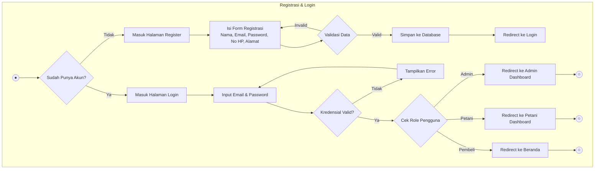
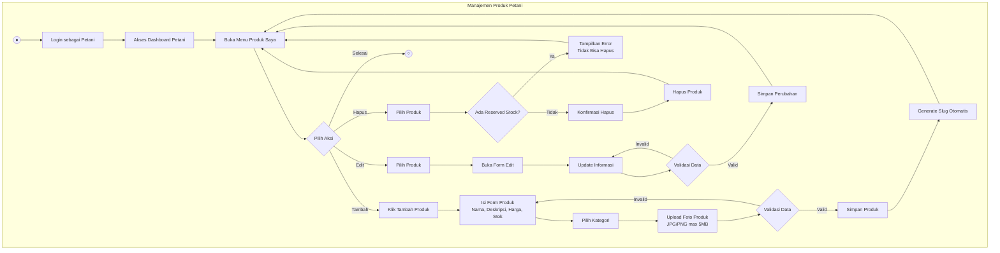
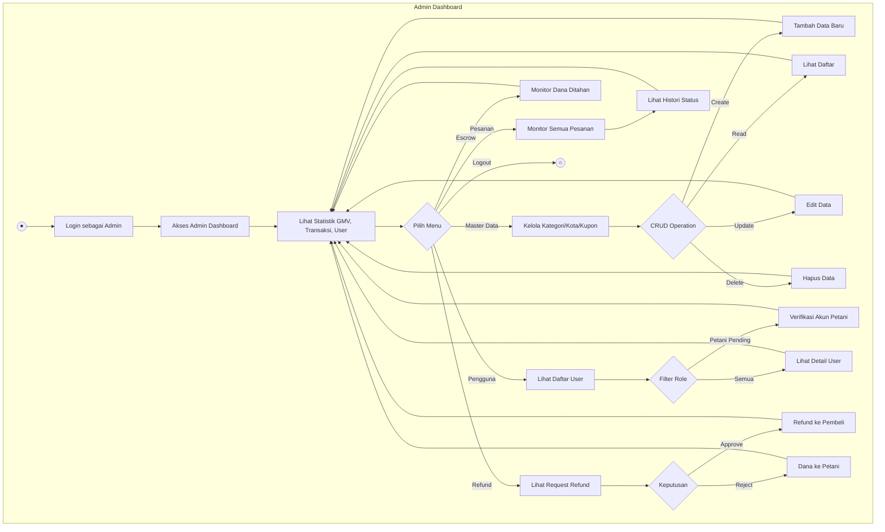
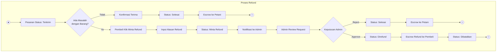
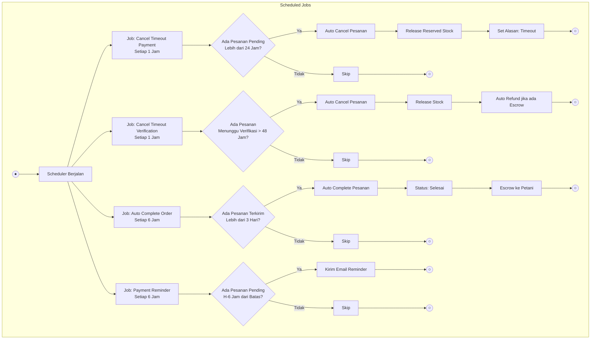
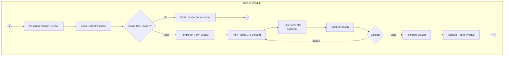
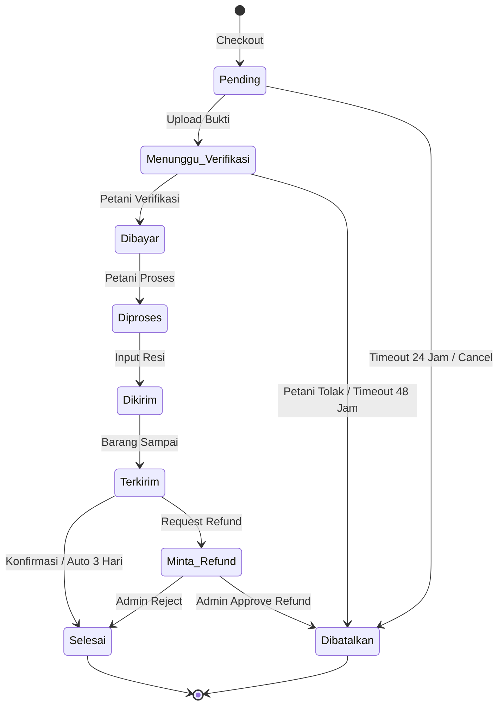

# 📊 Activity Diagram - TANAMI E-Commerce

Dokumen ini berisi Activity Diagram dalam format UML Mermaid untuk website TANAMI E-Commerce v2.0.

---

## 1. Activity Diagram: Registrasi & Login

Alur autentikasi pengguna mencakup registrasi akun baru dan proses login.

---

## 2. Activity Diagram: Alur Belanja (Pembeli)

Alur lengkap pembeli dari melihat produk hingga menyelesaikan pesanan.

```mermaid
flowchart TD
    subgraph "Alur Belanja Pembeli"
        START((●)) --> A[Buka Halaman Katalog]
        A --> B[Lihat Daftar Produk]
        B --> C{Filter/Search Produk?}
        C -->|Ya| D[Filter Kategori/Search/Sort]
        D --> B
        C -->|Tidak| E[Pilih Produk]
        E --> F[Lihat Detail Produk<br>Harga, Stok, Ulasan]
        
        F --> G{Tambah ke Keranjang?}
        G -->|Tidak| B
        G -->|Ya| H{Sudah Login?}
        H -->|Tidak| I[Redirect ke Login]
        I --> J[Login]
        J --> F
        H -->|Ya| K[Tambah ke Keranjang]
        K --> L{Lanjut Belanja?}
        L -->|Ya| B
        L -->|Tidak| M[Buka Keranjang]
        
        M --> N[Review Item di Keranjang]
        N --> O{Update/Hapus Item?}
        O -->|Ya| P[Update Qty/Hapus]
        P --> N
        O -->|Tidak| Q[Klik Checkout]
        
        Q --> R[Pilih Kota Tujuan]
        R --> S[Sistem Hitung Ongkir]
        S --> T{Pakai Kupon?}
        T -->|Ya| U[Input Kode Kupon]
        U --> V{Kupon Valid?}
        V -->|Tidak| W[Tampilkan Error]
        W --> T
        V -->|Ya| X[Terapkan Diskon]
        T -->|Tidak| X
        
        X --> Y[Tampilkan Ringkasan<br>Subtotal + Ongkir - Diskon]
        Y --> Z[Konfirmasi Pesanan]
        Z --> AA[Sistem Reserve Stok]
        AA --> AB[Create Pesanan<br>Status: Pending]
        AB --> AC[Set Batas Bayar<br>24 Jam]
        AC --> AD[Clear Keranjang]
        AD --> AE[Redirect ke Detail Pesanan]
        AE --> END((○))
    end
```

---

## 3. Activity Diagram: Pembayaran & Verifikasi

Alur pembayaran oleh pembeli dan verifikasi oleh petani.

```mermaid
flowchart TD
    subgraph "Pembayaran & Verifikasi"
        START((●)) --> A[Pesanan Status: Pending]
        A --> B[Lihat Detail Pesanan<br>Info Pembayaran]
        
        B --> C{Upload Bukti Bayar<br>Sebelum Timeout?}
        C -->|Timeout| D[Sistem Auto-Cancel<br>Release Reserved Stock]
        D --> END1((○))
        
        C -->|Ya| E[Upload Bukti Bayar<br>JPG/PNG max 2MB]
        E --> F[Status: Menunggu Verifikasi]
        
        F --> G[Petani Review<br>Bukti Bayar]
        G --> H{Pembayaran Valid?}
        
        H -->|Tolak| I[Input Alasan Tolak]
        I --> J[Status: Dibatalkan]
        J --> K[Release Reserved Stock]
        K --> END2((○))
        
        H -->|Verifikasi| L[Status: Dibayar]
        L --> M[Kurangi Stok Aktual]
        M --> N[Release Reserved Stock]
        N --> O[Create Escrow<br>Status: Ditahan]
        O --> P[Petani Proses Pesanan]
        P --> Q[Status: Diproses]
        
        Q --> R[Petani Siapkan Barang]
        R --> S[Input Nomor Resi]
        S --> T[Status: Dikirim]
        T --> U[Barang Terkirim]
        U --> V[Status: Terkirim]
        
        V --> W{Pembeli Konfirmasi<br>dalam 3 Hari?}
        W -->|Ya| X[Pembeli Klik Konfirmasi]
        W -->|Timeout| Y[Sistem Auto-Complete]
        
        X --> Z[Status: Selesai]
        Y --> Z
        Z --> AA[Escrow Dikirim ke Petani]
        AA --> AB[Pembeli Bisa Beri Ulasan]
        AB --> END3((○))
    end
```

---

## 4. Activity Diagram: Manajemen Produk (Petani)

Alur petani mengelola produk di toko mereka.

---

## 5. Activity Diagram: Verifikasi Pesanan (Petani)

Alur petani menangani pesanan masuk.

```mermaid
flowchart TD
    subgraph "Verifikasi Pesanan Petani"
        START((●)) --> A[Login sebagai Petani]
        A --> B[Akses Dashboard]
        B --> C[Buka Menu Pesanan Masuk]
        C --> D[Lihat Daftar Pesanan<br>Filter by Status]
        
        D --> E[Pilih Pesanan<br>Menunggu Verifikasi]
        E --> F[Lihat Detail Pesanan<br>& Bukti Bayar]
        
        F --> G{Bukti Bayar Valid?}
        
        G -->|Tolak| H[Input Alasan Penolakan]
        H --> I[Klik Tolak Pembayaran]
        I --> J[Status: Dibatalkan]
        J --> K[Release Stock]
        K --> D
        
        G -->|Verifikasi| L[Klik Verifikasi Pembayaran]
        L --> M[Status: Dibayar]
        M --> N[Kurangi Stok Produk]
        N --> O[Create Escrow Ditahan]
        
        O --> P[Klik Proses Pesanan]
        P --> Q[Status: Diproses]
        Q --> R[Siapkan Barang]
        
        R --> S[Input Nomor Resi]
        S --> T[Klik Kirim Pesanan]
        T --> U[Status: Dikirim]
        U --> V[Tunggu Konfirmasi Pembeli]
        V --> END((○))
    end
```

---

## 6. Activity Diagram: Admin Dashboard

Alur admin mengelola platform.

---

## 7. Activity Diagram: Proses Refund

Alur permintaan dan penanganan refund.

---

## 8. Activity Diagram: Scheduled Jobs (Automation)

Alur job otomatis yang berjalan di background.

---

## 9. Activity Diagram: Ulasan Produk

Alur pembeli memberikan ulasan setelah pesanan selesai.

---

## Ringkasan Flow Status Pesanan

---

> **Catatan**: Diagram ini dibuat menggunakan Mermaid UML berdasarkan analisis:
> - [README.md](file:///d:/laragon/www/Tanami_web/README.md)
> - [BACKEND-CHECKLIST.md](file:///d:/laragon/www/Tanami_web/BACKEND-CHECKLIST.md) 
> - [FRONTEND-PAGES.md](file:///d:/laragon/www/Tanami_web/FRONTEND-PAGES.md)
> - [routes/web.php](file:///d:/laragon/www/Tanami_web/routes/web.php)

_Dokumen Activity Diagram TANAMI E-Commerce v2.0_
