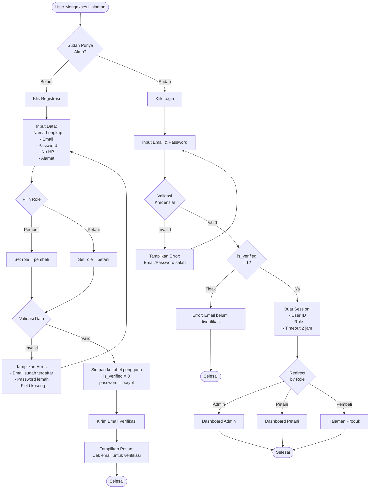
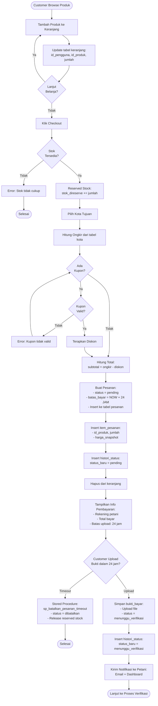
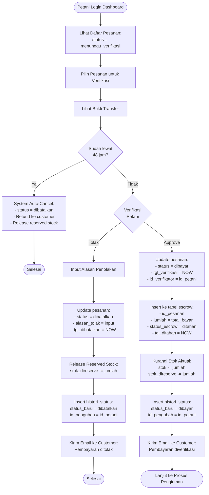
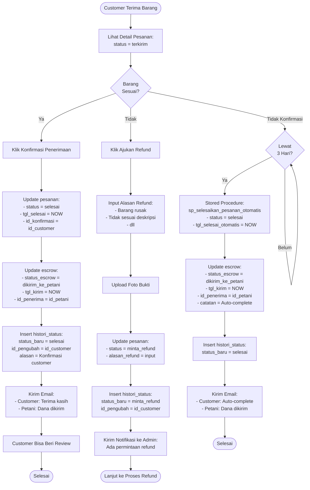
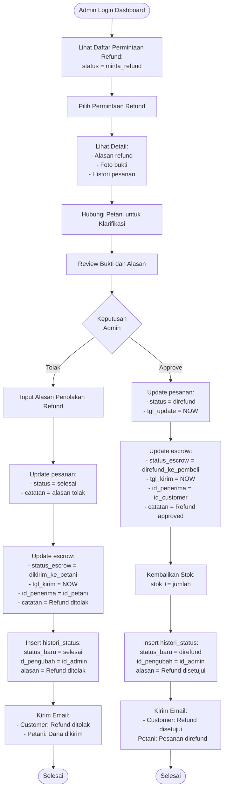
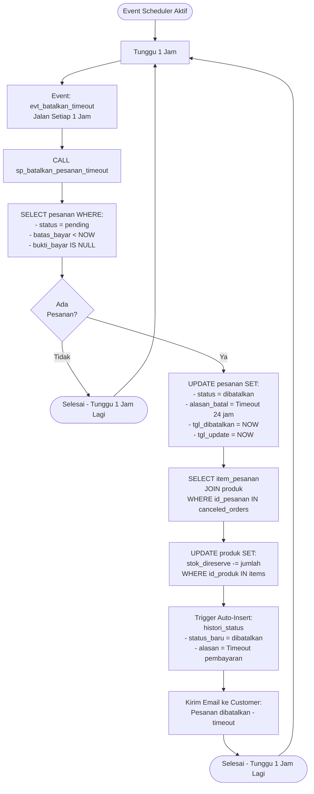
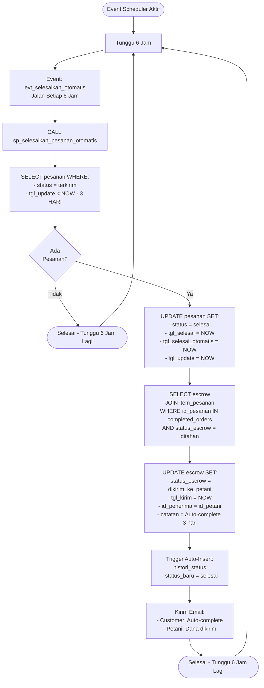

```mermaid
flowchart TD
    Start([Petani Login Dashboard]) --> ViewPaid[Lihat Pesanan:<br/>status = dibayar]
    ViewPaid --> SelectOrder[Pilih Pesanan untuk Diproses]
    SelectOrder --> ProcessOrder[Klik Proses Pesanan]

    ProcessOrder --> UpdateProses[Update pesanan:<br/>- status = diproses<br/>- tgl_update = NOW]
    UpdateProses --> LogProses[Insert histori_status:<br/>status_baru = diproses<br/>id_pengubah = id_petani]
    LogProses --> NotifyProses[Kirim Email ke Customer:<br/>Pesanan sedang diproses]

    NotifyProses --> PackOrder[Petani Kemas Barang]
    PackOrder --> ReadyShip[Barang Siap Kirim]
    ReadyShip --> InputResi[Input Nomor Resi Pengiriman]

    InputResi --> UpdateKirim[Update pesanan:<br/>- status = dikirim<br/>- no_resi = input<br/>- tgl_update = NOW]
    UpdateKirim --> LogKirim[Insert histori_status:<br/>status_baru = dikirim<br/>id_pengubah = id_petani]
    LogKirim --> NotifyKirim[Kirim Email ke Customer:<br/>Pesanan dikirim + no_resi]

    NotifyKirim --> WaitDelivery[Menunggu Barang Sampai]
    WaitDelivery --> CourierDeliver[Kurir Antarkan Barang]
    CourierDeliver --> UpdateTerkirim[Update pesanan:<br/>- status = terkirim<br/>- tgl_update = NOW]

    UpdateTerkirim --> LogTerkirim[Insert histori_status:<br/>status_baru = terkirim]
    LogTerkirim --> NotifyTerkirim[Kirim Email ke Customer:<br/>Barang telah sampai]
    NotifyTerkirim --> End([Lanjut ke Proses Konfirmasi])
```

# Activity Diagram - Sistem TANAMI E-Commerce

> **Dokumen Activity Diagram untuk Sistem Manajemen Basis Data Lanjut**  
> Berdasarkan Rule Bisnis Versi 2.0 dengan Sistem Escrow

---

## Daftar Isi

1. [Proses Registrasi dan Login](#1-proses-registrasi-dan-login)
2. [Proses Checkout dan Pembayaran (dengan Escrow)](#2-proses-checkout-dan-pembayaran-dengan-escrow)
3. [Proses Verifikasi Pembayaran oleh Petani](#3-proses-verifikasi-pembayaran-oleh-petani)
4. [Proses Pengiriman Barang](#4-proses-pengiriman-barang)
5. [Proses Konfirmasi Penerimaan Barang](#5-proses-konfirmasi-penerimaan-barang)
6. [Proses Refund](#6-proses-refund)
7. [Proses Auto-Cancel Timeout Pembayaran](#7-proses-auto-cancel-timeout-pembayaran)
8. [Proses Auto-Complete Pesanan](#8-proses-auto-complete-pesanan)

---

## 1. Proses Registrasi dan Login

### Activity Diagram



### Penjelasan

**Actor:** Customer/Petani, System

**Rule Bisnis:**

- Password harus di-hash menggunakan bcrypt
- Email harus unik
- Session timeout 2 jam
- Verifikasi email wajib untuk login

**Database Tables:**

- `pengguna` (id_pengguna, email, password, role_pengguna, is_verified)

---

## 2. Proses Checkout dan Pembayaran (dengan Escrow)

### Activity Diagram



### Penjelasan

**Actor:** Customer, System

**Rule Bisnis:**

- Timeout pembayaran: **24 JAM** (bukan 30 menit)
- Reserved stock dikurangi saat checkout, stok aktual dikurangi saat dibayar
- Kupon valid jika: aktif, belum expired, subtotal ≥ min_belanja, limit belum tercapai
- `batas_bayar` = NOW() + INTERVAL 24 HOUR

**Database Tables:**

- `keranjang`, `pesanan`, `item_pesanan`, `produk`, `kota`, `kupon`, `pemakaian_kupon`, `histori_status`

**Stored Procedures:**

- `sp_batalkan_pesanan_timeout()` - Jalan setiap 1 jam

---

## 3. Proses Verifikasi Pembayaran oleh Petani

### Activity Diagram



### Penjelasan

**Actor:** Petani, System

**Rule Bisnis:**

- Petani **WAJIB** verifikasi dalam **48 JAM**
- Jika lewat 48 jam → auto-cancel + auto-refund
- Saat approve: dana ditahan escrow (status: `ditahan`)
- Stok aktual baru dikurangi saat approve (bukan saat checkout)

**Database Tables:**

- `pesanan`, `escrow`, `produk`, `item_pesanan`, `histori_status`

**Escrow Status:**

- `ditahan` - Dana ditahan platform setelah verifikasi

---

## 4. Proses Pengiriman Barang

### Activity Diagram



### Penjelasan

**Actor:** Petani, Kurir, System

**Rule Bisnis:**

- Status sequential: dibayar → diproses → dikirim → terkirim
- Nomor resi wajib diinput saat update status "dikirim"
- Dana masih **DITAHAN** di escrow selama proses pengiriman
- Setiap perubahan status tercatat di `histori_status` via trigger

**Database Tables:**

- `pesanan`, `histori_status`

**Escrow Status:**

- Masih `ditahan` - Dana belum dikirim ke petani

---

## 5. Proses Konfirmasi Penerimaan Barang

### Activity Diagram



### Penjelasan

**Actor:** Customer, System, Admin

**Rule Bisnis:**

- Customer punya **3 HARI** untuk konfirmasi setelah status "terkirim"
- Jika tidak konfirmasi dalam 3 hari → **AUTO-COMPLETE**
- Saat konfirmasi OK atau auto-complete → dana **DIKIRIM KE PETANI**
- Jika komplain → status "minta_refund", menunggu review admin

**Database Tables:**

- `pesanan`, `escrow`, `histori_status`

**Escrow Status:**

- `dikirim_ke_petani` - Dana dikirim ke rekening petani

**Stored Procedures:**

- `sp_selesaikan_pesanan_otomatis()` - Jalan setiap 6 jam

---

## 6. Proses Refund

### Activity Diagram



### Penjelasan

**Actor:** Admin, System

**Rule Bisnis:**

- Admin review permintaan refund dari customer
- Jika approve → dana **DI-REFUND KE CUSTOMER**, stok dikembalikan
- Jika reject → dana **DIKIRIM KE PETANI**, status jadi "selesai"
- Semua keputusan tercatat di `histori_status`

**Database Tables:**

- `pesanan`, `escrow`, `produk`, `histori_status`

**Escrow Status:**

- `direfund_ke_pembeli` - Dana dikembalikan ke customer
- `dikirim_ke_petani` - Dana dikirim ke petani (jika refund ditolak)

---

## 7. Proses Auto-Cancel Timeout Pembayaran

### Activity Diagram



### Penjelasan

**Actor:** System (Automated)

**Rule Bisnis:**

- Stored Procedure: `sp_batalkan_pesanan_timeout()`
- Jalan setiap **1 JAM** via Event Scheduler
- Cancel order yang:
  - Status = "pending"
  - `batas_bayar` < NOW() (lewat 24 jam)
  - `bukti_bayar` IS NULL (belum upload)
- Reserved stock di-release kembali

**Database Tables:**

- `pesanan`, `item_pesanan`, `produk`, `histori_status`

**Event Scheduler:**

```sql
CREATE EVENT evt_batalkan_timeout
ON SCHEDULE EVERY 1 HOUR
DO CALL sp_batalkan_pesanan_timeout();
```

---

## 8. Proses Auto-Complete Pesanan

### Activity Diagram



### Penjelasan

**Actor:** System (Automated)

**Rule Bisnis:**

- Stored Procedure: `sp_selesaikan_pesanan_otomatis()`
- Jalan setiap **6 JAM** via Event Scheduler
- Auto-complete order yang:
  - Status = "terkirim"
  - `tgl_update` < NOW() - INTERVAL 3 DAY (lewat 3 hari)
- Dana **DIKIRIM KE PETANI** dari escrow
- Set `tgl_selesai_otomatis` untuk tracking

**Database Tables:**

- `pesanan`, `escrow`, `item_pesanan`, `histori_status`

**Escrow Status:**

- `dikirim_ke_petani` - Dana dikirim ke rekening petani

**Event Scheduler:**

```sql
CREATE EVENT evt_selesaikan_otomatis
ON SCHEDULE EVERY 6 HOUR
DO CALL sp_selesaikan_pesanan_otomatis();
```

---

## Ringkasan Timeline Timeout

| Proses                  | Timeout | Action                                     | Stored Procedure                   |
| ----------------------- | ------- | ------------------------------------------ | ---------------------------------- |
| **Upload Bukti Bayar**  | 24 JAM  | Auto-cancel jika tidak upload              | `sp_batalkan_pesanan_timeout()`    |
| **Verifikasi Petani**   | 48 JAM  | Auto-cancel + refund jika tidak verifikasi | Manual check (bisa dibuat SP)      |
| **Konfirmasi Customer** | 3 HARI  | Auto-complete + dana ke petani             | `sp_selesaikan_pesanan_otomatis()` |

---

## Ringkasan Status Escrow

| Status Escrow           | Deskripsi                     | Kapan Terjadi                                  |
| ----------------------- | ----------------------------- | ---------------------------------------------- |
| **ditahan**             | Dana ditahan platform         | Saat petani approve pembayaran                 |
| **dikirim_ke_petani**   | Dana dikirim ke petani        | Saat customer konfirmasi OK atau auto-complete |
| **direfund_ke_pembeli** | Dana dikembalikan ke customer | Saat admin approve refund                      |

---

## Referensi

- **Dokumen:** SISTEM-MANAJEMEN-BASIS-DATA-LANJUT-V2.md
- **Database:** tanami_web.sql
- **ERD:** https://dbdiagram.io/d/tanami_web2-694b539fdbf05578e66c71c5
- **Versi:** 2.0 (29 Desember 2025)
