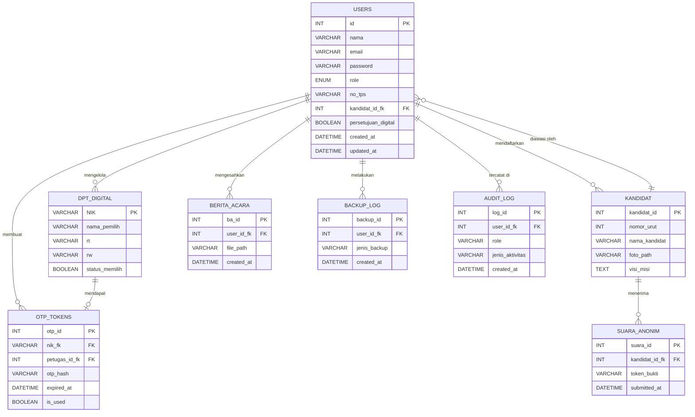

# Laporan Kelompok Barbarabar
## Analisis dan Perancangan Sistem Informasi
### Sistem Informasi E-Voting Tingkat Kelurahan

---

**Dosen Pengampu:** Krisnawati, S.Si, M.T.

**Disusun Oleh Kelompok 11:**

| Nama | NIM |
|------|-----|
| Yudistira Azfa Dani Wibowo | 24.12.3274 |
| Muhammad Adam Siswantoro | 24.12.3281 |
| Wasima Juhaina | 24.12.3282 |
| Sherly Meisya Maharani | 24.12.3301 |
| Evan Aubin Wibowo | 24.12.3319 |

**Program Studi Sistem Informasi**
**Fakultas Ilmu Komputer**
**Universitas AMIKOM Yogyakarta**
**2025/2026**

---

## Daftar Isi

- [A. Definisi](#a-definisi)
- [B. Struktur Organisasi](#b-struktur-organisasi)
- [C. Asumsi Sistem Lama](#c-asumsi-sistem-lama)
- [D. Alur Bisnis Sistem Informasi E-Voting](#d-alur-bisnis-sistem-informasi-e-voting)
- [E. Rancangan Keamanan Sistem](#e-rancangan-keamanan-sistem)
- [F. Analisis Biaya dan Manfaat](#f-analisis-biaya-dan-manfaat)
- [G. Personil Pengembangan Sistem](#g-personil-pengembangan-sistem)
- [H. Analisis PIECES](#h-analisis-pieces)
- [I. Teknologi Sistem yang Digunakan](#i-teknologi-sistem-yang-digunakan)
- [J. Identifikasi Kebutuhan Sistem Baru](#j-identifikasi-kebutuhan-sistem-baru)
- [K. Analisis Kebutuhan Sistem Baru](#k-analisis-kebutuhan-sistem-baru)
- [L. Workflow Sistem Baru](#l-workflow-sistem-baru)
- [M. Merancang Basis Data](#m-merancang-basis-data)
- [N. Lembar Kontribusi Anggota](#n-lembar-kontribusi-anggota)

---

## A. Definisi

### a. Sistem Informasi

Sistem informasi merupakan suatu kerangka kerja yang mengintegrasikan komponen-komponen meliputi manusia, teknologi, proses, dan data secara sinergis untuk mengumpulkan, mengolah, menyimpan, serta mendistribusikan informasi yang relevan dalam mendukung proses pengambilan keputusan dan pengendalian operasional suatu organisasi (Laudon & Laudon, 2020). Dalam pengertian yang lebih luas, sistem informasi tidak dapat dipandang semata-mata sebagai perangkat lunak atau aplikasi komputer biasa, melainkan sebagai sebuah ekosistem terpadu yang melibatkan interaksi antara pengguna (user), prosedur kerja, infrastruktur teknologi, serta basis data yang saling bergantung satu sama lain.

Secara fungsional, sistem informasi berperan sebagai jembatan antara data mentah dengan informasi yang bermakna dan dapat digunakan. Data yang masuk ke dalam sistem akan diproses melalui serangkaian mekanisme komputasi sehingga menghasilkan output berupa laporan, notifikasi, atau tampilan antarmuka yang memudahkan pengguna dalam memahami kondisi atau situasi tertentu. Dalam konteks pembangunan sistem e-voting di tingkat kelurahan, sistem informasi menjadi fondasi utama yang menaungi seluruh proses pemilihan, mulai dari pendaftaran pemilih, verifikasi identitas warga berdasarkan Daftar Pemilih Tetap (DPT), pelaksanaan pemungutan suara secara elektronik, hingga penampilan rekapitulasi hasil secara real-time kepada seluruh pemangku kepentingan.

### b. Voting

Voting atau pemungutan suara merupakan instrumen fundamental dalam proses pengambilan keputusan kolektif yang merepresentasikan pendelegasian hak suara secara demokratis. Secara konseptual, voting tidak hanya sekadar proses pemilihan kandidat atau opsi kebijakan, melainkan sebuah mekanisme resolusi konflik dan agregasi preferensi individu menjadi keputusan publik yang sah (legitim). Dalam pelaksanaannya, sistem voting yang ideal harus memenuhi asas fundamental pemilu, seperti **Langsung, Umum, Bebas, Rahasia, Jujur, dan Adil (LUBER JURDIL)**. Kompleksitas voting terletak pada bagaimana sistem dapat menjamin integritas proses tersebut, meminimalisir anomali atau kecurangan, serta memastikan bahwa setiap suara memiliki bobot yang setara (*one person, one vote*) tanpa adanya koersi atau manipulasi dari pihak manapun.

### c. Sistem Informasi E-Voting

E-Voting atau *Electronic Voting* adalah paradigma modern dalam pelaksanaan pemilu yang mendematerialisasi surat suara fisik menggunakan infrastruktur teknologi informasi dan komunikasi (TIK). E-Voting mencakup spektrum teknologi yang luas, mulai dari *Direct-Recording Electronic* (DRE) voting machines di Tempat Pemungutan Suara (TPS), hingga *Internet Voting* (i-Voting) yang dapat diakses dari jarak jauh. Transformasi dari sistem konvensional ke e-voting bertujuan untuk mereduksi *human error*, menekan biaya logistik, dan mempercepat proses rekapitulasi. Namun, implementasi e-voting menuntut pemenuhan tiga pilar keamanan kriptografis yang ketat:

1. **Privacy/Anonymity** — kerahasiaan identitas pemilih harus terpisah dari pilihan suaranya
2. **Integrity** — suara yang masuk tidak dapat diubah atau dihapus
3. **Verifiability** — kemampuan sistem untuk diaudit secara transparan, baik secara *individual verifiability* maupun *universal verifiability*

### d. E-Voting Tingkat Kelurahan

E-Voting Tingkat Kelurahan merupakan lokalisasi penerapan sistem informasi e-voting yang disesuaikan dengan skala dan karakteristik sosiologis masyarakat di tingkat desa atau kelurahan. Sistem ini diimplementasikan untuk pemilihan pemimpin akar rumput (Ketua RT, Ketua RW, atau Kepala Desa) maupun pengambilan keputusan strategis dalam Musyawarah Perencanaan Pembangunan (Musrenbang). Pada tingkat ini, kompleksitas sistem tidak hanya terletak pada aspek teknis (seperti penggunaan aplikasi berbasis web/mobile di TPS lokal atau jaringan intranet mandiri untuk mengantisipasi *blank spot* internet), tetapi juga pada aspek sosio-teknis. Sistem harus dirancang dengan *User Interface* (UI) yang sangat intuitif untuk mengakomodasi berbagai tingkat literasi digital warga, serta dilengkapi dengan *Role-Based Access Control* (RBAC) yang ketat untuk membedakan hak akses antara Panitia Pemilihan, Saksi, Operator Sistem, dan Pemilih, guna membangun kepercayaan masyarakat lokal terhadap keabsahan teknologi tersebut.

---

## B. Struktur Organisasi

### a. Peran dan Tanggung Jawab

| Peran | Tanggung Jawab |
|-------|----------------|
| **Lurah / Kepala Desa** | Penanggung jawab kegiatan, mengesahkan hasil pemilihan |
| **Panitia Pemilihan** | Menyusun DPT, menetapkan jadwal, mengkoordinasi TPS, mengumumkan hasil |
| **Operator Sistem (Admin IT)** | Setup perangkat & jaringan, mengelola akun pemilih, troubleshoot teknis |
| **Saksi Kandidat** | Mengawasi jalannya pemilihan, memverifikasi hasil akhir |
| **Petugas TPS** | Memverifikasi identitas pemilih (KTP/KK), memberikan akses ke perangkat voting |
| **Pemilih** | Warga terdaftar dalam DPT kelurahan, memberikan suara via perangkat |

---

## C. Asumsi Sistem Lama

Bagian "asumsi sistem lama pada e-voting" menggambarkan kondisi pemilihan yang masih menggunakan metode konvensional sebelum diterapkannya sistem elektronik. Dalam sistem lama ini, proses pemungutan suara diasumsikan masih dilakukan secara manual dengan menggunakan kertas suara, kotak suara, dan perhitungan yang dilakukan oleh panitia. Seluruh tahapan, mulai dari distribusi surat suara, pencoblosan, hingga penghitungan hasil, bergantung pada tenaga manusia, sehingga membutuhkan waktu yang cukup lama dan rentan terhadap kesalahan (*human error*).

Selain itu, sistem lama juga diasumsikan memiliki keterbatasan dalam hal transparansi dan akurasi. Karena prosesnya tidak terotomatisasi, peluang terjadinya kecurangan seperti manipulasi suara, surat suara tidak sah, atau kesalahan dalam pencatatan menjadi lebih besar. Dari sisi penyimpanan data, arsip hasil pemilihan masih berbentuk fisik sehingga rawan rusak, hilang, atau sulit diakses kembali ketika dibutuhkan untuk audit.

Di sisi efisiensi, sistem lama juga dianggap kurang efektif karena membutuhkan biaya operasional yang tinggi, seperti pencetakan surat suara, distribusi logistik ke berbagai lokasi, serta kebutuhan tenaga kerja dalam jumlah besar. Selain itu, partisipasi pemilih juga bisa terhambat karena pemilih harus datang langsung ke tempat pemungutan suara. Dengan berbagai keterbatasan tersebut, asumsi sistem lama ini menjadi dasar penting untuk mengembangkan sistem e-voting yang lebih cepat, akurat, transparan, serta mampu meningkatkan partisipasi masyarakat dalam proses pemilihan.

### a. Tahapan Proses Manual di Kelurahan

| No | Tahap | Proses | Kelemahan |
|----|-------|--------|-----------|
| 1 | Pendataan pemilih | RT/RW mengumpulkan data warga secara manual dari pintu ke pintu | Data tidak akurat, warga pindah tidak terdata, duplikasi |
| 2 | Pembuatan surat suara | Panitia mencetak kertas suara sesuai jumlah DPT | Biaya cetak, risiko kelebihan/kekurangan surat |
| 3 | Pelaksanaan di TPS | Warga datang → cek KTP → terima surat → coblos di bilik | Antrian panjang, proses lambat, warga malas datang |
| 4 | Penghitungan suara | Panitia buka kotak suara → hitung manual satu per satu | Salah hitung, surat tidak sah diperdebatkan |
| 5 | Rekapitulasi & pengumuman | Ditulis di papan, diumumkan lisan | Tidak ada rekam jejak digital, sulit diaudit ulang |

### b. Matriks Proses Detail Sistem Manual

| No | Proses | Pelaku (Siapa) | Aksi (Apa yang Dilakukan) | Output → Penerima (Ke Siapa) | Waktu (Kapan) | Data yang Digunakan |
|----|--------|----------------|---------------------------|-------------------------------|---------------|---------------------|
| 1 | Pendataan pemilih | RT/RW setempat | Mengumpulkan data warga secara door-to-door, mencatat nama & KTP | Daftar calon pemilih (DPT manual) → diserahkan ke Panitia Pemilihan | H-14 s/d H-7 sebelum pemilihan | Data KTP/KK warga, catatan kependudukan RT/RW |
| 2 | Validasi & finalisasi DPT | Panitia Pemilihan | Mencocokkan data dari RT/RW, menghapus duplikasi, menetapkan DPT final | DPT final (kertas) → diumumkan ke Warga & diserahkan ke Petugas TPS | H-7 sebelum pemilihan | Daftar warga dari RT/RW, data kependudukan kelurahan |
| 3 | Registrasi kandidat | Panitia Pemilihan | Menerima pendaftaran kandidat, memverifikasi persyaratan | Daftar kandidat resmi → diumumkan ke Warga, dicetak di surat suara | H-14 s/d H-7 sebelum pemilihan | Formulir pendaftaran, syarat administratif kandidat |
| 4 | Pembuatan surat suara | Panitia Pemilihan | Mencetak surat suara sesuai jumlah DPT + cadangan | Surat suara cetak → diserahkan ke Petugas TPS | H-3 s/d H-1 | DPT final, daftar kandidat resmi |
| 5 | Persiapan TPS | Petugas TPS | Menyiapkan bilik suara, kotak suara, dan perlengkapan TPS | TPS siap pakai → untuk Pemilih (Warga) | H-1 (sehari sebelum) | Surat suara, DPT, alat tulis, tinta |
| 6 | Verifikasi identitas | Petugas TPS | Mencocokkan KTP warga dengan DPT, mencoret nama di daftar | Surat suara → diberikan ke Pemilih | Hari-H pemilihan | KTP/KK pemilih, DPT cetak |
| 7 | Pemberian suara | Pemilih (Warga) | Masuk bilik suara, mencoblos kandidat pilihan | Surat suara tercoblos → dimasukkan ke kotak suara | Hari-H pemilihan | Surat suara |
| 8 | Penghitungan suara | Panitia Pemilihan + Saksi | Membuka kotak suara, menghitung manual satu per satu, mencatat di form | Berita acara penghitungan → diserahkan ke Lurah/Kades | Hari-H setelah TPS tutup | Surat suara tercoblos, formulir penghitungan (form C1) |
| 9 | Rekapitulasi & pengumuman | Panitia Pemilihan + Lurah | Merekap hasil dari seluruh TPS, mengumumkan pemenang | Hasil resmi → diumumkan ke Warga | Hari-H atau H+1 | Berita acara penghitungan dari setiap TPS |

### c. Matriks RACI Sistem Manual

| Proses | Lurah/Kades | Panitia | Petugas TPS | Saksi | Pemilih |
|--------|:-----------:|:-------:|:-----------:|:-----:|:-------:|
| Pendataan pemilih | I | A | R | – | C |
| Validasi & finalisasi DPT | A | R | I | I | I |
| Registrasi kandidat | A | R | I | I | C |
| Pembuatan surat suara | I | R | I | – | – |
| Persiapan TPS | I | A | R | I | – |
| Verifikasi identitas | – | I | R | C | R |
| Pemberian suara | – | – | I | I | R |
| Penghitungan suara | I | R | C | R | – |
| Rekapitulasi & pengumuman | R | R | – | C | I |

> **Keterangan RACI:**
> - **R** = Responsible (pelaksana)
> - **A** = Accountable (penanggung jawab)
> - **C** = Consulted (diminta pendapat)
> - **I** = Informed (diberi informasi)

### Masalah Utama Sistem Manual

- ❌ **Partisipasi rendah** — Warga malas antri, terutama usia muda
- ❌ **Waktu lama** — Proses 1 hari penuh untuk 1 RT/RW
- ❌ **Biaya operasional** — Cetak surat, konsumsi panitia, sewa tempat
- ❌ **Tidak ada audit trail** — Jika ada sengketa, harus hitung ulang fisik
- ❌ **Rentan kecurangan** — Surat suara bisa ditambah/dikurangi saat penghitungan

---

## D. Alur Bisnis Sistem Informasi E-Voting

### a. Matriks Proses Detail — Sistem E-Voting

| No | Tahap | Proses | Keterangan |
|----|-------|--------|------------|
| 1 | Persiapan | Admin import data warga dari database kelurahan ke sistem → generate DPT digital | Dilakukan H-7 sebelum pemilihan |
| 2 | Registrasi kandidat | Panitia input data kandidat (nama, foto, visi-misi) ke sistem | Data ditampilkan di halaman voting |
| 3 | Verifikasi pemilih | Warga datang ke TPS → petugas scan/cek KTP → sistem validasi di DPT | Warga yang sudah memilih otomatis ditandai |
| 4 | Pemberian suara | Pemilih akses halaman voting → pilih kandidat → konfirmasi → submit | Token unik dicetak/ditampilkan sebagai bukti |
| 5 | Penghitungan otomatis | Sistem hitung agregat suara secara real-time | Hasil bisa dipantau live oleh panitia & saksi |
| 6 | Pengumuman hasil | Setelah TPS tutup, hasil final ditampilkan di dashboard publik | Saksi memverifikasi, Lurah mengesahkan |

#### Detail Proses Lengkap

| No | Proses | Pelaku (Siapa) | Aksi (Apa yang Dilakukan) | Output → Penerima (Ke Siapa) | Waktu (Kapan) | Data yang Digunakan |
|----|--------|----------------|---------------------------|-------------------------------|---------------|---------------------|
| 1 | Import data pemilih | Admin IT (Operator Sistem) | Import data warga dari database kependudukan kelurahan ke sistem e-voting, generate DPT digital | DPT digital terverifikasi → tersimpan di sistem, dapat diakses oleh Panitia & Petugas TPS | H-7 sebelum pemilihan | Data kependudukan kelurahan (NIK, nama, RT, RW, status domisili) |
| 2 | Registrasi kandidat | Panitia Pemilihan | Input data kandidat ke sistem (nama, foto, visi-misi) | Profil kandidat digital → tampil di halaman voting untuk Pemilih | H-7 sebelum pemilihan | Nama kandidat, foto resmi, dokumen visi-misi |
| 3 | Setup perangkat & jaringan | Admin IT (Operator Sistem) | Konfigurasi server, tablet TPS, jaringan WiFi/LAN, uji koneksi | Perangkat TPS siap pakai → untuk Petugas TPS & Pemilih | H-3 s/d H-1 | Spesifikasi perangkat, konfigurasi jaringan, akun sistem |
| 4 | Verifikasi identitas pemilih | Petugas TPS | Scan/cek KTP warga, input NIK ke sistem, sistem validasi di DPT digital | OTP 6 digit → dicetak/ditampilkan lalu diberikan ke Pemilih | Hari-H pemilihan | KTP/KK pemilih, DPT digital di sistem |
| 5 | Autentikasi & pemberian suara | Pemilih (Warga) | Input OTP di tablet, pilih kandidat, konfirmasi pilihan, submit suara | Suara terenkripsi → tersimpan di database, token bukti → diterima oleh Pemilih | Hari-H pemilihan | OTP, daftar kandidat, token bukti |
| 6 | Monitoring real-time | Saksi Kandidat + Panitia | Memantau dashboard hasil dan statistik partisipasi secara live | Informasi progres → ditampilkan untuk Saksi & Panitia (read-only) | Hari-H selama TPS buka | Data agregat suara (tanpa identitas pemilih), jumlah partisipasi |
| 7 | Penghitungan otomatis | Sistem (otomatis) | Agregasi seluruh suara secara real-time setelah setiap suara masuk | Hasil penghitungan sementara → ditampilkan di dashboard untuk Panitia & Saksi | Hari-H (real-time) | Seluruh data suara yang valid di database |
| 8 | Pengumuman hasil resmi | Panitia + Lurah/Kades | Menutup sesi pemilihan, memverifikasi hasil final bersama saksi, mengesahkan hasil | Hasil resmi → ditampilkan di dashboard publik untuk Warga, berita acara digital → Lurah | Hari-H setelah TPS tutup | Hasil penghitungan final, log audit, tanda tangan digital saksi |
| 9 | Backup & arsip | Admin IT (Operator Sistem) | Export data hasil ke CSV, backup database ke USB dan cloud, cetak berita acara | Arsip digital & fisik → disimpan oleh Panitia & Lurah/Kades | Hari-H setelah pengumuman | Full database backup, CSV hasil, log audit lengkap |

### b. Matriks RACI — Sistem E-Voting

| Proses | Lurah/Kades | Panitia | Admin IT | Petugas TPS | Saksi | Pemilih |
|--------|:-----------:|:-------:|:--------:|:-----------:|:-----:|:-------:|
| Import data pemilih | I | A | R | I | – | – |
| Registrasi kandidat | I | AR | C | – | I | – |
| Setup perangkat & jaringan | I | I | A | C | – | – |
| Verifikasi identitas pemilih | – | I | C | A | I | R |
| Autentikasi & pemberian suara | – | – | I | A | – | R |
| Monitoring real-time | I | A | C | – | R | – |
| Penghitungan otomatis | I | A | R | – | C | – |
| Pengumuman hasil resmi | R | R | C | – | C | I |
| Backup & arsip | A | I | R | – | I | – |

> **Keterangan RACI:**
> - **R** = Responsible (pelaksana)
> - **A** = Accountable (penanggung jawab)
> - **C** = Consulted (diminta pendapat)
> - **I** = Informed (diberi informasi)

---

## E. Rancangan Keamanan Sistem

### a. Arsitektur Keamanan Berlapis

Sistem e-voting menggunakan arsitektur keamanan 4 lapisan untuk melindungi integritas dan kerahasiaan data pemilihan.

### b. Mekanisme Autentikasi Pemilih (OTP)

Menggantikan alur "petugas buka tablet langsung", autentikasi dua langkah ini memastikan hanya pemilih yang bersangkutan yang bisa submit suara.

### c. Pembatasan Akses Admin (Role-Based Access Control)

| Role | Hak Akses | Tidak Bisa Mengakses |
|------|-----------|---------------------|
| **Super Admin (Lurah)** | Buka/tutup pemilihan, export hasil resmi | Data suara individual, log OTP |
| **Admin IT** | Import DPT, kelola kandidat, pantau status sistem | Isi suara, token OTP pemilih |
| **Petugas TPS** | Generate OTP untuk pemilih yang terverifikasi | Dashboard hasil, data pemilih lain |
| **Saksi** | Pantau dashboard hasil real-time (read-only) | Data pemilih, log sistem |
| **Publik** | Verifikasi token bukti suara (hanya status: tercatat/tidak) | Semua data lain |

---

## F. Analisis Biaya dan Manfaat

### Asumsi / Parameter

| Parameter | Nilai |
|-----------|-------|
| Umur Ekonomis Sistem | 3 tahun (Th.0 = pembangunan; Th.1,2,3 = operasional) |
| Discount Rate (i) | 12% |
| Sumber Biaya | Rincian aktual proyek Kelompok 11 Barbarabar |
| Sumber Manfaat | Estimasi penghematan dibandingkan sistem manual kelurahan |

### I. Rincian Biaya

#### 1. Biaya Pengadaan Perangkat Keras (Hardware)

| No | Rincian | Tahun 0 (Rp) | Keterangan |
|----|---------|:------------:|------------|
| 1 | Server lokal (mini PC / NUC) | 1.500.000 | Untuk hosting aplikasi e-voting intranet TPS |
| 2 | Tablet Android (2 unit @ Rp 450.000 sewa) | 900.000 | Perangkat input pemilih di TPS |
| 3 | Printer kecil (cetak OTP / token) | 67.300 | Printer thermal untuk slip OTP pemilih |
| | **Sub-Total Biaya Hardware** | **2.467.300** | |

#### 2. Biaya Persiapan Perangkat Lunak (Software)

| No | Rincian | Tahun 0 (Rp) | Keterangan |
|----|---------|:------------:|------------|
| 4 | Framework & library open-source (gratis) | - | Laravel, Bootstrap, MySQL – FOSS, tanpa lisensi |
| 5 | SSL Certificate (Let's Encrypt) | - | Gratis untuk HTTPS jaringan lokal |
| 6 | Domain & hosting cloud (backup) | 300.000 | Layanan cloud backup 1 tahun (Niagahoster dsb.) |
| | **Sub-Total Biaya Software** | **300.000** | |

#### 3. Biaya Proyek Pengembangan

| No | Rincian | Tahun 0 (Rp) | Keterangan |
|----|---------|:------------:|------------|
| 7 | Pengumpulan Data | 1.000.000 | Survey & dokumentasi sistem lama di kelurahan |
| 8 | Dokumentasi | 500.000 | Pembuatan dokumen SDLC, laporan, SRS |
| 9 | Rapat Koordinasi | 2.000.000 | Biaya rapat tim + stakeholder kelurahan (5 sesi) |
| 10 | Analis Sistem | 12.000.000 | Honor 1 analis × 3 bulan × Rp 4.000.000 |
| 11 | Programmer | 6.000.000 | Honor 1 programmer fullstack × 2 bulan × Rp 3.000.000 |
| 12 | Konversi Data | 2.000.000 | Migrasi data kependudukan ke DPT digital |
| 13 | Pelatihan Personil | 1.000.000 | Pelatihan petugas TPS & operator sistem |
| 14 | Biaya Tak Terduga (Contingency) | 2.450.000 | Dana cadangan risiko (10% dari sub-total biaya proyek) |
| | **Sub-Total Biaya Proyek** | **26.950.000** | |

#### 4. Biaya Operasi & Perawatan Sistem (Tahun 1 dst.)

| No | Rincian | Tahun 1 (Rp) | Tahun 2 (Rp) | Tahun 3 (Rp) | Keterangan |
|----|---------|:------------:|:------------:|:------------:|------------|
| 15 | Biaya Overhead / Listrik | 250.000 | 275.000 | 300.000 | Konsumsi daya server & perangkat TPS |
| 16 | Biaya Perawatan Sistem | 500.000 | 750.000 | 900.000 | Update keamanan, maintenance server, backup |

#### Total Biaya

| | Tahun 0 | Tahun 1 | Tahun 2 | Tahun 3 |
|---|:-------:|:-------:|:-------:|:-------:|
| **TOTAL BIAYA** | **29.717.300** | **750.000** | **1.025.000** | **1.200.000** |

### II. Rincian Manfaat (Penghematan dibanding Sistem Manual)

| No | Rincian | Tahun 1 (Rp) | Tahun 2 (Rp) | Tahun 3 (Rp) | Keterangan |
|----|---------|:------------:|:------------:|:------------:|------------|
| 17 | Penghematan cetak surat suara & ATK | 3.000.000 | 3.500.000 | 4.000.000 | Eliminasi biaya kertas, tinta, segel, amplop per pemilihan |
| 18 | Penghematan biaya logistik & distribusi | 2.500.000 | 2.750.000 | 3.000.000 | Tidak perlu distribusi fisik kotak suara antar TPS |
| 19 | Penghematan honor & konsumsi panitia | 5.000.000 | 5.500.000 | 6.000.000 | Pengurangan jumlah panitia penghitung manual |
| 20 | Efisiensi waktu (nilai produktivitas warga) | 2.000.000 | 2.500.000 | 3.000.000 | Antrian lebih cepat, warga tidak kehilangan jam kerja |
| 21 | Penghematan sewa tempat TPS tambahan | 1.500.000 | 2.000.000 | 2.500.000 | Dengan e-voting, jumlah TPS dapat dikurangi |
| 22 | Peningkatan akurasi (nilai audit digital) | 1.500.000 | 1.750.000 | 2.000.000 | Menghindari sengketa & biaya hitung ulang |
| | **TOTAL MANFAAT** | **15.500.000** | **18.000.000** | **20.500.000** | |

#### Net Benefit

| | Tahun 0 | Tahun 1 | Tahun 2 | Tahun 3 |
|---|:-------:|:-------:|:-------:|:-------:|
| **NET BENEFIT (Manfaat – Biaya)** | (29.717.300) | 14.750.000 | 16.975.000 | 19.300.000 |
| **Kumulatif Net Benefit** | (29.717.300) | (14.967.300) | 2.007.700 | 21.307.700 |

### III. Kelayakan Ekonomi — PP | NPV | ROI

#### A. Payback Period (PP) — Kapan Modal Kembali?

| Item | Nilai |
|------|-------|
| Total Investasi Awal (Tahun 0) | 29.717.300 |
| Net Benefit Tahun 1 | 14.750.000 |
| Sisa Investasi setelah Tahun 1 | 14.967.300 |
| Net Benefit Tahun 2 | 16.975.000 |
| Sisa Investasi setelah Tahun 2 | (2.007.700) |
| ★ **PAYBACK PERIOD** | **1,88 Tahun** |

> **Interpretasi:** PP < umur ekonomis (3 th) → investasi **LAYAK** secara ekonomi.

#### B. Net Present Value (NPV) — Keuntungan dalam Nilai Uang Sekarang

| Item | Nilai |
|------|-------|
| PV Net Benefit Tahun 1 | 13.169.642,86 |
| PV Net Benefit Tahun 2 | 13.532.366,07 |
| PV Net Benefit Tahun 3 | 13.737.358,78 |
| Total PV Semua Manfaat | 40.439.367,71 |
| ★ **NPV** | **Rp 10.722.068** |

> **Interpretasi:** NPV > 0 → proyek **MENGUNTUNGKAN**.

#### C. Return on Investment (ROI) — Persentase Keuntungan atas Investasi

| Item | Nilai |
|------|-------|
| Total Manfaat Selama 3 Tahun Operasional | 54.000.000 |
| Total Biaya Selama 3 Tahun (investasi + operasional) | 32.692.300 |
| Total Keuntungan Bersih | 21.307.700 |
| ★ **ROI** | **65,18%** |

> **Interpretasi:** ROI > 0% → investasi memberikan keuntungan.

#### Ringkasan Hasil Analisis Kelayakan Ekonomi

| Indikator | Nilai | Syarat Layak | Hasil | Keterangan |
|-----------|-------|:------------:|:-----:|------------|
| Payback Period (PP) | 1,88 Tahun | < 3 Tahun (umur ekonomis) | ✅ LAYAK | Modal kembali sebelum sistem tidak ekonomis lagi |
| Net Present Value (NPV) | 10.722.068 | NPV > 0 | ✅ LAYAK | Nilai bersih positif → proyek menciptakan nilai ekonomi |
| Return on Investment (ROI) | 65,18% | ROI > 0% | ✅ LAYAK | Persentase keuntungan atas total investasi 3 tahun |

### Jadwal Kegiatan Pengembangan Sistem

| No | Fase / Kegiatan SDLC | Durasi (Minggu) | Periode | Keterangan |
|----|----------------------|:---------------:|---------|------------|
| 1 | Perencanaan Sistem (System Planning) | 2 | M1 – M2 | Studi kelayakan, identifikasi masalah, penentuan ruang lingkup sistem e-voting kelurahan |
| 2 | Analisis Sistem (System Analysis) | 3 | M3 – M5 | Analisis kebutuhan fungsional & non-fungsional, analisis sistem lama, wawancara stakeholder |
| 3 | Perancangan Sistem (System Design) | 4 | M6 – M9 | DFD, ERD, rancangan UI/UX, arsitektur keamanan berlapis, RBAC, desain database |
| 4 | Implementasi / Pengkodean (Coding) | 4 | M9 – M12 | Pengembangan modul: DPT digital, OTP auth, voting, dashboard real-time, backup & arsip |
| 5 | Pengujian Sistem (Testing & QA) | 1 | M13 | Unit test, integration test, user acceptance test (UAT) bersama panitia & petugas TPS |
| 6 | Implementasi & Konversi (Deployment) | 1 | M14 | Instalasi server & tablet TPS, konversi data kependudukan, pelatihan personil |
| 7 | Pemeliharaan Sistem (Ongoing Maintenance) | Berkelanjutan | M15+ | Monitoring sistem, update keamanan, backup rutin, pembaruan DPT tiap pemilihan |
| | **TOTAL DURASI PENGEMBANGAN** | **15 Minggu** | | |

---

## G. Personil Pengembangan Sistem

Personil dibagi menjadi dua peran utama, yaitu **Programmer** dan **System Analyst (SA)**, yang masing-masing memiliki tugas, tanggung jawab, dan kualifikasi teknis yang berbeda namun saling melengkapi dalam siklus pengembangan sistem (SDLC).

| Peran | Jumlah Personal | Durasi Penugasan | Total Biaya (Estimasi) |
|-------|:---------------:|:----------------:|:----------------------:|
| System Analyst (SA) | 1 orang | 4 bulan | Rp 12.000.000 |
| Programmer | 1 orang | 2 bulan | Rp 6.000.000 |
| **TOTAL** | **2 orang** | **3 bulan (overlap)** | **Rp 18.000.000** |

### System Analyst (SA)

**Deskripsi Peran:** System Analyst (SA) bertanggung jawab untuk memahami kebutuhan sistem secara menyeluruh, merancang arsitektur sistem, dan menjembatani komunikasi antara pemangku kepentingan (stakeholder) dengan tim pengembang teknis. SA berperan sejak fase perencanaan hingga pengujian sistem.

#### Tugas dan Tanggung Jawab SA

| No | Fase SDLC | Tugas & Tanggung Jawab |
|----|-----------|------------------------|
| 1 | Dokumen Analisis PIECES | Kelemahan & dampak sistem manual (Performance, Information, Economy, Control, Efficiency, Services) |
| 2 | Matriks RACI | Pemetaan peran dan tanggung jawab seluruh aktor (Lurah, Panitia, Admin IT, Petugas TPS, Saksi, Pemilih) |
| 3 | Rancangan DFD & ERD | Diagram alur data dan relasi entitas database sistem e-voting |
| 4 | Rancangan Keamanan Berlapis | Arsitektur 4 lapisan: Jaringan, Autentikasi (OTP), Aplikasi, Database (AES-256) |
| 5 | Dokumen Analisis Biaya-Manfaat | PP = 1,88 tahun \| NPV = Rp 10.722.068 \| ROI = 65,18% |
| 6 | Jadwal SDLC (Gantt Chart) | Timeline 15 minggu pengembangan dari perencanaan hingga deployment |

#### Kualifikasi Teknis SA

- Memahami konsep SDLC dan metodologi analisis sistem (terstruktur/berorientasi objek)
- Mampu membuat pemodelan sistem: DFD, ERD, flowchart, use case diagram
- Memahami konsep keamanan sistem informasi (enkripsi, autentikasi, RBAC)
- Mampu melakukan analisis biaya-manfaat (Payback Period, NPV, ROI)
- Memiliki kemampuan komunikasi yang baik untuk wawancara stakeholder
- Memahami regulasi dan kebutuhan sistem pemilihan umum di tingkat kelurahan
- Menguasai tools: Visio/draw.io (pemodelan), MS Office/Google Docs (dokumentasi)

#### Output/Deliverables SA

| No | Fase SDLC | Tugas & Tanggung Jawab |
|----|-----------|------------------------|
| 1 | Perencanaan Sistem | Melakukan studi kelayakan (PP, NPV, ROI), mengidentifikasi masalah sistem lama, menentukan ruang lingkup dan tujuan sistem e-voting |
| 2 | Analisis Sistem | Menganalisis kelemahan sistem manual menggunakan PIECES Framework, melakukan wawancara & survei stakeholder kelurahan, mengumpulkan kebutuhan fungsional & non-fungsional |
| 3 | Perancangan Sistem | Merancang DFD, ERD, arsitektur keamanan berlapis, Role-Based Access Control (RBAC), dan desain antarmuka UI/UX |
| 4 | Dokumentasi | Menyusun dokumen SDLC, SRS (Software Requirement Specification), laporan analisis biaya-manfaat, matriks RACI, dan panduan sistem |
| 5 | Pengujian (QA) | Menyusun skenario pengujian (test case), melakukan User Acceptance Test (UAT) bersama panitia kelurahan dan petugas TPS |

### Programmer

**Deskripsi Peran:** Programmer bertugas mengimplementasikan seluruh rancangan teknis yang telah dibuat oleh System Analyst menjadi sistem yang dapat berjalan secara nyata. Programmer mengembangkan aplikasi e-voting berbasis web menggunakan stack teknologi yang telah ditentukan.

#### Tugas dan Tanggung Jawab Programmer

| No | Fase SDLC | Tugas & Tanggung Jawab |
|----|-----------|------------------------|
| 1 | Backup & Arsip | Fitur export data hasil ke CSV, backup database ke USB dan cloud, cetak berita acara digital, dan log audit lengkap |
| 2 | Testing | Unit test, integration test, dan mendukung User Acceptance Test (UAT) bersama SA dan stakeholder kelurahan |

#### Kualifikasi Teknis Programmer

- Menguasai PHP dengan framework Laravel (backend) dan HTML/CSS/JavaScript (frontend)
- Memahami dan mampu mengimplementasikan MySQL / database relasional
- Menguasai konsep keamanan web: enkripsi AES-256, HTTPS/TLS, CSRF, SQL injection prevention
- Mampu mengimplementasikan sistem autentikasi OTP dan token management
- Memahami konsep RBAC (Role-Based Access Control) dalam aplikasi web
- Mampu membuat dashboard real-time menggunakan teknologi WebSocket atau polling
- Memahami konsep backup database, CSV export, dan audit log
- Menguasai tools: Git (version control), VS Code/PhpStorm (IDE), Postman (API testing)

#### Stack Teknologi yang Digunakan

| Layer | Teknologi | Keterangan |
|-------|-----------|------------|
| Backend | PHP / Laravel | Framework MVC, routing, ORM Eloquent, middleware RBAC |
| Frontend | Bootstrap + JavaScript | Antarmuka responsif dan intuitif untuk pemilih berbagai usia |
| Database | MySQL | Relational DB dengan enkripsi kolom AES-256 untuk data sensitif |
| Jaringan | HTTPS (Let's Encrypt / Self-signed LAN) | TLS 1.2+ wajib untuk semua komunikasi |
| Server | Mini PC / NUC (intranet TPS) | Hosting lokal untuk antisipasi blank spot internet |
| Backup | USB + Cloud (Niagahoster) | Dual backup pasca pemilihan |

### Alur Kolaborasi SA dan Programmer

| Fase SDLC | SA | Programmer | Waktu |
|-----------|:--:|:----------:|-------|
| Perencanaan | Aktif | - | M1 – M2 |
| Analisis | Aktif | - | M3 – M5 |
| Perancangan | Aktif | - | M6 – M9 |
| Implementasi/Coding | Konsultan | Aktif | M9 – M12 |
| Testing & QA | Aktif | Aktif | M13 |
| Deployment | Supervisi | Aktif | M14 |
| Maintenance | Evaluasi | Aktif | M15+ |

---

## H. Analisis PIECES

| No | Dimensi PIECES | Sistem Lama (Manual) | Sistem Baru (E-Voting) |
|----|---------------|----------------------|------------------------|
| 1 | **P — Performance (Kinerja)** | Proses berjalan sangat lambat: warga antri panjang, petugas mencocokkan KTP dengan DPT cetak satu per satu, dan penghitungan suara dilakukan secara fisik setelah TPS tutup sehingga hasil baru diketahui berjam-jam kemudian. | Verifikasi identitas dilakukan secara digital (scan NIK → validasi DPT otomatis) dan penghitungan suara berjalan real-time, sehingga hasil dapat dipantau langsung oleh panitia dan saksi tanpa menunggu TPS tutup. |
| 2 | **I — Information (Informasi)** | Data pemilih (DPT) dikumpulkan door-to-door sehingga rawan duplikasi dan tidak sinkron. Hasil penghitungan dicatat manual di form C1 tanpa audit trail digital, menyulitkan audit ulang jika terjadi sengketa. | DPT diimport langsung dari database kependudukan kelurahan secara digital sehingga akurat dan terverifikasi. Seluruh data suara tersimpan di database dengan log audit lengkap yang dapat ditelusuri kapan saja. |
| 3 | **E — Economy (Ekonomi)** | Biaya operasional tinggi meliputi cetak surat suara, pengadaan kotak suara dan ATK, distribusi logistik fisik ke setiap TPS, honor panitia penghitung manual, serta sewa tempat TPS tambahan. | Eliminasi biaya cetak surat suara, logistik fisik, dan pengurangan jumlah panitia manual. Investasi awal perangkat (server + tablet) dapat digunakan berulang untuk pemilihan berikutnya sehingga lebih hemat jangka panjang. |
| 4 | **C — Control (Kontrol)** | Tidak ada mekanisme pengendalian otomatis. Surat suara rawan ditambah atau dikurangi saat penghitungan, pemilih bisa mencoblos lebih dari sekali, dan tidak ada validasi yang memastikan setiap suara sah. | Sistem menerapkan OTP 6 digit per pemilih dan Role-Based Access Control (RBAC) sehingga setiap pemilih hanya bisa memberikan suara satu kali. Seluruh aksi tercatat dalam log audit yang tidak dapat dimanipulasi. |
| 5 | **E — Efficiency (Efisiensi)** | Alur kerja sangat repetitif: pengumpulan data manual → validasi ulang → cetak surat suara → distribusi fisik → penghitungan manual → rekap bertahap. Setiap tahap membutuhkan tenaga manusia dan waktu besar tanpa otomatisasi. | Seluruh alur diotomatisasi: import DPT digital, input kandidat, verifikasi NIK, pemberian suara, hingga rekapitulasi berjalan dalam satu sistem terintegrasi tanpa proses cetak atau distribusi fisik. |
| 6 | **S — Services (Layanan)** | Tidak ada pemantauan hasil secara real-time. Warga wajib datang fisik ke TPS, menyulitkan mereka dengan keterbatasan waktu atau kondisi fisik. Arsip hasil berbentuk fisik sehingga rawan rusak dan sulit diakses kembali. | Dashboard real-time dapat dipantau langsung oleh panitia dan saksi selama pemilihan berlangsung. Hasil dan arsip tersimpan digital (CSV + backup cloud) sehingga mudah diakses dan diaudit kapan saja. |

### Ringkasan Kemajuan Per Dimensi PIECES

- **P — Performance:** Efisiensi waktu pelayanan di TPS meningkat drastis dan hasil pemilihan dapat diketahui jauh lebih cepat tanpa harus menunggu proses hitung manual selesai.
- **I — Information:** DPT valid dan bebas duplikasi; seluruh proses pemilihan memiliki log audit digital yang lengkap untuk penelusuran transparan.
- **E — Economy:** Penghematan biaya operasional signifikan; investasi perangkat bersifat jangka panjang dan dapat digunakan berulang.
- **C — Control:** OTP 6 digit unik + RBAC membatasi hak akses; setiap pemilih hanya bisa memberikan suara tepat satu kali; log audit tidak dapat dimanipulasi.
- **E — Efficiency:** Seluruh alur terotomatisasi dalam satu platform terintegrasi, menghemat waktu dan sumber daya manusia secara drastis.
- **S — Services:** Dashboard real-time + arsip digital (CSV + cloud backup), aman dari kerusakan fisik, siap diaudit kapan saja.

---

## I. Teknologi Sistem yang Digunakan

### Arsitektur Sistem

Sistem Informasi E-Voting Tingkat Kelurahan dirancang menggunakan arsitektur berbasis web terpusat dengan model **client-server**, yang berjalan pada jaringan **intranet lokal** di TPS. Arsitektur ini dipilih untuk mengantisipasi kondisi *blank spot* internet di wilayah kelurahan, sekaligus memastikan ketersediaan sistem yang tinggi (*high availability*) selama hari pemilihan berlangsung.

#### Komponen Utama Arsitektur

| Lapisan | Komponen | Keterangan |
|---------|----------|------------|
| **Presentation Layer** | Bootstrap 5 + JavaScript | Antarmuka web responsif, diakses via browser di tablet TPS |
| **Application Layer** | PHP / Laravel (MVC) | Logika bisnis, routing, middleware RBAC, ORM Eloquent |
| **Data Layer** | MySQL | Database relasional dengan enkripsi kolom AES-256 |
| **Network Layer** | WiFi / LAN Router | Jaringan intranet lokal TPS, HTTPS TLS 1.2+ |
| **Backup Layer** | USB + Cloud (Niagahoster) | Dual backup pasca pemilihan |

> Arsitektur ini mencerminkan respons langsung terhadap temuan PIECES, khususnya dimensi **Performance** (kecepatan verifikasi & penghitungan), **Control** (RBAC & OTP), dan **Services** (dashboard real-time).

### Perangkat Lunak (Software)

#### 1. Backend Framework

| Komponen | Teknologi | Versi Rekomendasi | Fungsi |
|----------|-----------|:-----------------:|--------|
| Backend Framework | PHP / Laravel | Laravel 10.x | MVC, routing, middleware, ORM Eloquent |
| Database | MySQL | MySQL 8.0 | Penyimpanan data pemilih, suara, audit log |
| Web Server | Apache / Nginx | Apache 2.4 / Nginx 1.24 | HTTP server, SSL termination |
| PHP Runtime | PHP | PHP 8.2 | Eksekusi server-side scripting |

#### 2. Frontend

| Komponen | Teknologi | Fungsi |
|----------|-----------|--------|
| CSS Framework | Bootstrap 5 | Antarmuka responsif, mendukung berbagai ukuran layar tablet |
| JavaScript | Vanilla JS / Alpine.js | Interaksi UI, validasi form sisi klien |
| Real-time Update | Polling AJAX / Laravel Echo | Pembaruan dashboard hasil tanpa reload halaman |

#### 3. Keamanan & Kriptografi

| Komponen | Teknologi | Fungsi |
|----------|-----------|--------|
| SSL/TLS | Let's Encrypt / Self-signed LAN | Enkripsi komunikasi HTTPS TLS 1.2+ |
| Enkripsi Database | AES-256 (Laravel Crypt) | Enkripsi kolom NIK, data sensitif pemilih |
| OTP Generator | TOTP / Random Secure (PHP) | Generate OTP 6 digit, berlaku 10 menit, single-use |
| CSRF Protection | Laravel CSRF Token | Proteksi setiap form submission |
| Password Hashing | Bcrypt (Laravel default) | Hash password akun admin & operator |

#### 4. Tools Pengembangan & Operasional

| Komponen | Teknologi | Fungsi |
|----------|-----------|--------|
| Version Control | Git + GitHub/GitLab | Manajemen kode sumber |
| IDE | VS Code / PhpStorm | Pengembangan aplikasi |
| API Testing | Postman | Pengujian endpoint API |
| Backup Database | MySQL Dump + CSV Export | Backup otomatis pasca pemilihan |
| Cloud Storage | Niagahoster (Indonesia) | Penyimpanan backup cloud |

### Teknologi Tambahan

#### 1. Printer Thermal (Sarana Penunjang Fisik)
Alat ini difungsikan untuk memproduksi cetakan slip OTP bagi pemilih pasca verifikasi NIK yang valid. Pemilihan printer thermal didasari oleh efisiensi operasionalnya, yakni kecepatan cetak tinggi, operasional nirkabel tanpa tinta, serta biaya yang rendah. Hal ini merupakan perwujudan nyata dari dimensi **Economy** dalam analisis PIECES.

#### 2. Barcode / QR Code Scanner (Tambahan Opsional)
Guna meningkatkan efisiensi verifikasi, petugas TPS dapat memanfaatkan scanner untuk membaca NIK dari KTP-el. Integrasi ini secara efektif mengoptimalkan dimensi **Performance** dengan meminimalisir penumpukan antrian akibat validasi data secara konvensional.

#### 3. Token Validasi Pilihan
Sistem akan menerbitkan kode unik (alphanumerik 8–12 digit) untuk setiap partisipasi suara yang tersimpan. Token ini diserahkan kepada pemilih sebagai bukti sah data telah masuk. Kode tersebut memungkinkan verifikasi status oleh publik tanpa melanggar kerahasiaan pilihan, sesuai prinsip *verifiability* dalam e-voting.

#### 4. Panel Pemantauan Hasil Seketika (Real-Time)
Sistem menyediakan statistik hasil suara yang terus diperbarui secara otomatis menggunakan WebSocket atau AJAX polling. Kehadiran dashboard ini secara langsung memperbaiki aspek **Services** pada model lama yang belum memiliki fitur transparansi progres pemungutan suara.

#### 5. Log Audit Terenkripsi
Aktivitas krusial seperti otentikasi, pengiriman suara, dan perubahan data direkam dalam tabel `audit_logs`. Data log bersifat permanen (*immutable*) dan eksklusif bagi Super Admin untuk keperluan pengawasan. Fitur ini merupakan solusi atas kelemahan **Control** dan **Information** sebelumnya.

---

## J. Identifikasi Kebutuhan Sistem Baru

Identifikasi Kebutuhan Sistem Baru menciptakan cetak biru teknis yang presisi guna memastikan sistem e-voting berjalan aman, efisien, dan bebas kendala. Dengan memetakan alur kerja (Workflow) dan parameter kualitas (PIECES), dapat menutup celah kecurangan, menjamin kerahasiaan data suara, serta memastikan teknologi yang dibangun benar-benar solutif bagi warga.

### a. Analisis Kebutuhan Fungsional

Menjelaskan secara spesifik apa yang harus dilakukan oleh sistem untuk memenuhi kebutuhan operasional pengguna. Fokus utamanya adalah pada fitur, layanan, dan tugas yang dijalankan oleh setiap aktor.

| Kode | Tahapan Workflow | Kebutuhan Fungsional |
|------|-----------------|----------------------|
| F-01 | Persiapan | Sistem mampu melakukan import dan validasi data DPT dari Excel/CSV tanpa duplikasi |
| F-02 | Autentikasi | Manajemen hak akses menggunakan RBAC (Admin, Petugas, Saksi) dengan keamanan login |
| F-03 | Registrasi | Sistem mampu mengelola profil kandidat (foto, visi, misi) untuk ditampilkan di surat suara |
| F-04 | Verifikasi | Fitur pencarian NIK warga dan generator Kode OTP/Token unik untuk satu kali voting |
| F-05 | Voting | Surat suara digital (e-ballot) yang mampu merekam pilihan secara anonim dan terenkripsi |
| F-06 | Perhitungan | Tabulasi suara otomatis secara real-time yang ditampilkan pada dashboard hasil |
| F-07 | Pelaporan | Ekspor hasil akhir dan log audit dalam format PDF/CSV sebagai bukti otentik |

### b. Analisis Kebutuhan Non-Fungsional

Menjelaskan bagaimana sistem bekerja (kualitas dan batasan), bukan apa yang dilakukan sistem. Fokus utamanya adalah pada kriteria teknis seperti kecepatan, keamanan, ketersediaan, dan kemudahan penggunaan.

| Kode | Dimensi PIECES | Parameter Teknis & Target Kebutuhan |
|------|---------------|--------------------------------------|
| NF-01 | Performance | Waktu respon sistem maksimal < 2 detik untuk menjamin kelancaran antrean di TPS |
| NF-02 | Information | Enkripsi data suara menggunakan AES-256 dan integritas data melalui database constraint |
| NF-03 | Economics | Penghematan biaya logistik (kertas & tinta) melalui digitalisasi seluruh proses pemilihan |
| NF-04 | Control | Keamanan akses menggunakan Role-Based Access Control (RBAC) dan perlindungan dari serangan SQL Injection |
| NF-05 | Efficiency | Penggunaan jaringan Intranet Lokal untuk memastikan sistem tetap dapat diakses meskipun terjadi gangguan koneksi internet (blank spot) |
| NF-06 | Service | Jaminan ketersediaan sistem (availability) sebesar 99.9% selama hari pemilihan berlangsung |

---

## K. Analisis Kebutuhan Sistem Baru

Bagian ini menguraikan kebutuhan sistem e-voting baru secara terstruktur, diturunkan dari alur bisnis (workflow) yang telah dirancang serta temuan analisis PIECES terhadap kelemahan sistem lama.

### a. Kebutuhan Fungsional (Berdasarkan User)

#### 1. Super Admin (Lurah / Kepala Desa)

| Kode | Kebutuhan Fungsional |
|------|----------------------|
| F-SA-01 | Sistem mampu membuka dan menutup sesi pemilihan |
| F-SA-02 | Sistem mampu menampilkan hasil penghitungan final |
| F-SA-03 | Sistem mampu mengekspor hasil resmi pemilihan ke format CSV dan PDF |
| F-SA-04 | Sistem mampu mencatat pengesahan hasil oleh Lurah (tanda tangan digital / konfirmasi) |
| F-SA-05 | Sistem tidak menampilkan data suara individual maupun log OTP kepada Super Admin |

#### 2. Admin IT (Operator Sistem)

| Kode | Kebutuhan Fungsional |
|------|----------------------|
| F-AI-01 | Sistem mampu mengimpor data pemilih dari file CSV/database kependudukan kelurahan untuk menghasilkan DPT Digital |
| F-AI-02 | Sistem mampu memvalidasi dan mendeduplikasi data DPT yang diimpor |
| F-AI-03 | Sistem mampu mengelola data kandidat (tambah, ubah, hapus nama, foto, visi-misi) |
| F-AI-04 | Sistem mampu memantau status perangkat TPS dan koneksi jaringan |
| F-AI-05 | Sistem mampu melakukan backup database ke USB dan cloud secara manual maupun terjadwal |
| F-AI-06 | Sistem mampu mengekspor data audit log dalam format CSV |

#### 3. Panitia Pemilihan

| Kode | Kebutuhan Fungsional |
|------|----------------------|
| F-PA-01 | Sistem mampu menampilkan DPT Digital yang telah diverifikasi |
| F-PA-02 | Sistem mampu menampilkan statistik partisipasi pemilih secara real-time (jumlah yang sudah memilih vs total DPT) |
| F-PA-03 | Sistem mampu mengumumkan hasil final kepada publik melalui dashboard |
| F-PA-04 | Sistem mampu mencetak berita acara digital pemilihan |

#### 4. Petugas TPS

| Kode | Kebutuhan Fungsional |
|------|----------------------|
| F-PT-01 | Sistem mampu menerima input NIK pemilih dan memvalidasinya terhadap DPT Digital |
| F-PT-02 | Sistem mampu menolak NIK yang tidak terdaftar di DPT dengan pesan keterangan yang jelas |
| F-PT-03 | Sistem mampu menolak NIK pemilih yang statusnya sudah memilih (duplikat) |
| F-PT-04 | Sistem mampu menghasilkan OTP 6 digit yang unik, berlaku 10 menit, single-use per pemilih |
| F-PT-05 | Sistem mampu mencetak atau menampilkan OTP untuk diberikan kepada pemilih |

#### 5. Pemilih (Warga)

| Kode | Kebutuhan Fungsional |
|------|----------------------|
| F-PL-01 | Sistem mampu menampilkan halaman autentikasi untuk input OTP |
| F-PL-02 | Sistem mampu memvalidasi OTP yang dimasukkan pemilih |
| F-PL-03 | Sistem mampu menampilkan daftar kandidat beserta nama, foto, dan visi-misi |
| F-PL-04 | Sistem mampu menerima pilihan kandidat dari pemilih dan menampilkan konfirmasi sebelum pengiriman final |
| F-PL-05 | Sistem mampu menyimpan suara pemilih secara terenkripsi ke database |
| F-PL-06 | Sistem mampu menerbitkan token bukti suara unik setelah suara berhasil disimpan |
| F-PL-07 | Sistem mampu memperbarui status pemilih di DPT menjadi "Sudah Memilih" secara otomatis |
| F-PL-08 | Sistem mampu menginvalidasi OTP setelah digunakan sehingga tidak bisa dipakai ulang |

#### 6. Saksi Kandidat

| Kode | Kebutuhan Fungsional |
|------|----------------------|
| F-SK-01 | Sistem mampu menampilkan dashboard hasil penghitungan real-time dalam mode read-only |
| F-SK-02 | Sistem mampu menampilkan jumlah suara agregat per kandidat (tanpa identitas pemilih) |
| F-SK-03 | Sistem mampu menampilkan persentase partisipasi pemilih secara live |

#### 7. Publik (Warga Umum)

| Kode | Kebutuhan Fungsional |
|------|----------------------|
| F-PB-01 | Sistem mampu menerima input token bukti suara dari publik |
| F-PB-02 | Sistem mampu menampilkan status token: "Tercatat" atau "Tidak Ditemukan" tanpa mengungkap identitas pemilih maupun pilihan suara |

### b. Kebutuhan Non-Fungsional (Keamanan & Restriction Teknis)

#### 1. Keamanan Sistem (Security Requirements)

##### Keamanan Jaringan (Lapisan 1)

| Kode | Kebutuhan |
|------|-----------|
| NF-SEC-01 | Seluruh komunikasi antara client (tablet) dan server wajib menggunakan protokol HTTPS dengan TLS versi minimal 1.2 |
| NF-SEC-02 | Jaringan TPS menggunakan LAN/WiFi tertutup (tidak terhubung ke internet publik selama hari pemilihan) |
| NF-SEC-03 | Koneksi cloud (untuk backup) hanya diaktifkan setelah TPS resmi ditutup |

##### Keamanan Autentikasi (Lapisan 2)

| Kode | Kebutuhan |
|------|-----------|
| NF-SEC-04 | OTP yang dihasilkan sistem bersifat 6 digit numerik, cryptographically random, berlaku maksimal 10 menit |
| NF-SEC-05 | Setiap OTP bersifat single-use: sistem wajib menginvalidasi OTP segera setelah digunakan |
| NF-SEC-06 | Sistem menerapkan RBAC (Role-Based Access Control) dengan 5 level peran: Super Admin, Admin IT, Petugas TPS, Saksi, Publik |
| NF-SEC-07 | Setiap peran hanya dapat mengakses fitur dan data sesuai hak akses yang telah didefinisikan |

##### Keamanan Aplikasi (Lapisan 3)

| Kode | Kebutuhan |
|------|-----------|
| NF-SEC-08 | Sistem wajib melakukan validasi dan sanitasi seluruh input pengguna untuk mencegah SQL Injection dan Cross-Site Scripting (XSS) |
| NF-SEC-09 | Setiap pengiriman form wajib dilindungi dengan token CSRF (Laravel CSRF Token) |
| NF-SEC-10 | Sistem menerapkan rate limiting maksimal 5 request/menit per IP untuk endpoint autentikasi guna mencegah brute force attack |
| NF-SEC-11 | Sesi pengguna (session) memiliki batas waktu timeout yang wajar (maksimal 30 menit tidak aktif) |

##### Keamanan Database (Lapisan 4)

| Kode | Kebutuhan |
|------|-----------|
| NF-SEC-12 | Kolom NIK dan data identitas pemilih lainnya wajib dienkripsi menggunakan algoritma AES-256 sebelum disimpan di database |
| NF-SEC-13 | NIK di-hash (SHA-256 + salt) untuk keperluan pencocokan di DPT agar nilai asli tidak mudah terbaca |
| NF-SEC-14 | Akun database dibagi berdasarkan hak akses: read-only (untuk dashboard/laporan), write (untuk aplikasi utama), dan audit (untuk log) |
| NF-SEC-15 | Tabel `audit_logs` bersifat append-only: akun database aplikasi tidak memiliki hak UPDATE maupun DELETE pada tabel ini |
| NF-SEC-16 | Data suara yang tersimpan tidak boleh mengandung asosiasi langsung antara identitas pemilih (NIK) dan pilihan kandidatnya (anonimitas suara) |

#### 2. Kebutuhan Teknis Tambahan

##### Keandalan & Ketersediaan (Reliability & Availability)

| Kode | Kebutuhan |
|------|-----------|
| NF-REL-01 | Sistem harus mampu beroperasi secara penuh dalam kondisi jaringan lokal tanpa koneksi internet (offline-capable) |
| NF-REL-02 | Sistem harus mampu menangani minimal 100 pemilih aktif secara bersamaan tanpa penurunan performa yang signifikan |
| NF-REL-03 | Waktu respons verifikasi NIK pemilih tidak boleh melebihi 3 detik |
| NF-REL-04 | Proses penyimpanan suara setelah konfirmasi tidak boleh melebihi 2 detik |

##### Kemudahan Penggunaan (Usability)

| Kode | Kebutuhan |
|------|-----------|
| NF-USE-01 | Antarmuka pemilih harus intuitif dan dapat digunakan oleh warga dengan berbagai tingkat literasi digital, termasuk lansia |
| NF-USE-02 | Teks pada antarmuka pemilih menggunakan ukuran font minimal 16px dan menggunakan Bahasa Indonesia yang sederhana |
| NF-USE-03 | Alur pemberian suara dari input OTP hingga konfirmasi tidak boleh lebih dari 3 langkah |
| NF-USE-04 | Tampilan antarmuka harus responsif dan berfungsi optimal pada layar tablet berukuran 7–10 inci |

##### Pemeliharaan & Portabilitas (Maintainability)

| Kode | Kebutuhan |
|------|-----------|
| NF-MNT-01 | Kode sumber menggunakan pola arsitektur MVC (Model-View-Controller) agar mudah dipelihara dan dikembangkan |
| NF-MNT-02 | Sistem harus menyediakan fitur ekspor data pemilih dan hasil pemilihan dalam format CSV untuk keperluan arsip jangka panjang |
| NF-MNT-03 | Proses pembaruan DPT untuk pemilihan berikutnya harus dapat dilakukan melalui fitur impor ulang tanpa merombak struktur database |

### c. Spesifikasi Perangkat Lunak, Domain & Server

#### Spesifikasi Server (Mini PC / NUC Lokal)

| Komponen | Spesifikasi Minimum | Rekomendasi |
|----------|:-------------------:|:-----------:|
| Prosesor | Intel Celeron N4100 / setara | Intel Core i3 Gen 10+ / setara |
| RAM | 4 GB DDR4 | 8 GB DDR4 |
| Penyimpanan | 64 GB SSD | 128 GB SSD |
| Sistem Operasi | Ubuntu Server 22.04 LTS | Ubuntu Server 22.04 LTS |
| Web Server | Apache 2.4 | Nginx 1.24 |
| PHP Runtime | PHP 8.1 | PHP 8.2 |
| Database | MySQL 8.0 | MySQL 8.0 |
| Koneksi Jaringan | LAN 100 Mbps | WiFi + LAN Gigabit |
| Daya | ≤ 15W TDP | ≤ 15W TDP |

> **Catatan:** Server mini PC/NUC dipilih karena konsumsi daya rendah, form factor kecil (mudah dibawa ke TPS), dan mampu berjalan tanpa monitor (headless mode).

#### Spesifikasi Perangkat Lunak Stack Lengkap

| Layer | Software | Versi | Lisensi |
|-------|----------|:-----:|---------|
| OS Server | Ubuntu Server 22.04 LTS | 22.04 | Open Source (Free) |
| Web Server | Nginx | 1.24 | Open Source (Free) |
| PHP Runtime | PHP | 8.2 | Open Source (Free) |
| Backend Framework | Laravel | 10.x | Open Source (MIT) |
| Database | MySQL | 8.0 | Open Source (GPL) |
| CSS Framework | Bootstrap | 5.3 | Open Source (MIT) |
| JavaScript | Alpine.js / Vanilla JS | 3.x | Open Source (MIT) |
| SSL Certificate | Let's Encrypt | - | Gratis |
| Backup Cloud | Niagahoster Hosting | - | Berbayar (Rp 300.000/tahun) |

#### Konfigurasi Domain & Jaringan

| Item | Nilai | Keterangan |
|------|-------|------------|
| Domain Lokal (Intranet) | `http://evoting.tps-local` | Dikonfigurasi via file hosts di perangkat TPS |
| IP Server Lokal | `192.168.1.1` (contoh) | IP statis di jaringan LAN/WiFi TPS |
| Domain Cloud (Backup) | `https://evoting-backup.niagahoster.com` | Digunakan hanya pasca pemilihan untuk backup |
| Protokol | HTTPS (TLS 1.2+) | Sertifikat self-signed untuk intranet, Let's Encrypt untuk cloud |
| Port | 443 (HTTPS), 80 (redirect) | Port 22 (SSH) hanya untuk Admin IT |

---

## L. Workflow Sistem Baru

Workflow sistem baru menggambarkan seluruh alur proses dari tahap persiapan hingga pengarsipan, melibatkan semua peran yang telah didefinisikan.

### Gambaran Umum Alur (Summary Flow)

```
[H-7 Sebelum Pemilihan]
     │
     ▼
┌───────────────────────┐
│    TAHAP PERSIAPAN    │
│ 1. Import DPT Digital │◄── Admin IT
│ 2. Input Kandidat     │◄── Panitia
│ 3. Setup Perangkat    │◄── Admin IT
└──────────┬────────────┘
           │ [Hari-H Pemilihan]
           ▼
┌───────────────────────┐
│   TAHAP PEMILIHAN     │
│ 4. Verifikasi Pemilih │◄── Petugas TPS
│ 5. Autentikasi OTP    │◄── Pemilih
│ 6. Pemberian Suara    │◄── Pemilih
│ 7. Monitoring Live    │◄── Panitia + Saksi
└──────────┬────────────┘
           │ [Setelah TPS Tutup]
           ▼
┌───────────────────────┐
│   TAHAP PENUTUPAN     │
│ 8. Pengumuman Hasil   │◄── Panitia + Lurah
│ 9. Backup & Arsip     │◄── Admin IT
└───────────────────────┘
```

### Detail Workflow Per Tahap

#### FASE 1 — Persiapan (H-7 s/d H-1)

##### Langkah 1: Import Data Pemilih & Generate DPT Digital

```
Admin IT
  │
  ├─► Siapkan file CSV data kependudukan dari kelurahan
  │    (NIK, Nama, RT, RW, Status Domisili)
  │
  ├─► Upload file CSV ke sistem melalui halaman "Import DPT"
  │
  ├─► Sistem memvalidasi format dan mendeduplikasi data
  │    ▼
  │ [Duplikat / data tidak valid?]
  │ ├─ Ya ──► Sistem menampilkan laporan error → Admin IT perbaiki
  │ └─ Tidak ──► DPT Digital tersimpan & diaktifkan di sistem
  │
  └─► Panitia dapat melihat & mencetak DPT Digital untuk referensi
```

##### Langkah 2: Registrasi Kandidat

```
Panitia Pemilihan
  │
  ├─► Login ke panel Panitia
  ├─► Buka menu "Kelola Kandidat"
  ├─► Input data tiap kandidat:
  │      - Nama lengkap
  │      - Foto resmi (format JPG/PNG, maks 2MB)
  │      - Dokumen visi-misi (teks)
  │      - Nomor urut kandidat
  │
  └─► Simpan → Profil kandidat tampil di halaman voting
```

##### Langkah 3: Setup Perangkat & Jaringan (H-3 s/d H-1)

```
Admin IT
  │
  ├─► Konfigurasi server mini PC:
  │    - Pastikan service Nginx & MySQL berjalan
  │    - Uji akses aplikasi via browser: http://evoting.tps-local
  │
  ├─► Konfigurasi tablet TPS:
  │    - Set IP statis / DHCP sesuai jaringan LAN
  │    - Buka browser → akses URL sistem
  │    - Login dengan akun Petugas TPS
  │
  ├─► Konfigurasi printer thermal:
  │    - Pasang driver / koneksi USB/Bluetooth
  │    - Uji cetak slip OTP
  │
  └─► Jalankan simulasi end-to-end:
      Input NIK → Generate OTP → Input OTP → Pilih kandidat → Submit → Cek token
```

#### FASE 2 — Pelaksanaan Pemilihan (Hari-H)

##### Langkah 4: Verifikasi Identitas Pemilih

```
Pemilih (Warga) datang ke TPS
  │
  ▼
Petugas TPS
  │
  ├─► Minta KTP/KK pemilih
  ├─► Scan barcode KTP ATAU ketik manual NIK di sistem
  │
  ▼
Sistem
  ├─► Query DPT Digital dengan NIK yang diinput
  │
  ├─► [NIK tidak ditemukan di DPT?]
  │ └─ Ya ──► Tampilkan pesan "Tidak Terdaftar dalam DPT"
  │           Petugas arahkan pemilih ke panitia
  │
  ├─► [Status pemilih "Sudah Memilih"?]
  │ └─ Ya ──► Tampilkan pesan "Anda telah memberikan suara"
  │           Tolak akses — catat kejadian di audit log
  │
  └─► [NIK valid & belum memilih?]
     └─ Ya ──► Generate OTP 6 digit (berlaku 10 menit)
               Tampilkan di layar petugas → cetak slip OTP
```

##### Langkah 5: Autentikasi OTP & Pemberian Suara

```
Petugas TPS menyerahkan slip OTP kepada Pemilih
Petugas mundur — Pemilih kini berinteraksi langsung dengan tablet
  │
  ▼
Pemilih
  │
  ├─► Input OTP 6 digit di tablet
  │
  ▼
Sistem
  ├─► Validasi OTP:
  │ ├─ [OTP salah / expired?] ──► Tampilkan error, pemilih minta OTP baru ke petugas
  │ └─ [OTP valid?] ──► Lanjut ke halaman voting
  │
  ▼
Pemilih (lanjut)
  │
  ├─► Sistem menampilkan halaman voting dengan daftar kandidat
  │   (Nama, Foto, Visi-Misi, Nomor Urut)
  │
  ├─► Pemilih memilih satu kandidat dengan mengetuk/klik tombol pilih
  │
  ├─► Sistem menampilkan halaman konfirmasi:
  │   "Anda memilih: [Nama Kandidat]. Yakin? [Ya] [Batal]"
  │
  ├─► Pemilih menekan [Ya]
  │
  ▼
Sistem (otomatis)
  ├─► Simpan suara terenkripsi ke database
  ├─► Invalidasi OTP (tidak bisa dipakai lagi)
  ├─► Update status pemilih di DPT → "Sudah Memilih"
  ├─► Tambahkan 1 ke agregat suara kandidat (real-time)
  ├─► Catat aksi di audit_log
  └─► Terbitkan token bukti suara → tampilkan & cetak untuk pemilih
```

##### Langkah 6: Monitoring Real-Time (Sepanjang Hari-H)

```
Panitia & Saksi Kandidat
  │
  ├─► Login ke dashboard masing-masing (read-only untuk Saksi)
  │
  └─► Dashboard menampilkan (diperbarui setiap 5 detik):
        - Total suara masuk
        - Jumlah suara per kandidat (grafik batang / pie chart)
        - Persentase partisipasi (sudah memilih / total DPT)
        - Status TPS (buka/tutup)
        - Waktu pemilihan tersisa

     ⚠ Dashboard TIDAK menampilkan:
        - Identitas individual pemilih
        - Asosiasi pemilih dengan pilihan suaranya
```

#### FASE 3 — Penutupan & Pengarsipan (Setelah TPS Tutup)

##### Langkah 7: Penutupan Sesi & Pengumuman Hasil

```
Super Admin (Lurah)
  │
  ├─► Login ke panel Super Admin
  ├─► Klik "Tutup Sesi Pemilihan"
  │
  ▼
Sistem
  └─► Nonaktifkan akses voting (halaman pemilih tidak dapat diakses)
      Kunci tabel suara (read-only)
      Hitung hasil final dari database

Panitia + Saksi
  │
  ├─► Verifikasi hasil bersama di dashboard
  ├─► Saksi memberikan persetujuan digital (konfirmasi di sistem)
  │
  ▼
Super Admin (Lurah)
  ├─► Mengesahkan hasil dengan konfirmasi di sistem
  ├─► Hasil final ditampilkan di dashboard publik
  └─► Cetak berita acara digital (PDF)
```

##### Langkah 8: Backup & Arsip

```
Admin IT
  │
  ├─► Ekspor data hasil ke CSV
  │     (rekap suara per kandidat, log partisipasi)
  │
  ├─► Backup database lengkap:
  │ ├─► Backup ke USB (penyimpanan fisik lokal)
  │ └─► Backup ke cloud Niagahoster (aktifkan koneksi internet)
  │
  ├─► Ekspor audit log lengkap ke CSV
  │
  └─► Cetak / simpan berita acara digital
      ► Diserahkan kepada Panitia & Lurah
```

### Diagram Alur Keseluruhan (Text-Based Swimlane)

```
╔═══════════╦═══════════╦════════════╦══════════╦══════════╦══════════╗
║  Admin IT ║  Panitia  ║Petugas TPS ║  Pemilih ║   Saksi  ║   Lurah  ║
╠═══════════╬═══════════╬════════════╬══════════╬══════════╬══════════╣
║ Import DPT║           ║            ║          ║          ║          ║
║ Digital   ║           ║            ║          ║          ║          ║
║     │     ║   Input   ║            ║          ║          ║          ║
║     │     ║  Kandidat ║            ║          ║          ║          ║
║   Setup   ║     │     ║            ║          ║          ║          ║
║ Perangkat ║     │     ║            ║          ║          ║          ║
║           ║     │     ║ Verifikasi ║          ║          ║          ║
║           ║     │     ║  NIK→OTP   ║          ║          ║          ║
║           ║     │     ║     │      ║Input OTP ║          ║          ║
║           ║     │     ║     │      ║  Pilih   ║          ║          ║
║           ║     │     ║     │      ║  Submit  ║          ║          ║
║           ║  Monitor  ║     │      ║  Terima  ║ Monitor  ║          ║
║           ║ Dashboard ║     │      ║  Token   ║Dashboard ║          ║
║           ║     │     ║     │      ║          ║  (R/O)   ║          ║
║           ║ Umumkan   ║     │      ║          ║Verifikasi║ Sahkan   ║
║  Backup   ║  Hasil    ║     │      ║          ║  Hasil   ║  Hasil   ║
║  Arsip    ║           ║            ║          ║          ║          ║
╚═══════════╩═══════════╩════════════╩══════════╩══════════╩══════════╝
```

---

## M. Merancang Basis Data

### Identitas Entitas

Seluruh aktor sistem dikonsolidasikan ke dalam satu tabel `USERS` dengan kolom `role` untuk mendukung implementasi RBAC (Role-Based Access Control) yang konsisten di Laravel. Pendekatan ini mengikuti prinsip normalisasi dan best practice Laravel Auth yang dirancang untuk satu tabel users.

> [!IMPORTANT]
> **Perbaikan Temuan Audit #7:** Empat tabel user terpisah (ADMIN_IT, PANITIA, PETUGAS_TPS, LURAH) telah dikonsolidasikan menjadi satu tabel `USERS` dengan kolom `role` ENUM. Hal ini memungkinkan: satu guard autentikasi, satu middleware, query lintas-role dengan satu JOIN, dan kompatibilitas penuh dengan Laravel's built-in Auth.

| No | Entitas | Deskripsi |
|----|---------|-----------|
| 1 | **USERS** | Entitas terpusat yang menampung seluruh aktor sistem (Super Admin/Lurah, Admin IT, Panitia, Petugas TPS, Saksi) dengan pembedaan hak akses melalui kolom `role` ENUM |
| 2 | **DPT_DIGITAL** | Entitas yang menampung data daftar pemilih tetap (warga kelurahan) yang memiliki hak suara sah |
| 3 | **KANDIDAT** | Entitas penampung data pasangan calon pemimpin (nomor urut, nama, foto, visi misi) yang akan dipilih warga |
| 4 | **OTP_TOKENS** | Entitas transaksional penampung hash kode acak sekali pakai (one-time password) sebagai tiket pemilih untuk mengaktifkan surat suara di bilik. OTP disimpan dalam bentuk hash (Bcrypt), bukan plaintext |
| 5 | **SUARA_ANONIM** | Entitas penampung hasil pilihan suara warga yang masuk ke dalam kotak suara digital. Timestamp dicatat dengan presisi menit untuk mencegah serangan korelasi waktu |
| 6 | **BERITA_ACARA** | Entitas dokumen hasil pemilu yang diterbitkan sistem setelah ditandatangani oleh Lurah |
| 7 | **BACKUP_LOG** | Entitas pencatat riwayat aktivitas pencadangan database yang dilakukan oleh Admin IT |
| 8 | **AUDIT_LOG** | Entitas log keamanan yang mencatat seluruh jejak aktivitas sensitif di dalam sistem demi transparansi |

### Identitas Relasi Antar Entitas

| Relasi | Entitas | Tipe | Deskripsi |
|--------|---------|:----:|-----------|
| A | USERS (role: admin_it) → DPT_DIGITAL | One-to-Many | Satu orang Admin IT dapat mengimpor, memperbarui, dan mengelola banyak data warga di dalam tabel DPT digital |
| B | USERS (role: admin_it) → BACKUP_LOG | One-to-Many | Satu orang Admin IT dapat melakukan tindakan pencadangan data (backup) berkali-kali secara periodik |
| C | USERS (role: panitia) → KANDIDAT | One-to-Many | Panitia pemilihan kelurahan memiliki hak akses untuk mendaftarkan dan mengelola profil dari banyak pasangan kandidat |
| D | USERS (role: petugas_tps) → OTP_TOKENS | One-to-Many | Satu orang Petugas TPS dapat membuat dan mencetak banyak slip kode OTP untuk para pemilih |
| E | DPT_DIGITAL → OTP_TOKENS | One-to-One | Setiap satu warga terdaftar (NIK) hanya berhak mendapatkan maksimal satu token OTP aktif dalam satu periode pemilihan |
| F | KANDIDAT → USERS (role: saksi) | One-to-Many | Satu nomor urut kandidat pasangan calon dapat diwakili atau diawasi oleh beberapa orang saksi resmi |
| G | USERS (role: super_admin) → BERITA_ACARA | One-to-Many | Lurah selaku otoritas tertinggi dapat memeriksa dan mengesahkan beberapa dokumen berita acara |
| H | KANDIDAT → SUARA_ANONIM | One-to-Many | Setiap satu pasang kandidat dapat menerima akumulasi pilihan dari banyak lembar suara digital yang masuk secara anonim |

### Detail Struktur Tabel & Atribut (Versi Ternormalisasi)

> [!IMPORTANT]
> **Perbaikan Temuan Audit #7 — Konsolidasi Tabel User:**
> Empat tabel terpisah (ADMIN_IT, PANITIA, PETUGAS_TPS, LURAH) beserta SAKSI telah digabungkan menjadi satu tabel `USERS` dengan kolom `role` ENUM. Ini memungkinkan:
> - ✅ Satu guard autentikasi Laravel (`web`)
> - ✅ Satu middleware RBAC (`role:super_admin,admin_it`)
> - ✅ Query lintas-role dengan satu JOIN
> - ✅ Kompatibel penuh dengan Laravel's built-in Auth & `php artisan make:auth`
>
> Atribut khusus per role (seperti `no_tps` untuk Petugas TPS, `kandidat_id_fk` untuk Saksi) ditampung dalam kolom nullable yang hanya diisi oleh role terkait.

#### 1. Tabel `USERS` *(Konsolidasi dari ADMIN_IT + PANITIA + PETUGAS_TPS + SAKSI + LURAH)*

| Kolom | Tipe Data | Constraint | Keterangan |
|-------|-----------|------------|------------|
| `id` | INT | Primary Key, AUTO_INCREMENT | ID unik internal user |
| `nama` | VARCHAR(100) | NOT NULL | Nama lengkap pengguna |
| `email` | VARCHAR(100) | UNIQUE, NOT NULL | Alamat email untuk akses masuk (login credential) |
| `password` | VARCHAR(255) | NOT NULL | Kata sandi keamanan terenkripsi (Bcrypt) |
| `role` | ENUM('super_admin', 'admin_it', 'panitia', 'petugas_tps', 'saksi') | NOT NULL | Peran pengguna dalam sistem, menentukan hak akses via middleware RBAC |
| `no_tps` | VARCHAR(10) | NULLABLE | Nomor identitas lokasi TPS penugasan *(hanya diisi jika role = petugas_tps)* |
| `kandidat_id_fk` | INT | Foreign Key, NULLABLE | Relasi ke kandidat yang diawasi *(hanya diisi jika role = saksi)* |
| `persetujuan_digital` | BOOLEAN | DEFAULT FALSE | Status tanda tangan digital kesepakatan hasil *(hanya diisi jika role = saksi)* |
| `created_at` | DATETIME | NOT NULL | Timestamp pembuatan akun |
| `updated_at` | DATETIME | NOT NULL | Timestamp pembaruan terakhir |

#### 6. Tabel `DPT_DIGITAL`

| Kolom | Tipe Data | Constraint | Keterangan |
|-------|-----------|------------|------------|
| `NIK` | VARCHAR(16) | Primary Key, NOT NULL | Nomor Induk Kependudukan warga kelurahan |
| `nama_pemilih` | VARCHAR(100) | NOT NULL | Nama warga sesuai KTP asli |
| `rt` | VARCHAR(3) | NOT NULL | Rukun Tetangga alamat rumah warga |
| `rw` | VARCHAR(3) | NOT NULL | Rukun Warga alamat rumah warga |
| `status_memilih` | BOOLEAN | DEFAULT FALSE | Penanda apakah warga sudah menggunakan hak suaranya |

#### 7. Tabel `KANDIDAT`

| Kolom | Tipe Data | Constraint | Keterangan |
|-------|-----------|------------|------------|
| `kandidat_id` | INT | Primary Key, AUTO_INCREMENT | ID unik internal entitas paslon |
| `nomor_urut` | INT | UNIQUE, NOT NULL | Nomor urut kontestasi di surat suara digital |
| `nama_kandidat` | VARCHAR(100) | NOT NULL | Nama pasangan calon pemimpin kelurahan |
| `foto_path` | VARCHAR(255) | NOT NULL | Alamat direktori file gambar profil paslon |
| `visi_misi` | TEXT | NOT NULL | Rincian teks narasi visi dan misi kerja |

#### 4. Tabel `OTP_TOKENS`

> [!WARNING]
> **Perbaikan Temuan Audit #5 — OTP Harus Di-Hash:**
> Kolom `kode_otp` sekarang menyimpan **hash Bcrypt** dari OTP 6 digit, bukan nilai plaintext. OTP asli hanya ditampilkan/dicetak **sekali** saat di-generate oleh Petugas TPS, kemudian di-hash sebelum disimpan ke database. Validasi dilakukan dengan `Hash::check()` di Laravel, sama seperti mekanisme verifikasi password.
>
> Dengan pendekatan ini, siapapun yang memiliki akses database (termasuk DBA dan Admin IT) **tidak dapat membaca OTP aktif** untuk menyalahgunakannya.

| Kolom | Tipe Data | Constraint | Keterangan |
|-------|-----------|------------|------------|
| `otp_id` | INT | Primary Key, AUTO_INCREMENT | ID unik lembar token |
| `nik_fk` | VARCHAR(16) | Foreign Key | Relasi kunci ke NIK pemilih di DPT_DIGITAL |
| `petugas_id_fk` | INT | Foreign Key | Relasi kunci ke pembuat token di tabel USERS (role: petugas_tps) |
| `otp_hash` | VARCHAR(255) | NOT NULL | **Hash Bcrypt** dari OTP 6 digit — nilai asli tidak pernah disimpan di database |
| `expired_at` | DATETIME | NOT NULL | Waktu kedaluwarsa masa aktif token (misal: 10 menit) |
| `is_used` | BOOLEAN | DEFAULT FALSE | Validasi penanda apakah token sudah hangus/terpakai |

#### 5. Tabel `SUARA_ANONIM`

> [!WARNING]
> **Perbaikan Temuan Audit #6 — Anti-Korelasi Timestamp:**
> Kolom `submitted_at` sekarang menggunakan presisi **menit** (bukan detik/milidetik) dan aplikasi menambahkan **random delay 2–10 detik** antara invalidasi OTP dan pencatatan suara. Hal ini mencegah serangan korelasi timestamp berikut:
> ```sql
> -- Serangan yang sekarang TIDAK MUNGKIN dilakukan:
> SELECT d.NIK, s.kandidat_id_fk
> FROM OTP_TOKENS o
>   JOIN DPT_DIGITAL d ON o.nik_fk = d.NIK
>   JOIN SUARA_ANONIM s
>     ON ABS(TIMESTAMPDIFF(SECOND, o.updated_at, s.submitted_at)) < 5
> ```
> Karena semua suara dalam menit yang sama memiliki timestamp identik, korelasi 1:1 tidak lagi dimungkinkan.

| Kolom | Tipe Data | Constraint | Keterangan |
|-------|-----------|------------|------------|
| `suara_id` | INT | Primary Key, AUTO_INCREMENT | ID internal pencatatan log suara masuk |
| `kandidat_id_fk` | INT | Foreign Key | ID nomor urut kandidat yang dicoblos oleh warga |
| `token_bukti` | VARCHAR(12) | UNIQUE, NOT NULL | String acak yang dicetak sebagai resi bukti warga telah mencoblos |
| `submitted_at` | DATETIME | NOT NULL | Catatan waktu dengan **presisi menit** (detik selalu 00) — mencegah serangan korelasi timestamp. Aplikasi juga menambahkan random delay 2–10 detik sebelum menyimpan record ini |

#### 6. Tabel `BERITA_ACARA`

| Kolom | Tipe Data | Constraint | Keterangan |
|-------|-----------|------------|------------|
| `ba_id` | INT | Primary Key, AUTO_INCREMENT | ID dokumen legalitas hasil pemilu |
| `user_id_fk` | INT | Foreign Key | Relasi ke tabel USERS (role: super_admin) yang menandatangani |
| `file_path` | VARCHAR(255) | NOT NULL | Lokasi penyimpanan file dokumen digital format PDF |
| `created_at` | DATETIME | NOT NULL | Catatan waktu penerbitan dokumen hasil |

#### 7. Tabel `BACKUP_LOG`

| Kolom | Tipe Data | Constraint | Keterangan |
|-------|-----------|------------|------------|
| `backup_id` | INT | Primary Key, AUTO_INCREMENT | ID riwayat berkas cadangan |
| `user_id_fk` | INT | Foreign Key | Referensi penanggung jawab ke tabel USERS (role: admin_it) |
| `jenis_backup` | VARCHAR(50) | NOT NULL | Metode penyimpanan (misal: Flashdisk, Hardisk, Cloud) |
| `created_at` | DATETIME | NOT NULL | Waktu selesainya proses pencadangan |

#### 8. Tabel `AUDIT_LOG`

| Kolom | Tipe Data | Constraint | Keterangan |
|-------|-----------|------------|------------|
| `log_id` | INT | Primary Key, AUTO_INCREMENT | ID baris keamanan sistem |
| `user_id_fk` | INT | Foreign Key, NULLABLE | Relasi ke tabel USERS (NULL jika aksi sistem otomatis) |
| `role` | VARCHAR(20) | NOT NULL | Peran pengguna saat aksi dilakukan (snapshot, agar tetap valid meski role berubah) |
| `jenis_aktivitas` | VARCHAR(255) | NOT NULL | Keterangan aksi (misal: "Membuka Kunci Pemilihan", "Mengimpor DPT") |
| `created_at` | DATETIME | NOT NULL | Catatan waktu sistem saat aksi terjadi |

### ERD (Entity Relationship Diagram)



---

## N. Lembar Kontribusi Anggota

| Nama | NIM | Kontribusi (%) | Peran / Kontribusi |
|------|-----|:--------------:|-------------------|
| Yudistira Azfa Dani Wibowo | 24.12.3274 | 20% | Pencetus Ide Sistem Informasi E-Voting sekaligus ketua kelompok Barbarabar |
| Muhammad Adam Siswantoro | 24.12.3281 | 20% | Menyusun Alur kerja Sistem E-Voting |
| Wasima Juhaina | 24.12.3282 | 20% | Menyusun/Membuat Struktur Organisasi |
| Sherly Meisya Maharani | 24.12.3301 | 20% | Menyusun alur asumsi sistem lama (Manual) |
| Evan Aubin Wibowo | 24.12.3319 | 20% | Menyusun pengertian ide sistem E-Voting |

---

> **Dokumen ini disusun oleh Kelompok 11 Barbarabar — Program Studi Sistem Informasi, Fakultas Ilmu Komputer, Universitas AMIKOM Yogyakarta, Tahun Ajaran 2025/2026.**
