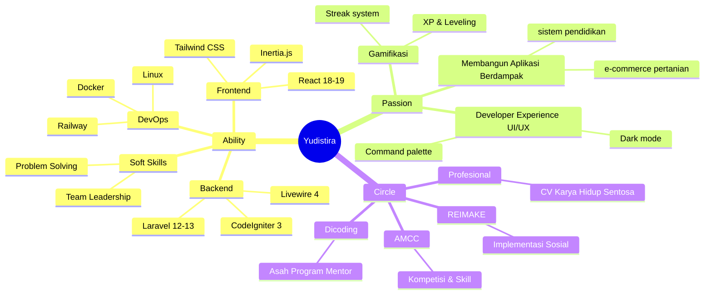
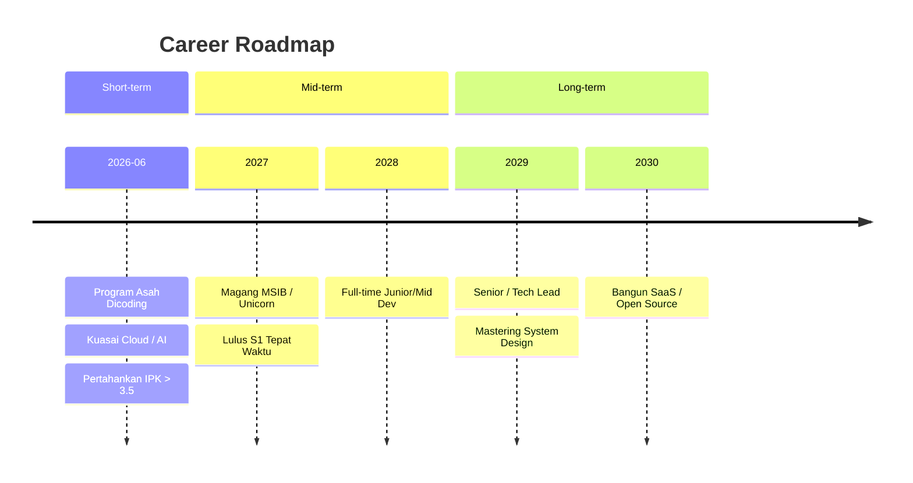

# Career Mapping & Personal Analysis
**Nama:** Yudistira Azfa Dani Wibowo  
**Fokus Karir:** Full-Stack Web Developer / Software Engineer

---

## 1. Personal SWOT Analysis

### Strengths
*   **Pengalaman Praktis:** 12 bulan magang enterprise di CV KHS.
*   **Modern Stack:** Menguasai TALL Stack & React/Inertia.
*   **End-to-End:** Mampu handle Database, Backend, Frontend, hingga DevOps (Docker/Railway).
*   **Leadership:** Backend Lead di proyek TANAMI (tim 5 orang).

### Weaknesses
*   **Manajemen Waktu:** Ketersediaan waktu terbatas karena status mahasiswa aktif.
*   **Skala Enterprise Masif:** Belum berpengalaman di arsitektur raksasa (Microservices, Kubernetes).

### Opportunities
*   **Program Asah:** Akses sertifikasi industri & networking via Dicoding.
*   **Market Demand:** Permintaan tinggi untuk Laravel & React dev.
*   **Kompetisi:** Kesempatan menang hackathon untuk branding (seperti AMCC).

### Threats
*   **AI Coding Assistants:** Kompetisi ketat di level entry; dituntut mahir problem-solving.
*   **Lulusan IT:** Persaingan tinggi dari bootcamp & kampus lain dengan portofolio serupa.

---

## 2. Ability, Passion & Circle

### ⚡ Ability
*   **Backend:** Laravel 12-13, Livewire 4, CodeIgniter 3
*   **Frontend:** React 18-19, Inertia.js, Tailwind CSS
*   **DevOps:** Docker, Railway, Linux
*   **Soft Skills:** Problem Solving, Team Leadership

### ❤️ Passion
*   **Aplikasi Berdampak:** E-commerce & Pendidikan
*   **Developer Experience:** Dark mode, Command palette
*   **Gamifikasi:** XP, Leveling, Streak system

### 🤝 Circle
*   **AMCC:** Kompetisi & Skill
*   **REIMAKE:** Implementasi Sosial
*   **CV KHS:** Profesional Industri
*   **Dicoding:** Asah Program Mentor

---

## 3. Career Roadmap

### Short-term (2026)
*   Lulus dengan memuaskan di program "Asah led by Dicoding"
*   Kuasai skill baru high-value (Cloud Computing AWS/GCP atau AI Integration)
*   Pertahankan IPK di atas 3.5

### Mid-term (2027 - 2028)
*   Magang kampus merdeka (MSIB) atau part-time di startup unicorn / tech company ternama
*   Lulus S1 Sistem Informasi tepat waktu dengan skripsi yang bisa dikomersialkan
*   Mendapatkan posisi Full-time Junior / Mid-level Software Engineer langsung setelah lulus

### Long-term (2029 - 2030+)
*   Menjadi Senior Software Engineer atau Tech Lead
*   Memiliki pemahaman mendalam tentang Software Architecture, System Design, dan Scalability
*   Berkontribusi di proyek Open Source berdampak atau membangun startup SaaS sendiri
