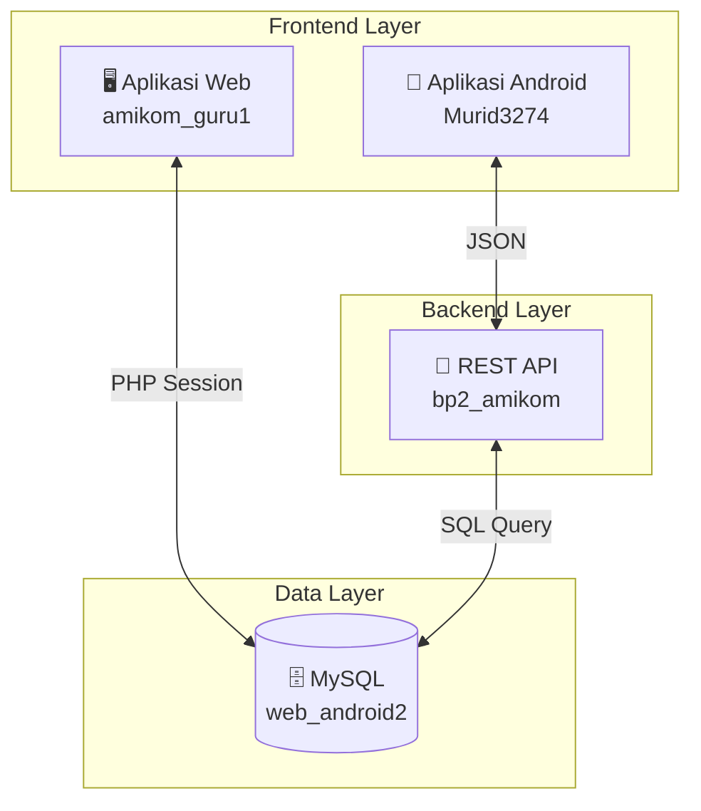
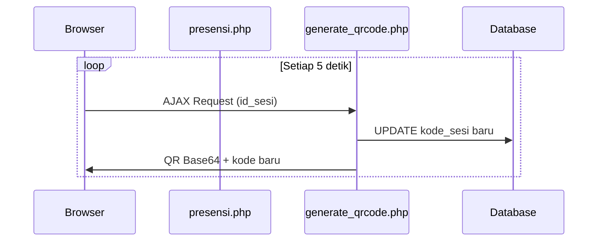
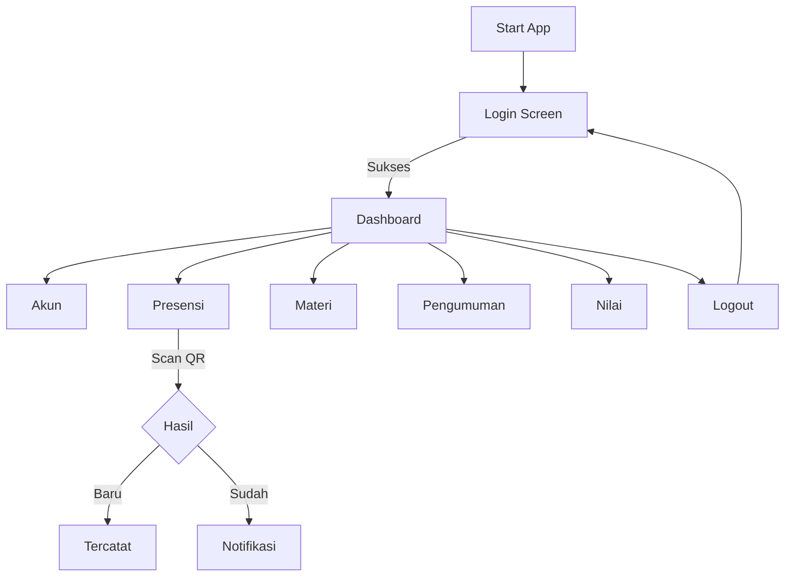
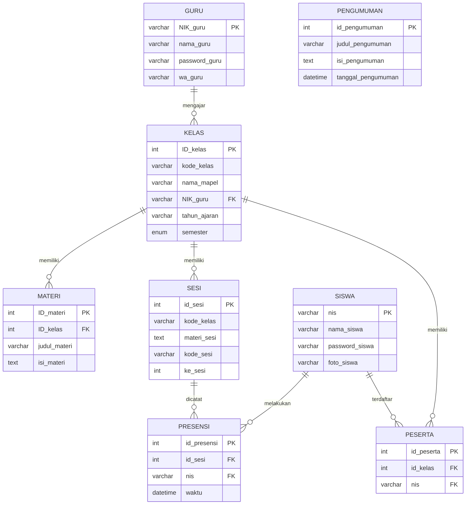

# Laporan Lengkap Sistem Presensi QR Code AMIKOM

**Proyek:** BP2 AMIKOM  
**Dibuat:** 28 Januari 2026  
**Penulis:** Azfa

---

## 1. Pendahuluan

Sistem Presensi QR Code AMIKOM adalah sebuah platform terintegrasi yang terdiri dari tiga komponen utama:

1. **Aplikasi Web Guru** (`amikom_guru1`) - Dashboard untuk manajemen kelas dan presensi
2. **Backend API** (`bp2_amikom`) - REST API penghubung Android dan database
3. **Aplikasi Android Siswa** (`murid3274`) - Mobile app untuk presensi dan akses akademik

Ketiga komponen ini saling terhubung menggunakan database **MySQL** (`web_android2`) dan berkomunikasi melalui protokol **HTTP POST** dengan format **JSON**.

---

## 2. Arsitektur Sistem



### Alur Komunikasi:

| Komponen      | Komunikasi        | Target             |
| ------------- | ----------------- | ------------------ |
| Android → API | HTTP POST + JSON  | `bp2_amikom/*.php` |
| Web Guru → DB | Native PHP mysqli | Database langsung  |
| API → DB      | Native PHP mysqli | Database langsung  |

---

## 3. Komponen 1: Aplikasi Web Guru

**Direktori:** `/var/www/html/amikom_guru1/`

### 3.1 Teknologi

| Komponen | Teknologi                                           |
| -------- | --------------------------------------------------- |
| Backend  | PHP Native                                          |
| Frontend | HTML, CSS, Bootstrap 5, JavaScript                  |
| Library  | `chillerlan/php-qrcode`, `phpoffice/phpspreadsheet` |

### 3.2 Fitur Utama

| No  | Fitur                 | Deskripsi                        |
| --- | --------------------- | -------------------------------- |
| 1   | Login Guru            | Autentikasi NIK + Password       |
| 2   | Dashboard             | Menu navigasi 4 aksi utama       |
| 3   | Manajemen Kelas       | CRUD kelas, lihat sesi, rekap    |
| 4   | Import Peserta        | Upload Excel (.xlsx/.xls)        |
| 5   | Buat Sesi             | Form sesi baru (materi, bahasan) |
| 6   | **QR Dinamis**        | QR berubah tiap 5 detik          |
| 7   | Daftar Hadir Realtime | Auto-refresh tiap 1 detik        |
| 8   | Batalkan Presensi     | Hapus via NIS atau ID            |

### 3.3 Fitur Unggulan: QR Code Dinamis



**Keunggulan:**

- QR tidak bisa di-screenshot karena terus berubah
- Kode sesi di database selalu sinkron
- Countdown timer visual

### 3.4 Kredensial Login

```
NIK: 190302684
Password: password123
```

---

## 4. Komponen 2: Backend API

**Direktori:** `/var/www/html/bp2_amikom/`

### 4.1 Daftar Endpoint

| Endpoint             | Fungsi               | Kode Akses  |
| -------------------- | -------------------- | ----------- |
| `login_siswa.php`    | Login siswa          | `amikomoke` |
| `get_siswa.php`      | Ambil profil siswa   | `amikomoke` |
| `update_siswa.php`   | Update nama/password | `amikomoke` |
| `presensi_siswa.php` | Catat kehadiran      | `amikomoke` |
| `get_materi.php`     | Daftar materi        | `amikom`    |
| `get_pengumuman.php` | Daftar pengumuman    | `azfa`      |

### 4.2 Format Request/Response

**Request:** HTTP POST dengan parameter:

```
kode=amikomoke&nis=24.12.2001&password_siswa=password123
```

**Response Sukses:**

```json
{
  "hasil": "sukses",
  "data": {
    "nis": "24.12.2001",
    "nama_siswa": "Aditya Rahman",
    "foto_siswa": "default.jpg"
  }
}
```

**Response Gagal:**

```json
{
  "hasil": "gagal",
  "data": []
}
```

### 4.3 Contoh cURL

```bash
# Login
curl -X POST http://localhost/bp2_amikom/login_siswa.php \
  -d "kode=amikomoke" \
  -d "nis=24.12.2001" \
  -d "password_siswa=password123"

# Presensi
curl -X POST http://localhost/bp2_amikom/presensi_siswa.php \
  -d "kode=amikomoke" \
  -d "nis=24.12.2001" \
  -d "kode_sesi=gf8p2"
```

---

## 5. Komponen 3: Aplikasi Android Siswa

**Package:** `murid3274`

### 5.1 Teknologi

| Komponen    | Teknologi                    |
| ----------- | ---------------------------- |
| Platform    | Android Native               |
| Bahasa      | Kotlin                       |
| HTTP Client | Volley                       |
| QR Scanner  | ZXing (journeyapps)          |
| UI          | CardView, Fragment, GridView |

### 5.2 Fitur Aplikasi

| Menu          | Fungsi                     | Activity        |
| ------------- | -------------------------- | --------------- |
| 🔐 Login      | Autentikasi NIS + Password | `Login.kt`      |
| 🏠 Dashboard  | Menu utama 6 fitur         | `Dashboard.kt`  |
| 👤 Akun       | Lihat/edit profil          | `Akun.kt`       |
| ✅ Presensi   | Scan QR Code               | `Presensi.kt`   |
| 📖 Materi     | GridView materi            | `Materi.kt`     |
| 📢 Pengumuman | ListView pengumuman        | `Pengumuman.kt` |
| 📊 Nilai      | Tab UTS/UAS                | `Nilai.kt`      |

### 5.3 Flow Diagram



### 5.4 Dependencies

```kotlin
dependencies {
    implementation("com.android.volley:volley:1.2.1")
    implementation("com.journeyapps:zxing-android-embedded:4.3.0")
    implementation("com.google.android.material:material:1.9.0")
}
```

---

## 6. Struktur Database

**Nama Database:** `web_android2`

### 6.1 Entity Relationship Diagram



### 6.2 Ringkasan Tabel

| No  | Tabel        | Fungsi               | PK            |
| --- | ------------ | -------------------- | ------------- |
| 1   | `guru`       | Data guru/dosen      | NIK_guru      |
| 2   | `siswa`      | Data siswa           | nis           |
| 3   | `kelas`      | Kelas/mata pelajaran | ID_kelas      |
| 4   | `materi`     | Materi per kelas     | ID_materi     |
| 5   | `sesi`       | Pertemuan/sesi       | id_sesi       |
| 6   | `peserta`    | Relasi siswa-kelas   | id_peserta    |
| 7   | `presensi`   | Catatan kehadiran    | id_presensi   |
| 8   | `pengumuman` | Pengumuman umum      | id_pengumuman |

---

## 7. Keamanan

### 7.1 Mekanisme Saat Ini

| Aspek           | Implementasi                                |
| --------------- | ------------------------------------------- |
| Password        | SHA1 Hash                                   |
| Session Web     | PHP Session                                 |
| Session Android | SharedPreferences                           |
| API Auth        | Static Code (`amikomoke`, `amikom`, `azfa`) |
| Anti-Cheat      | QR dinamis 5 detik                          |

### 7.2 Catatan Keamanan

> [!WARNING]
> **Potensi Kerentanan:**
>
> 1. SQL Injection - Query tanpa prepared statements
> 2. Kode akses statis di-hardcode
> 3. SHA1 tidak direkomendasikan untuk password

### 7.3 Rekomendasi

1. Gunakan **Prepared Statements** (`mysqli_prepare`)
2. Implementasi **JWT Token** untuk API
3. Gunakan **password_hash()** dengan bcrypt/argon2
4. Aktifkan **HTTPS** untuk production

---

## 8. Struktur File Proyek

### Web Guru (`amikom_guru1/`)

```
├── login.php          # Login
├── index.php          # Dashboard
├── kelas.php          # Manajemen kelas
├── sesi.php           # Form sesi baru
├── presensi.php       # QR Code dinamis
├── peserta.php        # Import Excel
└── vendor/            # Composer dependencies
```

### API (`bp2_amikom/`)

```
├── koneksi.php        # DB connection
├── login_siswa.php    # Login API
├── get_siswa.php      # Get profile
├── update_siswa.php   # Update profile
├── presensi_siswa.php # Record attendance
├── get_materi.php     # Get materials
└── get_pengumuman.php # Get announcements
```

### Android (`murid3274/`)

```
├── Login.kt           # Login activity
├── Dashboard.kt       # Main menu
├── Akun.kt            # Profile
├── Presensi.kt        # QR Scanner
├── Materi.kt          # Materials list
├── Pengumuman.kt      # Announcements
└── Nilai.kt           # Grades (UTS/UAS)
```

---

## 9. Ringkasan Fitur

| No  | Fitur                | Web Guru | API | Android |
| --- | -------------------- | :------: | :-: | :-----: |
| 1   | Login                |    ✅    | ✅  |   ✅    |
| 2   | Manajemen Kelas      |    ✅    |  -  |    -    |
| 3   | Import Peserta Excel |    ✅    |  -  |    -    |
| 4   | QR Code Dinamis      |    ✅    |  -  |    -    |
| 5   | Scan Presensi        |    -     | ✅  |   ✅    |
| 6   | Lihat Profil         |    -     | ✅  |   ✅    |
| 7   | Edit Profil          |    -     | ✅  |   ✅    |
| 8   | Lihat Materi         |    -     | ✅  |   ✅    |
| 9   | Lihat Pengumuman     |    -     | ✅  |   ✅    |
| 10  | Lihat Nilai          |    -     |  -  |   ✅    |

---

## 10. Kesimpulan

Sistem Presensi QR Code AMIKOM berhasil mengintegrasikan tiga platform berbeda:

- **Web Guru** menyediakan dashboard lengkap untuk manajemen kelas dengan fitur unggulan QR Code Dinamis yang mencegah kecurangan presensi.
- **Backend API** menjadi penghubung yang menyediakan 6 endpoint RESTful untuk aplikasi Android.
- **Aplikasi Android** memberikan kemudahan bagi siswa untuk melakukan presensi, mengakses materi, dan melihat pengumuman secara mobile.

Ketiganya berjalan di atas database MySQL yang sama (`web_android2`) dengan 8 tabel yang saling berelasi, menciptakan sistem informasi akademik yang terintegrasi dan efisien.

---

**© 2026 BP2 AMIKOM - Sistem Presensi QR Code**
