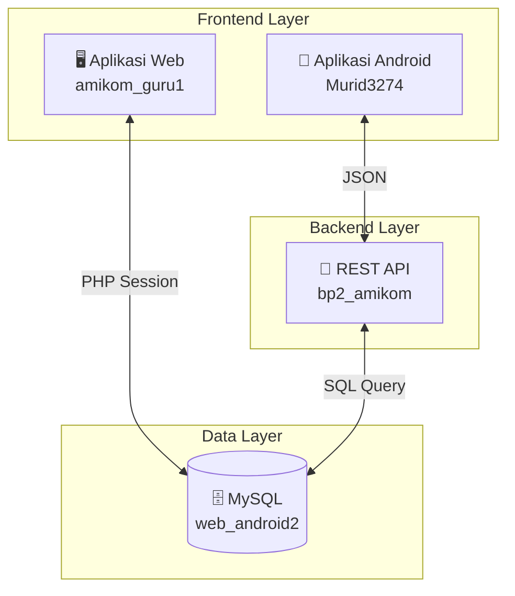
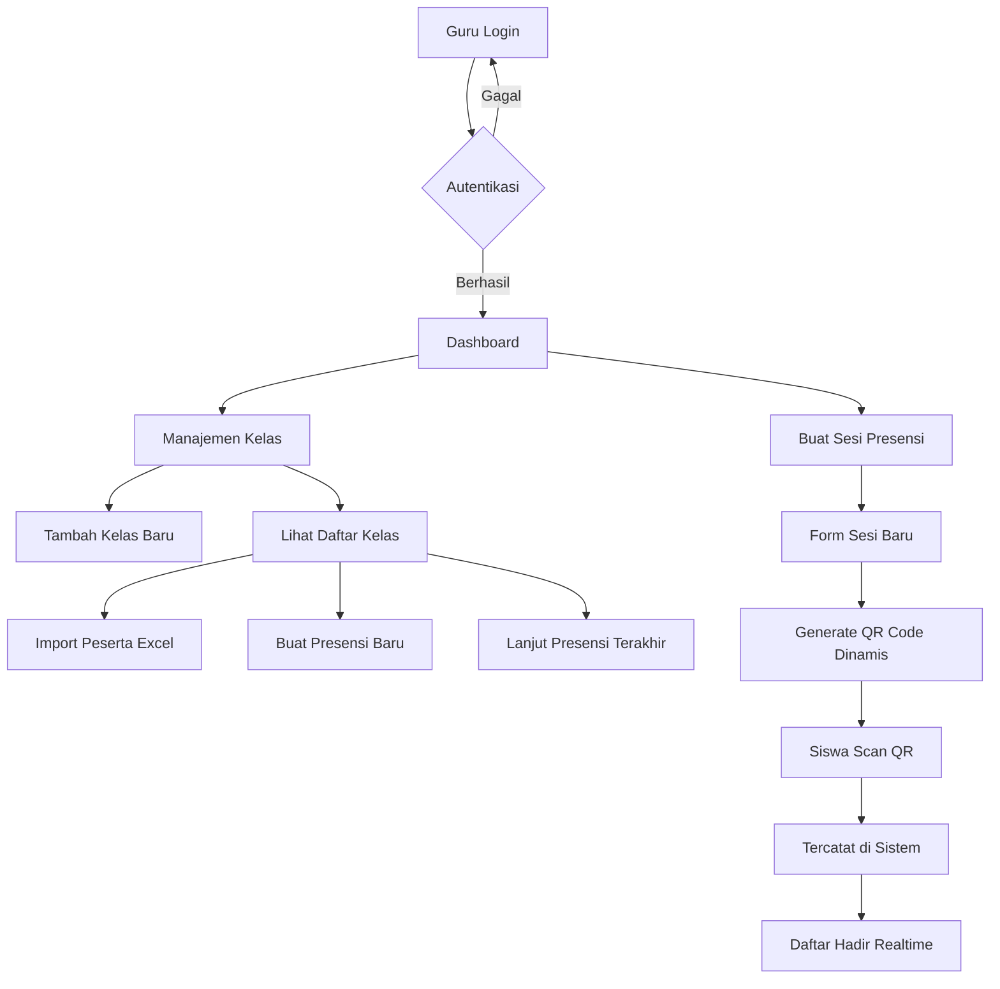
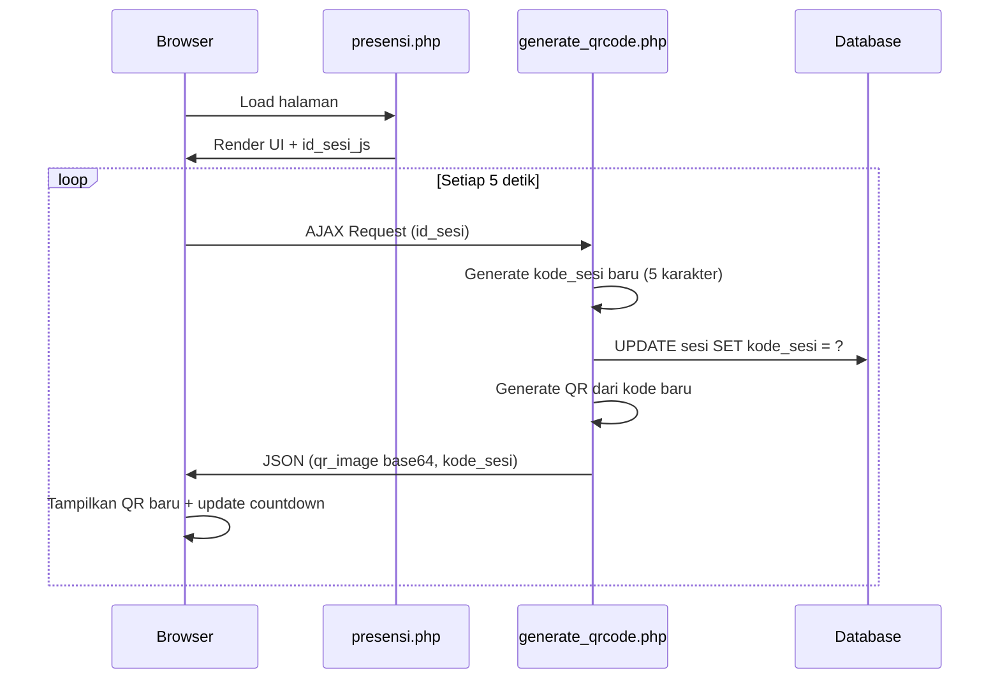
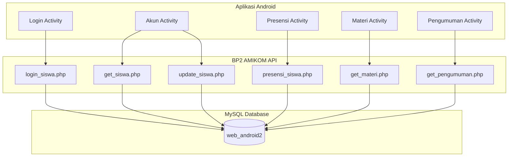
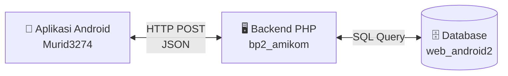
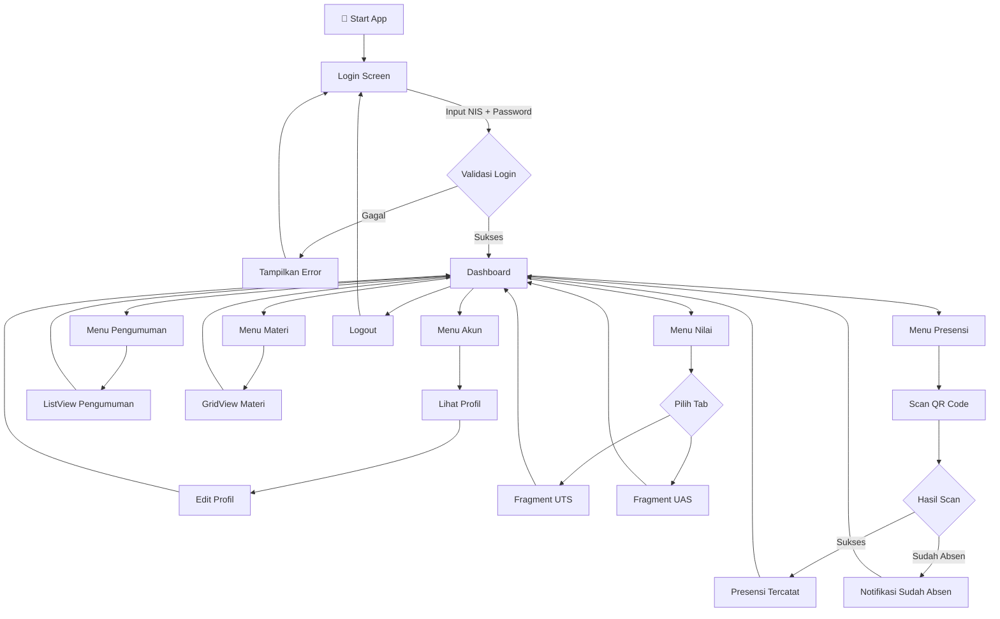
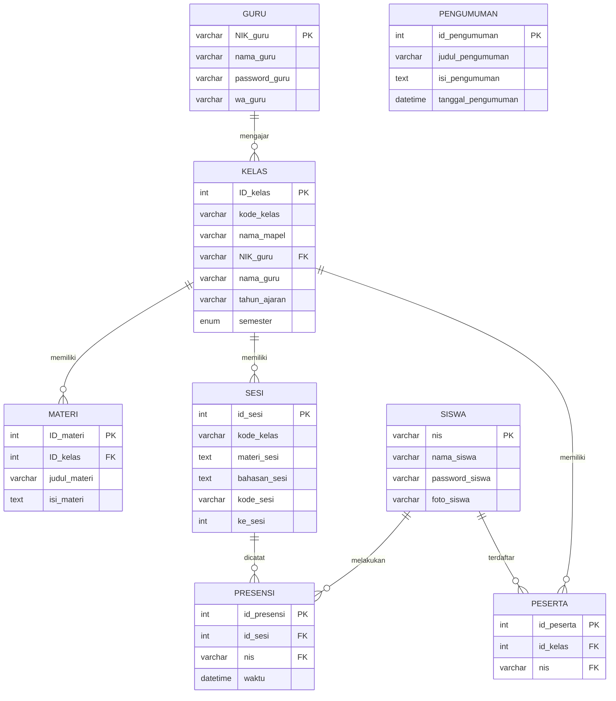

# Laporan Lengkap Sistem Presensi QR Code AMIKOM

**Proyek:** BP2 AMIKOM  
**Dibuat:** 28 Januari 2026  
**Penulis:** Azfa

---

## 1. Pendahuluan

Sistem Presensi QR Code AMIKOM adalah sebuah platform terintegrasi yang terdiri dari tiga komponen utama:

1. **Aplikasi Web Guru** (`amikom_guru1`) - Dashboard untuk manajemen kelas dan presensi
2. **Backend API** (`bp2_amikom`) - REST API penghubung Android dan database
3. **Aplikasi Android Siswa** (`murid3274`) - Mobile app untuk presensi dan akses akademik

Ketiga komponen ini saling terhubung menggunakan database **MySQL** (`web_android2`) dan berkomunikasi melalui protokol **HTTP POST** dengan format **JSON**.

---

## 2. Arsitektur Sistem



### Alur Komunikasi:

| Komponen      | Komunikasi        | Target             |
| ------------- | ----------------- | ------------------ |
| Android → API | HTTP POST + JSON  | `bp2_amikom/*.php` |
| Web Guru → DB | Native PHP mysqli | Database langsung  |
| API → DB      | Native PHP mysqli | Database langsung  |

---

## 3. Komponen 1: Aplikasi Web Guru

**Direktori:** `/var/www/html/amikom_guru1/`

### 3.1 Teknologi yang Digunakan

| Komponen      | Teknologi                          |
| ------------- | ---------------------------------- |
| Backend       | PHP Native                         |
| Frontend      | HTML, CSS, Bootstrap 5, JavaScript |
| Database      | MySQL                              |
| Library QR    | `chillerlan/php-qrcode`            |
| Library Excel | `phpoffice/phpspreadsheet`         |
| AJAX          | jQuery                             |

### 3.2 Alur Kerja Sistem



### 3.3 Fitur-Fitur Lengkap

#### 3.3.1 🔐 Autentikasi Guru

**File:** `login.php`

Guru login menggunakan **NIK** dan **Password**. Validasi dilakukan dengan query ke tabel `guru`. Session disimpan untuk akses halaman terproteksi dan redirect otomatis ke dashboard setelah login berhasil.

**Kredensial Contoh:**

```
NIK: 190302684
Password: password123
```

---

#### 3.3.2 🏠 Dashboard Utama

**File:** `index.php`

Menampilkan menu utama berupa card navigation:

| Menu       | Deskripsi                |
| ---------- | ------------------------ |
| **Akun**   | Kelola profil guru       |
| **Sesi**   | Buat sesi presensi baru  |
| **Kelas**  | Kelola kelas yang diajar |
| **Logout** | Keluar dari sistem       |

---

#### 3.3.3 📚 Manajemen Kelas

**File:** `kelas.php`

**Fitur:**

- **Lihat daftar kelas** yang diajar oleh guru yang login
- **Tambah kelas baru** via tombol "Tambah Kelas"
- **Kelola peserta** - masuk ke halaman import peserta
- **Rekap presensi** - lihat rekap kehadiran per kelas
- **Mulai presensi** - buat sesi baru untuk presensi
- **Lanjut presensi** - lanjutkan sesi terakhir yang sudah ada

**Informasi yang Ditampilkan:**

| Kolom          | Keterangan                           |
| -------------- | ------------------------------------ |
| Kode Kelas     | Kode unik kelas (misal: TI-101)      |
| Mata Pelajaran | Nama mata pelajaran                  |
| Tahun Ajaran   | Periode akademik                     |
| Semester       | Ganjil/Genap                         |
| Jumlah Sesi    | Total pertemuan yang sudah dilakukan |

---

#### 3.3.4 👥 Import Peserta Kelas

**File:** `peserta.php`

**Fitur:**

- **Lihat daftar peserta** yang sudah terdaftar di kelas
- **Import dari Excel** - upload file .xlsx/.xls

**Format File Excel:**

| Kolom A    | Kolom B        |
| ---------- | -------------- |
| NIS        | Nama Siswa     |
| 24.12.2001 | Aditya Rahman  |
| 24.12.2002 | Bella Fitriani |

**Proses Import:**

1. Sistem membaca file Excel yang diupload
2. Untuk setiap baris:
   - Cek apakah siswa sudah ada di tabel `siswa`
   - Jika belum ada, tambahkan ke tabel `siswa` dengan password = SHA1(NIS)
   - Tambahkan relasi ke tabel `peserta` untuk mengaitkan siswa dengan kelas

---

#### 3.3.5 ➕ Buat Sesi Presensi

**File:** `sesi.php`

**Form Input:**

| Field    | Keterangan                                   |
| -------- | -------------------------------------------- |
| Kelas    | Dropdown pilihan kelas yang diajar           |
| Sesi Ke- | Urutan pertemuan (auto-increment dari kelas) |
| Materi   | Judul materi yang akan dibahas               |
| Bahasan  | Deskripsi detail materi                      |

**Proses:**

1. Guru mengisi form sesi baru
2. Sistem generate `kode_sesi` unik (5 karakter acak)
3. Data disimpan ke tabel `sesi`
4. Redirect ke halaman presensi dengan QR Code

---

#### 3.3.6 📲 QR Code Dinamis (Fitur Unggulan!)

**Files:** `presensi.php`, `generate_qrcode.php`, `footer.php`

**Cara Kerja QR Code Dinamis:**



**Keunggulan Sistem:**

| Aspek          | Penjelasan                                       |
| -------------- | ------------------------------------------------ |
| **Anti Cheat** | QR berubah setiap 5 detik, tidak bisa screenshot |
| **Realtime**   | Kode sesi di database selalu up-to-date          |
| **Smooth UX**  | Countdown timer memberi feedback visual          |
| **Otomatis**   | Tidak perlu refresh manual oleh guru             |

**Komponen JavaScript:**

```javascript
// Countdown dari 5 ke 0
setInterval(function () {
  countdown--;
  if (countdown <= 0) {
    updateQRCode(); // Request QR baru
  }
}, 1000);
```

---

#### 3.3.7 ✅ Daftar Kehadiran Realtime

**File:** `presensi_peserta.php`

**Fitur:**

- Menampilkan siswa yang sudah scan QR beserta waktu kehadiran
- **Auto-refresh setiap 1 detik** via AJAX
- Tombol hapus untuk membatalkan presensi siswa

**Aksi yang Tersedia:**

| Aksi                 | Keterangan                                  |
| -------------------- | ------------------------------------------- |
| **Batalkan Manual**  | Input NIS untuk batalkan presensi via modal |
| **Hapus dari Tabel** | Klik tombol hapus di baris siswa            |

---

#### 3.3.8 🚫 Batalkan Presensi

**File:** `hapus_presensi.php`

**Dua Metode:**

1. **Via ID Presensi** - Hapus berdasarkan id_presensi spesifik
2. **Via NIS + Sesi** - Hapus berdasarkan kombinasi NIS dan id_sesi

---

### 3.4 Struktur File Web Guru

```
amikom_guru1/
├── index.php          # Dashboard utama
├── login.php          # Halaman login
├── logout.php         # Handler logout
├── koneksi.php        # Koneksi database
├── header.php         # Template header + navbar
├── footer.php         # Template footer + JS QR dinamis
│
├── kelas.php          # Manajemen kelas
├── tambah_kelas.php   # Form tambah kelas baru
│
├── sesi.php           # Form buat sesi presensi
├── presensi.php       # Halaman QR Code + daftar hadir
├── presensi_peserta.php # AJAX endpoint daftar hadir
├── generate_qrcode.php  # AJAX endpoint generate QR
│
├── peserta.php        # Import peserta dari Excel
├── hapus_peserta.php  # Hapus peserta dari kelas
├── hapus_presensi.php # Batalkan presensi siswa
│
├── vendor/            # Dependencies (Composer)
├── images/            # Gambar logo dll
└── composer.json      # Dependency manager
```

---

## 4. Komponen 2: Backend API

**Direktori:** `/var/www/html/bp2_amikom/`

### 4.1 Konfigurasi Database

**File:** `koneksi.php`

| Parameter | Nilai              |
| --------- | ------------------ |
| Host      | `localhost`        |
| User      | `root`             |
| Database  | `web_android2`     |
| Koneksi   | `mysqli_connect()` |

### 4.2 Daftar Endpoint API

| No  | Endpoint             | Fungsi                  | Method | Kode Akses  |
| --- | -------------------- | ----------------------- | ------ | ----------- |
| 1   | `login_siswa.php`    | Login siswa             | POST   | `amikomoke` |
| 2   | `get_siswa.php`      | Mengambil data siswa    | POST   | `amikomoke` |
| 3   | `update_siswa.php`   | Update data siswa       | POST   | `amikomoke` |
| 4   | `presensi_siswa.php` | Mencatat presensi       | POST   | `amikomoke` |
| 5   | `get_materi.php`     | Mengambil daftar materi | POST   | `amikom`    |
| 6   | `get_pengumuman.php` | Mengambil pengumuman    | POST   | `azfa`      |

### 4.3 Detail Endpoint API

#### 4.3.1 Login Siswa

**Endpoint:** `/login_siswa.php`  
**Method:** `POST`  
**Deskripsi:** Melakukan autentikasi siswa berdasarkan NIS dan password.

**Request Parameters:**

| Parameter        | Tipe   | Wajib | Keterangan                           |
| ---------------- | ------ | ----- | ------------------------------------ |
| `kode`           | String | Ya    | Kode akses API = `amikomoke`         |
| `nis`            | String | Ya    | Nomor Induk Siswa                    |
| `password_siswa` | String | Ya    | Password siswa (di-hash dengan SHA1) |

**Response Sukses:**

```json
{
  "hasil": "sukses",
  "data": {
    "nis": "24.12.2001",
    "nama_siswa": "Aditya Rahman",
    "password_siswa": "40869821f65a4fb6b83e567434f4adb78078f821",
    "foto_siswa": "default.jpg"
  }
}
```

**Response Gagal:**

```json
{
  "hasil": "gagal",
  "data": []
}
```

**Contoh Request (cURL):**

```bash
curl -X POST http://localhost/bp2_amikom/login_siswa.php \
  -d "kode=amikomoke" \
  -d "nis=24.12.2001" \
  -d "password_siswa=password123"
```

---

#### 4.3.2 Get Data Siswa

**Endpoint:** `/get_siswa.php`  
**Method:** `POST`  
**Deskripsi:** Mengambil data profil siswa berdasarkan NIS.

**Request Parameters:**

| Parameter | Tipe   | Wajib | Keterangan                   |
| --------- | ------ | ----- | ---------------------------- |
| `kode`    | String | Ya    | Kode akses API = `amikomoke` |
| `nis`     | String | Ya    | Nomor Induk Siswa            |

**Response Sukses:**

```json
{
  "hasil": "sukses",
  "data": {
    "nis": "24.12.2003",
    "nama_siswa": "Citra Amelia",
    "foto_siswa": "default.jpg"
  }
}
```

**Contoh Request (cURL):**

```bash
curl -X POST http://localhost/bp2_amikom/get_siswa.php \
  -d "kode=amikomoke" \
  -d "nis=24.12.2003"
```

---

#### 4.3.3 Update Data Siswa

**Endpoint:** `/update_siswa.php`  
**Method:** `POST`  
**Deskripsi:** Memperbarui data profil siswa (nama dan/atau password).

**Request Parameters:**

| Parameter        | Tipe   | Wajib | Keterangan                                    |
| ---------------- | ------ | ----- | --------------------------------------------- |
| `kode`           | String | Ya    | Kode akses API = `amikomoke`                  |
| `nis`            | String | Ya    | Nomor Induk Siswa                             |
| `nama_siswa`     | String | Ya    | Nama lengkap siswa                            |
| `password_siswa` | String | Tidak | Password baru (opsional, di-hash dengan SHA1) |

**Logic Flow:**

1. Cek apakah siswa dengan NIS tersebut ada di database
2. Jika password_siswa diisi → Update nama_siswa dan password_siswa (di-hash SHA1)
3. Jika password_siswa kosong → Hanya update nama_siswa

**Contoh Request - Update nama saja:**

```bash
curl -X POST http://localhost/bp2_amikom/update_siswa.php \
  -d "kode=amikomoke" \
  -d "nis=24.12.2001" \
  -d "nama_siswa=Aditya Rahman Updated"
```

**Contoh Request - Update nama dan password:**

```bash
curl -X POST http://localhost/bp2_amikom/update_siswa.php \
  -d "kode=amikomoke" \
  -d "nis=24.12.2001" \
  -d "nama_siswa=Aditya Rahman Updated" \
  -d "password_siswa=newpassword123"
```

---

#### 4.3.4 Presensi Siswa

**Endpoint:** `/presensi_siswa.php`  
**Method:** `POST`  
**Deskripsi:** Mencatat kehadiran siswa pada sesi tertentu berdasarkan kode QR sesi.

**Request Parameters:**

| Parameter   | Tipe   | Wajib | Keterangan                        |
| ----------- | ------ | ----- | --------------------------------- |
| `kode`      | String | Ya    | Kode akses API = `amikomoke`      |
| `nis`       | String | Ya    | Nomor Induk Siswa                 |
| `kode_sesi` | String | Ya    | Kode sesi presensi (dari QR code) |

**Logic Flow:**

1. Validasi siswa dengan NIS
2. Validasi sesi dengan kode_sesi
3. Cek apakah siswa sudah presensi pada sesi tersebut
4. Jika belum, insert record presensi baru
5. Jika sudah, kembalikan status "sudah"

**Response Sukses (Presensi Berhasil):**

```json
{ "hasil": "sukses", "data": [] }
```

**Response Sudah Presensi:**

```json
{ "hasil": "sudah", "data": [] }
```

**Contoh Request (cURL):**

```bash
curl -X POST http://localhost/bp2_amikom/presensi_siswa.php \
  -d "kode=amikomoke" \
  -d "nis=24.12.2001" \
  -d "kode_sesi=gf8p2"
```

---

#### 4.3.5 Get Materi Pembelajaran

**Endpoint:** `/get_materi.php`  
**Method:** `POST`  
**Deskripsi:** Mengambil daftar semua materi pembelajaran beserta informasi kelas terkait.

**Request Parameters:**

| Parameter | Tipe   | Wajib | Keterangan                |
| --------- | ------ | ----- | ------------------------- |
| `kode`    | String | Ya    | Kode akses API = `amikom` |

> ⚠️ **Perhatian:** Endpoint ini menggunakan kode akses berbeda: `amikom` (bukan `amikomoke`)

**Response Sukses:**

```json
{
  "data": [
    {
      "ID_materi": "1",
      "judul_materi": "Pengenalan HTML",
      "isi_materi": "Materi dasar tentang struktur HTML.",
      "nama_mapel": "Pemrograman Web",
      "nama_guru": "Acihmah Sidauruk, S.Kom., M.Kom",
      "tahun_ajaran": "2024/2025",
      "semester": "ganjil"
    }
  ]
}
```

**Relasi Database (SQL Query):**

```sql
SELECT
    materi.ID_materi,
    materi.judul_materi,
    materi.isi_materi,
    kelas.nama_mapel,
    kelas.nama_guru,
    kelas.tahun_ajaran,
    kelas.semester
FROM materi
LEFT JOIN kelas ON materi.ID_kelas = kelas.ID_kelas
```

**Contoh Request (cURL):**

```bash
curl -X POST http://localhost/bp2_amikom/get_materi.php \
  -d "kode=amikom"
```

---

#### 4.3.6 Get Pengumuman

**Endpoint:** `/get_pengumuman.php`  
**Method:** `POST`  
**Deskripsi:** Mengambil daftar semua pengumuman yang tersedia.

**Request Parameters:**

| Parameter | Tipe   | Wajib | Keterangan              |
| --------- | ------ | ----- | ----------------------- |
| `kode`    | String | Ya    | Kode akses API = `azfa` |

> ⚠️ **Perhatian:** Endpoint ini menggunakan kode akses berbeda: `azfa`

**Response Sukses:**

```json
{
  "hasil": "success",
  "data": [
    {
      "id_pengumuman": "1",
      "judul_pengumuman": "Jadwal UAS",
      "isi_pengumuman": "UAS akan dilaksanakan mulai tanggal 20 Desember 2024.",
      "tanggal_pengumuman": "2024-12-01 08:00:00"
    }
  ]
}
```

**Contoh Request (cURL):**

```bash
curl -X POST http://localhost/bp2_amikom/get_pengumuman.php \
  -d "kode=azfa"
```

---

### 4.4 Diagram Arsitektur API



---

## 5. Komponen 3: Aplikasi Android Siswa

**Package:** `murid3274`

### 5.1 Teknologi yang Digunakan

| Komponen           | Teknologi                              |
| ------------------ | -------------------------------------- |
| Platform           | Android (Native)                       |
| Bahasa Pemrograman | Kotlin                                 |
| HTTP Client        | Volley Library                         |
| Database           | MySQL (via PHP API)                    |
| QR Scanner         | ZXing (journeyapps barcodescanner)     |
| UI Components      | CardView, Fragment, GridView, ListView |

### 5.2 Arsitektur Sistem



**Alur Data:**

1. Aplikasi mengirim request POST ke API PHP
2. Backend PHP memproses dan query ke database MySQL
3. Response dikembalikan dalam format JSON
4. Aplikasi mem-parsing JSON dan menampilkan data

### 5.3 Fitur-Fitur Lengkap

#### 5.3.1 🔐 Login

**File:** `Login.kt`

**Fungsi:** Autentikasi siswa menggunakan NIS dan Password.

**Cara Kerja:**

1. Siswa memasukkan NIS dan Password
2. Aplikasi mengirim data ke API `login_siswa.php`
3. Backend memverifikasi kredensial dengan hash SHA1
4. Jika sukses, data siswa disimpan ke **SharedPreferences** (session)
5. Siswa diarahkan ke halaman Dashboard

**Endpoint API:** `POST /login_siswa.php`

**Data Session Tersimpan:**

- `nis` - Nomor Induk Siswa
- `nama_siswa` - Nama lengkap siswa
- `foto_siswa` - Nama file foto profil

---

#### 5.3.2 🏠 Dashboard (Beranda)

**File:** `Dashboard.kt`

**Fungsi:** Menampilkan menu utama aplikasi.

**Fitur:**

- Menampilkan nama siswa dari session
- Menampilkan foto profil siswa
- Menyediakan navigasi ke 6 menu:

| Menu          | Deskripsi              | Activity         |
| ------------- | ---------------------- | ---------------- |
| 👤 Akun       | Kelola profil          | `Akun.kt`        |
| 📢 Pengumuman | Lihat pengumuman       | `Pengumuman.kt`  |
| 📖 Materi     | Lihat materi pelajaran | `Materi.kt`      |
| 📊 Nilai      | Lihat nilai UTS/UAS    | `Nilai.kt`       |
| ✅ Kehadiran  | Scan presensi QR       | `Presensi.kt`    |
| 🚪 Logout     | Keluar aplikasi        | Kembali ke Login |

---

#### 5.3.3 👤 Akun (Profil)

**File:** `Akun.kt`

**Fungsi:** Melihat dan mengubah data profil siswa.

**Cara Kerja:**

1. **Melihat Data:**
   - Aplikasi mengambil data siswa dari API `get_siswa.php`
   - Menampilkan NIS dan Nama siswa
2. **Mengubah Data:**
   - Siswa dapat mengubah Nama dan Password
   - Data dikirim ke API `update_siswa.php`
   - Setelah sukses, kembali ke Dashboard

**Endpoint API:**

- `POST /get_siswa.php` - Mengambil data siswa
- `POST /update_siswa.php` - Mengupdate data siswa

---

#### 5.3.4 ✅ Presensi (Kehadiran)

**File:** `Presensi.kt`

**Fungsi:** Melakukan presensi kehadiran dengan scan QR Code.

**Cara Kerja:**

1. Siswa menekan tombol "Scan QR Code"
2. Aplikasi meminta izin kamera
3. Kamera membaca QR Code yang berisi `kode_sesi`
4. Aplikasi mengirim data (NIS + kode_sesi) ke API `presensi_siswa.php`
5. Backend mencatat presensi dengan waktu saat ini
6. Menampilkan feedback:
   - ✅ "Presensi berhasil" - jika baru pertama kali
   - ⚠️ "Anda sudah melakukan presensi" - jika sudah tercatat

**Endpoint API:** `POST /presensi_siswa.php`

**Library QR Scanner:** `journeyapps:barcodescanner`

---

#### 5.3.5 📖 Materi

**File:** `Materi.kt`, `MateriItem.kt`

**Fungsi:** Menampilkan daftar materi pelajaran.

**Cara Kerja:**

1. Aplikasi mengambil data materi dari API `get_materi.php`
2. Data ditampilkan dalam **GridView**
3. Setiap item menampilkan:
   - Judul materi
   - Nama guru pengajar

**Endpoint API:** `POST /get_materi.php`

**Tampilan:** Grid 2 kolom dengan CardView

---

#### 5.3.6 📢 Pengumuman

**File:** `Pengumuman.kt`, `PengumumanItem.kt`

**Fungsi:** Menampilkan daftar pengumuman akademik.

**Cara Kerja:**

1. Aplikasi mengambil data dari API `get_pengumuman.php`
2. Data ditampilkan dalam **ListView**
3. Setiap item menampilkan:
   - Judul pengumuman
   - Tanggal pengumuman

**Endpoint API:** `POST /get_pengumuman.php`

---

#### 5.3.7 📊 Nilai

**File:** `Nilai.kt`, `Uts.kt`, `Uas.kt`

**Fungsi:** Menampilkan nilai ujian siswa.

**Cara Kerja:**

1. Halaman nilai menggunakan **Fragment** untuk tab navigasi
2. Terdapat 2 tab:
   - **UTS** - Nilai Ujian Tengah Semester
   - **UAS** - Nilai Ujian Akhir Semester
3. Klik tab untuk berpindah tampilan nilai

**Komponen UI:** `FragmentContainerView` + `MaterialButton`

---

### 5.4 Flow Diagram Aplikasi



### 5.5 Komponen UI

| Layout File      | Deskripsi                          |
| ---------------- | ---------------------------------- |
| `login.xml`      | Form login (NIS, Password, Button) |
| `dashboard.xml`  | Grid menu dengan 6 CardView        |
| `akun.xml`       | Form profil (NIS, Nama, Password)  |
| `presensi.xml`   | Tombol scan dan hasil              |
| `materi.xml`     | GridView untuk daftar materi       |
| `pengumuman.xml` | ListView untuk pengumuman          |
| `nilai.xml`      | Tab UTS/UAS dengan Fragment        |

### 5.6 Dependencies (build.gradle)

```kotlin
dependencies {
    // Volley - HTTP Client
    implementation("com.android.volley:volley:1.2.1")

    // ZXing - QR Code Scanner
    implementation("com.journeyapps:zxing-android-embedded:4.3.0")

    // Material Design
    implementation("com.google.android.material:material:1.9.0")

    // CardView
    implementation("androidx.cardview:cardview:1.0.0")
}
```

---

## 6. Struktur Database

**Nama Database:** `web_android2`

### 6.1 Entity Relationship Diagram



### 6.2 Deskripsi Tabel

| No  | Tabel        | Fungsi                              | Jumlah Kolom |
| --- | ------------ | ----------------------------------- | ------------ |
| 1   | `guru`       | Menyimpan data guru/dosen           | 4            |
| 2   | `siswa`      | Menyimpan data siswa                | 4            |
| 3   | `kelas`      | Menyimpan data kelas/mata pelajaran | 7            |
| 4   | `materi`     | Menyimpan materi per kelas          | 4            |
| 5   | `sesi`       | Menyimpan sesi/pertemuan kelas      | 6            |
| 6   | `peserta`    | Relasi siswa-kelas (many-to-many)   | 3            |
| 7   | `presensi`   | Mencatat kehadiran siswa per sesi   | 4            |
| 8   | `pengumuman` | Menyimpan pengumuman umum           | 4            |

---

## 7. Keamanan

### 7.1 Mekanisme Saat Ini

| Aspek           | Implementasi                                |
| --------------- | ------------------------------------------- |
| Password        | SHA1 Hash                                   |
| Session Web     | PHP Session                                 |
| Session Android | SharedPreferences                           |
| API Auth        | Static Code (`amikomoke`, `amikom`, `azfa`) |
| Anti-Cheat      | QR dinamis 5 detik                          |
| Access Control  | Setiap halaman cek session login            |

### 7.2 Catatan Keamanan

> [!WARNING]  
> **Potensi Kerentanan:**
>
> 1. **SQL Injection** - Query menggunakan string concatenation langsung tanpa prepared statements
> 2. **Kode Akses Statis** - Kode akses di-hardcode dalam kode
> 3. **SHA1 Hashing** - SHA1 sudah tidak direkomendasikan untuk password hashing
> 4. **Password Guru** - Masih disimpan dalam bentuk plain text

### 7.3 Rekomendasi Perbaikan

1. Gunakan **Prepared Statements** (`mysqli_prepare`) untuk mencegah SQL Injection
2. Implementasi **JWT Token** untuk autentikasi yang lebih aman
3. Gunakan **password_hash()** dengan algoritma **bcrypt** atau **argon2**
4. Implementasi **rate limiting** untuk mencegah brute force
5. Aktifkan **HTTPS** untuk production

---

## 8. Ringkasan Fitur

### 8.1 Matriks Fitur per Komponen

| No  | Fitur                     | Web Guru | API | Android |
| --- | ------------------------- | :------: | :-: | :-----: |
| 1   | Login/Logout              |    ✅    | ✅  |   ✅    |
| 2   | Dashboard Menu            |    ✅    |  -  |   ✅    |
| 3   | Manajemen Kelas           |    ✅    |  -  |    -    |
| 4   | Tambah Kelas Baru         |    ✅    |  -  |    -    |
| 5   | Import Peserta (Excel)    |    ✅    |  -  |    -    |
| 6   | Buat Sesi Presensi        |    ✅    |  -  |    -    |
| 7   | QR Code Dinamis (5 detik) |    ✅    |  -  |    -    |
| 8   | Daftar Hadir Realtime     |    ✅    |  -  |    -    |
| 9   | Batalkan Presensi         |    ✅    |  -  |    -    |
| 10  | Scan Presensi QR          |    -     | ✅  |   ✅    |
| 11  | Lihat/Edit Profil         |    -     | ✅  |   ✅    |
| 12  | Lihat Materi              |    -     | ✅  |   ✅    |
| 13  | Lihat Pengumuman          |    -     | ✅  |   ✅    |
| 14  | Lihat Nilai UTS/UAS       |    -     |  -  |   ✅    |

### 8.2 Status Pengembangan Web Guru

| No  | Fitur                     | Status                  |
| --- | ------------------------- | ----------------------- |
| 1   | Login/Logout Guru         | ✅                      |
| 2   | Dashboard Menu            | ✅                      |
| 3   | Manajemen Kelas           | ✅                      |
| 4   | Tambah Kelas Baru         | ✅                      |
| 5   | Import Peserta (Excel)    | ✅                      |
| 6   | Buat Sesi Presensi        | ✅                      |
| 7   | QR Code Dinamis (5 detik) | ✅                      |
| 8   | Daftar Hadir Realtime     | ✅                      |
| 9   | Batalkan Presensi         | ✅                      |
| 10  | Rekap Presensi            | 🔄 (Dalam pengembangan) |

---

## 9. Cara Menjalankan

### 9.1 Setup Database

```sql
CREATE DATABASE web_android2;
-- Import file web_android2.sql
```

### 9.2 Konfigurasi Web Guru

**File:** `amikom_guru1/koneksi.php`

```php
$koneksi = new mysqli("localhost", "root", "", "web_android2");
```

**Install Dependencies:**

```bash
cd amikom_guru1
composer install
```

**Akses Aplikasi:**

```
http://localhost/amikom_guru1/login.php
```

### 9.3 Konfigurasi API

**File:** `bp2_amikom/koneksi.php`

```php
$koneksi = mysqli_connect("localhost", "root", "", "web_android2");
```

### 9.4 Konfigurasi Android

**File:** `Backend.kt`

```kotlin
val url_utama: String = "http://192.168.1.72/bp2_amikom/"
val url_login_siswa: String = url_utama + "login_siswa.php"
val url_get_siswa: String = url_utama + "get_siswa.php"
val url_update_siswa: String = url_utama + "update_siswa.php"
val url_presensi: String = url_utama + "presensi_siswa.php"
val url_materi: String = url_utama + "get_materi.php"
val url_pengumuman: String = url_utama + "get_pengumuman.php"
```

---

## 10. Kesimpulan

Sistem Presensi QR Code AMIKOM berhasil mengintegrasikan tiga platform berbeda:

- **Web Guru** menyediakan dashboard lengkap untuk manajemen kelas dengan fitur unggulan QR Code Dinamis yang mencegah kecurangan presensi. QR Code berubah setiap 5 detik sehingga tidak bisa di-screenshot dan dibagikan.

- **Backend API** menjadi penghubung yang menyediakan 6 endpoint RESTful untuk aplikasi Android dengan format JSON. Setiap endpoint diamankan dengan kode akses statis.

- **Aplikasi Android Siswa** memberikan kemudahan bagi siswa untuk:
  - ✅ Login dengan NIS dan Password
  - ✅ Melihat dan mengubah profil
  - ✅ Melakukan presensi dengan scan QR Code
  - ✅ Melihat materi pelajaran
  - ✅ Melihat pengumuman akademik
  - ✅ Melihat nilai UTS dan UAS

Ketiganya berjalan di atas database MySQL yang sama (`web_android2`) dengan 8 tabel yang saling berelasi, menciptakan sistem informasi akademik yang terintegrasi dan efisien.

---

**Dibuat oleh:** Azfa  
**© 2026** Sistem Presensi QR Code - AMIKOM
