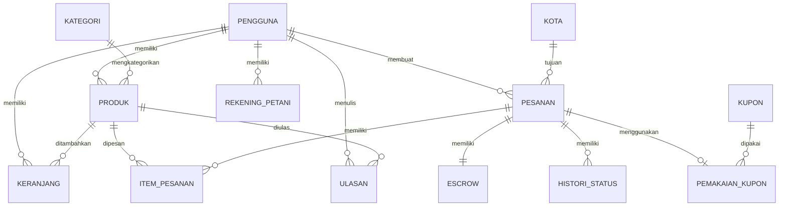

# 📋 MATERI LAPORAN FINAL PROJECT

## TANAMI - Platform E-Commerce Pertanian

---

# BAB I. PENDAHULUAN

## 1.1 Latar Belakang

Indonesia sebagai negara agraris memiliki potensi pertanian yang sangat besar. Namun, petani seringkali menghadapi kendala dalam memasarkan hasil panennya. Rantai distribusi yang panjang menyebabkan petani hanya mendapatkan sebagian kecil dari harga jual akhir, sementara konsumen harus membayar harga yang lebih tinggi.

Di era digital saat ini, e-commerce telah menjadi solusi untuk menghubungkan produsen langsung dengan konsumen. Dengan memanfaatkan teknologi web, petani dapat menjual produknya secara langsung kepada pembeli tanpa melalui banyak perantara.

**Tanami** hadir sebagai platform e-commerce khusus untuk produk pertanian yang menghubungkan **petani** langsung dengan **pembeli**. Nama "Tanami" berasal dari kata "tanam" yang mencerminkan esensi pertanian dan juga bermakna ajakan untuk "menanam" atau memulai.

## 1.2 Alasan Pemilihan Tema

1. **Relevansi Sosial**: Membantu petani mendapatkan akses pasar yang lebih luas
2. **Kebutuhan Pasar**: Permintaan produk pertanian segar yang meningkat, terutama pasca pandemi
3. **Kompleksitas Teknis**: Memerlukan berbagai fitur seperti multi-role user, sistem transaksi, escrow payment, dan manajemen stok
4. **Penerapan Laravel 12**: Menggunakan framework terbaru dengan fitur-fitur modern

## 1.3 Keunikan dan Value dari Project

### 🌟 Keunikan Tanami:

| Fitur                     | Deskripsi                                                                               |
| ------------------------- | --------------------------------------------------------------------------------------- |
| **Multi-Role System**     | 3 peran berbeda (Admin, Petani, Pembeli) dengan dashboard masing-masing                 |
| **Escrow Payment**        | Dana pembeli ditahan sampai pesanan selesai, melindungi kedua belah pihak               |
| **Stock Reserve System**  | Stok otomatis di-reserve saat checkout untuk mencegah overselling                       |
| **Auto-Complete Order**   | Pesanan otomatis selesai 3 hari setelah status "terkirim" jika pembeli tidak konfirmasi |
| **Payment Timeout**       | Pesanan otomatis dibatalkan jika tidak dibayar dalam 24 jam                             |
| **Refund System**         | Pembeli dapat mengajukan refund dengan alasan yang valid                                |
| **Kupon Diskon**          | Mendukung kupon nominal maupun persentase dengan validasi lengkap                       |
| **Order Status Tracking** | Histori perubahan status pesanan yang detail                                            |

### 💎 Value Proposition:

1. **Untuk Petani**: Akses langsung ke konsumen, tidak perlu melalui tengkulak
2. **Untuk Pembeli**: Produk pertanian segar langsung dari petani dengan harga lebih fair
3. **Untuk Admin**: Dashboard lengkap untuk monitoring dan pengelolaan platform

---

# BAB II. PEMBAHASAN

## 2.1 Software dan Perangkat yang Digunakan

### Backend:

| Software        | Versi | Keterangan                            |
| --------------- | ----- | ------------------------------------- |
| PHP             | ^8.2  | Bahasa pemrograman server-side        |
| Laravel         | 12.0  | Framework PHP untuk web application   |
| Laravel Sanctum | 4.2   | API authentication (untuk mobile app) |
| MySQL           | 8.0   | Database management system            |
| Composer        | 2.x   | PHP dependency manager                |

### Frontend:

| Software    | Versi  | Keterangan                |
| ----------- | ------ | ------------------------- |
| Vite        | 7.0.7  | Build tool & dev server   |
| TailwindCSS | 4.1.18 | CSS framework             |
| Blade       | -      | Laravel templating engine |
| Axios       | 1.11.0 | HTTP client untuk AJAX    |

### Development Tools:

| Software           | Keterangan                    |
| ------------------ | ----------------------------- |
| Visual Studio Code | Code editor                   |
| Git                | Version control               |
| Laragon / XAMPP    | Local development environment |
| Browser            | Chrome/Firefox untuk testing  |
| Postman            | API testing (opsional)        |

### Server Hosting:

| Platform       | Keterangan             |
| -------------- | ---------------------- |
| Railway        | Cloud hosting platform |
| MySQL Database | Database cloud         |

---

## 2.2 Rancangan Database

### Entity Relationship Diagram (ERD)



### Struktur Tabel Database

#### 1. Tabel `pengguna` (Users)

| Kolom         | Tipe Data    | Keterangan                   |
| ------------- | ------------ | ---------------------------- |
| id_pengguna   | BIGINT (PK)  | Primary key                  |
| nama_lengkap  | VARCHAR(100) | Nama user                    |
| email         | VARCHAR(100) | Email (unique)               |
| password      | VARCHAR(255) | Hash bcrypt                  |
| role_pengguna | ENUM         | 'admin', 'petani', 'pembeli' |
| alamat        | TEXT         | Alamat lengkap               |
| no_hp         | VARCHAR(20)  | Nomor telepon                |
| foto          | VARCHAR(255) | Foto profil                  |
| is_verified   | BOOLEAN      | Status verifikasi petani     |
| tgl_daftar    | TIMESTAMP    | Tanggal registrasi           |

#### 2. Tabel `kategori` (Product Categories)

| Kolom         | Tipe Data   | Keterangan         |
| ------------- | ----------- | ------------------ |
| id_kategori   | BIGINT (PK) | Primary key        |
| nama_kategori | VARCHAR(50) | Nama kategori      |
| slug_kategori | VARCHAR(50) | Slug URL (unique)  |
| deskripsi     | TEXT        | Deskripsi kategori |

#### 3. Tabel `produk` (Products)

| Kolom          | Tipe Data     | Keterangan           |
| -------------- | ------------- | -------------------- |
| id_produk      | BIGINT (PK)   | Primary key          |
| id_petani      | BIGINT (FK)   | → pengguna           |
| id_kategori    | BIGINT (FK)   | → kategori           |
| nama_produk    | VARCHAR(100)  | Nama produk          |
| slug_produk    | VARCHAR(100)  | Slug URL (unique)    |
| harga          | DECIMAL(10,2) | Harga per satuan     |
| stok           | INT           | Jumlah stok          |
| stok_direserve | INT           | Stok yang di-reserve |
| satuan         | VARCHAR(20)   | kg, pcs, ikat, dll   |
| deskripsi      | TEXT          | Deskripsi produk     |
| foto           | VARCHAR(255)  | Foto produk          |
| is_aktif       | BOOLEAN       | Status aktif         |

#### 4. Tabel `kota` (Cities)

| Kolom     | Tipe Data     | Keterangan    |
| --------- | ------------- | ------------- |
| id_kota   | BIGINT (PK)   | Primary key   |
| nama_kota | VARCHAR(100)  | Nama kota     |
| provinsi  | VARCHAR(100)  | Nama provinsi |
| ongkir    | DECIMAL(10,2) | Biaya ongkir  |
| is_aktif  | BOOLEAN       | Status aktif  |

#### 5. Tabel `keranjang` (Shopping Cart)

| Kolom        | Tipe Data   | Keterangan  |
| ------------ | ----------- | ----------- |
| id_keranjang | BIGINT (PK) | Primary key |
| id_pengguna  | BIGINT (FK) | → pengguna  |
| id_produk    | BIGINT (FK) | → produk    |
| jumlah       | INT         | Jumlah item |

#### 6. Tabel `kupon` (Discount Coupons)

| Kolom          | Tipe Data     | Keterangan             |
| -------------- | ------------- | ---------------------- |
| id_kupon       | BIGINT (PK)   | Primary key            |
| kode_kupon     | VARCHAR(50)   | Kode kupon (unique)    |
| tipe_diskon    | ENUM          | 'nominal', 'persen'    |
| nominal_diskon | DECIMAL(10,2) | Nilai diskon nominal   |
| persen_diskon  | DECIMAL(5,2)  | Nilai diskon persen    |
| min_belanja    | DECIMAL(10,2) | Minimum belanja        |
| limit_total    | INT           | Limit total penggunaan |
| limit_per_user | INT           | Limit per user         |
| tgl_mulai      | TIMESTAMP     | Tanggal mulai berlaku  |
| tgl_selesai    | TIMESTAMP     | Tanggal berakhir       |
| is_aktif       | BOOLEAN       | Status aktif           |

#### 7. Tabel `pesanan` (Orders)

| Kolom          | Tipe Data     | Keterangan            |
| -------------- | ------------- | --------------------- |
| id_pesanan     | BIGINT (PK)   | Primary key           |
| id_pembeli     | BIGINT (FK)   | → pengguna            |
| id_kota_tujuan | BIGINT (FK)   | → kota                |
| subtotal       | DECIMAL(10,2) | Total harga produk    |
| ongkir         | DECIMAL(10,2) | Biaya pengiriman      |
| diskon         | DECIMAL(10,2) | Nilai diskon          |
| total_bayar    | DECIMAL(10,2) | Total pembayaran      |
| status_pesanan | ENUM          | Status pesanan        |
| bukti_bayar    | VARCHAR(255)  | File bukti bayar      |
| tgl_verifikasi | TIMESTAMP     | Tanggal verifikasi    |
| id_verifikator | BIGINT (FK)   | Yang memverifikasi    |
| alasan_tolak   | TEXT          | Alasan penolakan      |
| no_resi        | VARCHAR(100)  | Nomor resi pengiriman |
| batas_bayar    | TIMESTAMP     | Batas waktu bayar     |
| catatan        | TEXT          | Catatan pesanan       |
| alasan_refund  | TEXT          | Alasan request refund |

**Status Pesanan:**

- `pending` - Menunggu pembayaran
- `menunggu_verifikasi` - Menunggu verifikasi bukti bayar
- `dibayar` - Pembayaran terverifikasi
- `diproses` - Sedang diproses petani
- `dikirim` - Dalam pengiriman
- `terkirim` - Sudah sampai
- `selesai` - Transaksi selesai
- `dibatalkan` - Dibatalkan
- `minta_refund` - Request refund
- `direfund` - Dana dikembalikan

#### 8. Tabel `item_pesanan` (Order Items)

| Kolom          | Tipe Data     | Keterangan          |
| -------------- | ------------- | ------------------- |
| id_item        | BIGINT (PK)   | Primary key         |
| id_pesanan     | BIGINT (FK)   | → pesanan           |
| id_produk      | BIGINT (FK)   | → produk            |
| id_petani      | BIGINT (FK)   | → pengguna          |
| jumlah         | INT           | Jumlah item         |
| harga_snapshot | DECIMAL(10,2) | Harga saat checkout |
| subtotal       | DECIMAL(10,2) | Subtotal item       |

#### 9. Tabel `escrow` (Payment Escrow)

| Kolom         | Tipe Data     | Keterangan           |
| ------------- | ------------- | -------------------- |
| id_escrow     | BIGINT (PK)   | Primary key          |
| id_pesanan    | BIGINT (FK)   | → pesanan (unique)   |
| jumlah        | DECIMAL(10,2) | Jumlah dana          |
| status_escrow | ENUM          | Status escrow        |
| tgl_ditahan   | TIMESTAMP     | Tanggal dana ditahan |
| tgl_kirim     | TIMESTAMP     | Tanggal dana dikirim |
| id_penerima   | BIGINT (FK)   | → pengguna           |
| catatan       | TEXT          | Catatan              |

**Status Escrow:**

- `ditahan` - Dana dalam escrow
- `dikirim_ke_petani` - Dana dikirim ke petani
- `direfund_ke_pembeli` - Dana refund ke pembeli

#### 10. Tabel `histori_status` (Order Status History)

| Kolom       | Tipe Data   | Keterangan        |
| ----------- | ----------- | ----------------- |
| id_histori  | BIGINT (PK) | Primary key       |
| id_pesanan  | BIGINT (FK) | → pesanan         |
| status_lama | VARCHAR(50) | Status sebelumnya |
| status_baru | VARCHAR(50) | Status baru       |
| id_pengubah | BIGINT (FK) | → pengguna        |
| alasan      | TEXT        | Alasan perubahan  |
| tgl_ubah    | TIMESTAMP   | Waktu perubahan   |

#### 11. Tabel `pemakaian_kupon` (Coupon Usage)

| Kolom        | Tipe Data     | Keterangan   |
| ------------ | ------------- | ------------ |
| id_pemakaian | BIGINT (PK)   | Primary key  |
| id_kupon     | BIGINT (FK)   | → kupon      |
| id_pengguna  | BIGINT (FK)   | → pengguna   |
| id_pesanan   | BIGINT (FK)   | → pesanan    |
| nilai_diskon | DECIMAL(10,2) | Nilai diskon |

#### 12. Tabel `ulasan` (Product Reviews)

| Kolom           | Tipe Data   | Keterangan      |
| --------------- | ----------- | --------------- |
| id_ulasan       | BIGINT (PK) | Primary key     |
| id_item_pesanan | BIGINT (FK) | → item_pesanan  |
| id_pengguna     | BIGINT (FK) | → pengguna      |
| id_produk       | BIGINT (FK) | → produk        |
| rating          | INT         | Rating 1-5      |
| komentar        | TEXT        | Komentar ulasan |

#### 13. Tabel `rekening_petani` (Farmer Bank Accounts)

| Kolom       | Tipe Data    | Keterangan     |
| ----------- | ------------ | -------------- |
| id_rekening | BIGINT (PK)  | Primary key    |
| id_petani   | BIGINT (FK)  | → pengguna     |
| nama_bank   | VARCHAR(50)  | Nama bank      |
| no_rekening | VARCHAR(30)  | Nomor rekening |
| atas_nama   | VARCHAR(100) | Nama pemilik   |
| is_utama    | BOOLEAN      | Rekening utama |

#### 14. Tabel `pesan_kontak` (Contact Messages)

| Kolom    | Tipe Data    | Keterangan     |
| -------- | ------------ | -------------- |
| id_pesan | BIGINT (PK)  | Primary key    |
| nama     | VARCHAR(100) | Nama pengirim  |
| email    | VARCHAR(100) | Email pengirim |
| subjek   | VARCHAR(200) | Subjek pesan   |
| pesan    | TEXT         | Isi pesan      |

---

## 2.3 Fitur-Fitur Website

### A. Halaman Publik (Tanpa Login)

#### 1. Halaman Beranda (Home)

**URL**: `/`

Halaman utama yang menampilkan:

- Hero section dengan tagline Tanami
- Produk unggulan terbaru (4 produk)
- Cara kerja platform
- Ajakan untuk bergabung

> **[Screenshot: Halaman Beranda]**
> _Tampilkan screenshot halaman welcome.blade.php_

---

#### 2. Halaman Katalog Produk

**URL**: `/katalog`

Fitur:

- Daftar semua produk yang tersedia
- Filter berdasarkan kategori
- Filter berdasarkan range harga
- Sorting (terbaru, termurah, termahal, terlaris)
- Pencarian produk
- Pagination (12 produk per halaman)

> **[Screenshot: Halaman Katalog]**
> _Tampilkan screenshot katalog.blade.php_

---

#### 3. Halaman Detail Produk

**URL**: `/produk/{slug}`

Fitur:

- Gambar produk
- Nama, harga, stok, dan satuan
- Deskripsi lengkap
- Informasi petani penjual
- Rating dan ulasan dari pembeli
- Tombol "Tambah ke Keranjang"
- Produk terkait (kategori sama)
- Produk lain dari petani yang sama

> **[Screenshot: Detail Produk]**
> _Tampilkan screenshot produk-detail.blade.php_

---

#### 4. Halaman Tentang

**URL**: `/tentang`

Menjelaskan:

- Tentang Tanami
- Visi dan misi
- Tim pengembang

> **[Screenshot: Halaman Tentang]**
> _Tampilkan screenshot tentang.blade.php_

---

#### 5. Halaman Kontak

**URL**: `/kontak`

Fitur:

- Form kontak (nama, email, subjek, pesan)
- Informasi kontak Tanami
- Embed Google Maps (opsional)

> **[Screenshot: Halaman Kontak]**
> _Tampilkan screenshot kontak.blade.php_

---

### B. Halaman Autentikasi

#### 6. Halaman Login

**URL**: `/login`

Fitur:

- Form login (email, password)
- Remember me
- Link ke halaman register
- Redirect berdasarkan role setelah login

> **[Screenshot: Halaman Login]**
> _Tampilkan screenshot login form_

---

#### 7. Halaman Register (Daftar)

**URL**: `/register`

Fitur:

- Form registrasi lengkap
- Pilihan role (Pembeli atau Petani)
- Validasi input real-time
- Password confirmation

> **[Screenshot: Halaman Register]**
> _Tampilkan screenshot register form_

---

### C. Halaman Pembeli

#### 8. Halaman Keranjang Belanja

**URL**: `/keranjang`

Fitur:

- Daftar item di keranjang
- Update jumlah item
- Hapus item
- Kosongkan keranjang
- Total harga
- Tombol checkout

> **[Screenshot: Halaman Keranjang]**
> _Tampilkan screenshot keranjang.blade.php_

---

#### 9. Halaman Checkout

**URL**: `/checkout`

Fitur:

- Ringkasan pesanan
- Pilih kota tujuan pengiriman
- Otomatis hitung ongkir
- Input kode kupon (opsional)
- Detail perhitungan (subtotal, ongkir, diskon, total)
- Konfirmasi pesanan

> **[Screenshot: Halaman Checkout]**
> _Tampilkan screenshot checkout.blade.php_

---

#### 10. Halaman Daftar Pesanan

**URL**: `/pesanan`

Fitur:

- Daftar semua pesanan pembeli
- Filter berdasarkan status
- Info singkat setiap pesanan
- Link ke detail pesanan

> **[Screenshot: Daftar Pesanan]**
> _Tampilkan screenshot pesanan.blade.php_

---

#### 11. Halaman Detail Pesanan

**URL**: `/pesanan/{id}`

Fitur:

- Detail lengkap pesanan
- Status pesanan real-time
- Upload bukti pembayaran (jika pending)
- Batalkan pesanan (jika masih bisa)
- Konfirmasi penerimaan (jika terkirim)
- Request refund (jika diperlukan)
- Tulis ulasan (jika selesai)
- Histori perubahan status

> **[Screenshot: Detail Pesanan]**
> _Tampilkan screenshot pesanan-detail.blade.php_

---

#### 12. Halaman Profil

**URL**: `/profil`

Fitur:

- Lihat dan edit data profil
- Upload foto profil
- Ubah password
- Logout

> **[Screenshot: Halaman Profil]**
> _Tampilkan screenshot profil.blade.php_

---

### D. Halaman Petani

#### 13. Dashboard Petani

**URL**: `/petani/dashboard`

Menampilkan:

- Total produk
- Pesanan aktif
- Total penjualan
- Saldo tersedia
- Pertumbuhan penjualan
- Pesanan terbaru
- Rating toko
- Jumlah verifikasi pending

> **[Screenshot: Dashboard Petani]**
> _Tampilkan screenshot petani/dashboard.blade.php_

---

#### 14. Kelola Produk Petani

**URL**: `/petani/produk`

Fitur:

- Daftar produk milik petani
- Tambah produk baru
- Edit produk
- Hapus produk
- Toggle status aktif
- Filter dan pencarian

> **[Screenshot: Produk Petani]**
> _Tampilkan screenshot petani/produk_

---

#### 15. Form Tambah/Edit Produk

**URL**: `/petani/produk/tambah` atau `/petani/produk/{id}/edit`

Fitur:

- Input nama, kategori, harga
- Input stok dan satuan
- Upload foto produk
- Deskripsi produk
- Status aktif/nonaktif

> **[Screenshot: Form Produk]**
> _Tampilkan screenshot form produk_

---

#### 16. Pesanan Petani

**URL**: `/petani/pesanan`

Fitur:

- Daftar pesanan yang berisi produk petani
- Filter berdasarkan status
- Aksi: verifikasi, tolak, proses, kirim
- Link ke detail

> **[Screenshot: Pesanan Petani]**
> _Tampilkan screenshot petani/pesanan_

---

#### 17. Detail Pesanan Petani

**URL**: `/petani/pesanan/{id}`

Fitur:

- Detail pesanan lengkap
- Lihat bukti bayar
- Verifikasi/tolak pembayaran
- Proses pesanan
- Input resi pengiriman
- Cetak invoice

> **[Screenshot: Detail Pesanan Petani]**
> _Tampilkan screenshot petani/pesanan/detail_

---

#### 18. Kelola Rekening Petani

**URL**: `/petani/rekening`

Fitur:

- Daftar rekening bank
- Tambah rekening baru
- Edit rekening
- Hapus rekening
- Set rekening utama

> **[Screenshot: Rekening Petani]**
> _Tampilkan screenshot petani/rekening.blade.php_

---

#### 19. Ulasan Produk Petani

**URL**: `/petani/ulasan`

Fitur:

- Lihat semua ulasan untuk produk petani
- Filter berdasarkan rating
- Info produk yang diulas

> **[Screenshot: Ulasan Petani]**
> _Tampilkan screenshot petani/ulasan.blade.php_

---

### E. Halaman Admin

#### 20. Dashboard Admin

**URL**: `/admin/dashboard`

Menampilkan:

- Statistik pengguna (pembeli, petani, pending verifikasi)
- Statistik transaksi (per status)
- Statistik keuangan (GMV, escrow)
- Statistik produk
- Pesanan terbaru
- Petani pending verifikasi

> **[Screenshot: Dashboard Admin]**
> _Tampilkan screenshot admin/dashboard.blade.php_

---

#### 21. Kelola Pengguna

**URL**: `/admin/pengguna`

Fitur:

- Daftar semua pengguna
- Filter berdasarkan role
- Lihat detail pengguna
- Verifikasi akun petani
- Hapus pengguna

> **[Screenshot: Kelola Pengguna]**
> _Tampilkan screenshot admin/pengguna_

---

#### 22. Verifikasi Petani

**URL**: `/admin/pengguna/petani`

Fitur:

- Daftar petani yang menunggu verifikasi
- Lihat detail petani
- Approve/Reject verifikasi

> **[Screenshot: Verifikasi Petani]**
> _Tampilkan screenshot verifikasi petani_

---

#### 23. Kelola Kategori

**URL**: `/admin/kategori`

Fitur:

- Daftar kategori produk
- Tambah kategori baru
- Edit kategori
- Hapus kategori
- Jumlah produk per kategori

> **[Screenshot: Kelola Kategori]**
> _Tampilkan screenshot admin/master kategori_

---

#### 24. Kelola Kota & Ongkir

**URL**: `/admin/kota`

Fitur:

- Daftar kota dan ongkir
- Tambah kota baru
- Edit kota dan ongkir
- Hapus kota
- Toggle status aktif

> **[Screenshot: Kelola Kota]**
> _Tampilkan screenshot admin/master kota_

---

#### 25. Kelola Kupon

**URL**: `/admin/kupon`

Fitur:

- Daftar kupon diskon
- Tambah kupon baru
- Edit kupon
- Hapus kupon
- Info penggunaan kupon

> **[Screenshot: Kelola Kupon]**
> _Tampilkan screenshot admin/master kupon_

---

#### 26. Kelola Pesanan Admin

**URL**: `/admin/pesanan`

Fitur:

- Daftar semua pesanan
- Filter berdasarkan status
- Pencarian pesanan
- Cancel pesanan
- Force complete pesanan

> **[Screenshot: Pesanan Admin]**
> _Tampilkan screenshot admin/pesanan_

---

#### 27. Kelola Escrow

**URL**: `/admin/escrow`

Fitur:

- Daftar dana escrow
- Filter berdasarkan status
- Release dana ke petani
- Refund dana ke pembeli
- Histori transaksi escrow

> **[Screenshot: Kelola Escrow]**
> _Tampilkan screenshot admin/escrow.blade.php_

---

#### 28. Kelola Refund

**URL**: `/admin/refund`

Fitur:

- Daftar request refund
- Lihat detail dan alasan refund
- Approve refund
- Reject refund dengan alasan

> **[Screenshot: Kelola Refund]**
> _Tampilkan screenshot admin/refund.blade.php_

---

#### 29. Laporan Transaksi

**URL**: `/admin/laporan`

Fitur:

- Laporan penjualan
- Filter berdasarkan periode
- Grafik tren penjualan
- Export data (opsional)

> **[Screenshot: Laporan]**
> _Tampilkan screenshot admin/laporan.blade.php_

---

#### 30. Pesan Kontak

**URL**: `/admin/pesan-kontak`

Fitur:

- Daftar pesan dari halaman kontak
- Lihat detail pesan
- Hapus pesan

> **[Screenshot: Pesan Kontak]**
> _Tampilkan screenshot admin/pesan-kontak_

---

## 2.4 Alamat Website & Kredensial

### 🌐 Alamat Website

| Jenis                 | URL                                     |
| --------------------- | --------------------------------------- |
| **Production**        | `https://[nama-project].up.railway.app` |
| **Local Development** | `http://localhost:8000`                 |

### 🔐 Kredensial Login

#### Admin (WAJIB):

| Field    | Value              |
| -------- | ------------------ |
| Email    | `admin@tanami.com` |
| Password | `admin`            |

#### Petani (Testing):

| Email           | Password |
| --------------- | -------- |
| tono@petani.com | password |
| siti@petani.com | password |

#### Pembeli (Testing):

| Email            | Password |
| ---------------- | -------- |
| budi@pembeli.com | password |
| ani@pembeli.com  | password |

> **Catatan**: Untuk memenuhi ketentuan laporan, pastikan sudah membuat akun admin dengan kredensial `admin@tanami.com` / `admin` di database production.

---

## 2.5 Link Dokumentasi File

### 📁 Backup Google Drive

**Link**: `[Masukkan link Google Drive di sini]`

Isi folder backup:

- Source code (ZIP)
- Database export (SQL)
- File dokumentasi
- Screenshot aplikasi

> **Cara Share Link:**
>
> 1. Upload file ke Google Drive
> 2. Klik kanan folder > "Share"
> 3. Ubah ke "Anyone with the link can view"
> 4. Copy link yang dihasilkan

---

# BAB III. KESIMPULAN

## 3.1 Kesimpulan

Berdasarkan pembuatan website dinamis **Tanami - Platform E-Commerce Pertanian**, dapat disimpulkan:

1. **Keberhasilan Implementasi**: Website Tanami berhasil diimplementasikan menggunakan framework Laravel 12 dengan fitur-fitur lengkap mulai dari manajemen pengguna multi-role, katalog produk, sistem transaksi, hingga sistem escrow payment.

2. **Solusi Permasalahan**: Platform ini menjadi solusi digital untuk menghubungkan petani langsung dengan konsumen, mengurangi rantai distribusi, dan memberikan keuntungan yang lebih adil bagi kedua pihak.

3. **Fitur Keamanan**: Implementasi sistem escrow payment memastikan keamanan transaksi bagi pembeli maupun penjual. Dana ditahan sampai pesanan benar-benar selesai.

4. **Skalabilitas**: Arsitektur aplikasi yang terstruktur dengan baik (MVC pattern, repository pattern) memungkinkan pengembangan lebih lanjut di masa depan.

5. **User Experience**: Antarmuka yang responsif dan intuitif memudahkan pengguna dari berbagai latar belakang untuk menggunakan platform ini.

## 3.2 Saran Pengembangan

Untuk pengembangan lebih lanjut, dapat ditambahkan:

1. **Integrasi Payment Gateway** (Midtrans, Xendit) untuk pembayaran otomatis
2. **Push Notification** untuk update status pesanan real-time
3. **Chat System** antara pembeli dan petani
4. **Mobile Application** (Android/iOS) untuk akses yang lebih mudah
5. **Integrasi dengan jasa pengiriman** (JNE, J&T, SiCepat) untuk tracking otomatis

---

## Lampiran

### Teknologi yang Digunakan:

- **Backend**: PHP 8.2, Laravel 12, MySQL 8
- **Frontend**: Blade, TailwindCSS 4, Vite 7
- **Authentication**: Laravel Sanctum
- **Hosting**: Railway

### File Struktur Project:

```
web_tanami2/
├── app/
│   ├── Http/Controllers/     # 30+ controllers
│   ├── Models/               # 14 models
│   └── Mail/                 # Email templates
├── database/
│   ├── migrations/           # 18 migration files
│   └── seeders/              # 15 seeder files
├── resources/views/
│   ├── admin/                # 14 view files
│   ├── petani/               # 8 view files
│   ├── pembeli/              # 5 view files
│   ├── pages/                # 6 public pages
│   └── layouts/              # 4 layout files
└── routes/
    ├── web.php               # Web routes
    └── api.php               # API routes
```

---

_Dokumen ini dibuat sebagai materi untuk Laporan Final Project_
