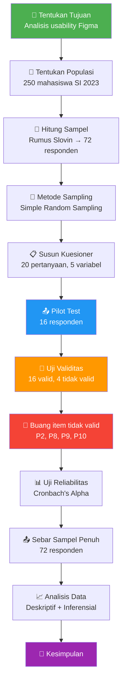

# 📚 Panduan Lengkap Final Project Statistika
## Analisis Kepuasan Mahasiswa terhadap Usability Figma

> [!IMPORTANT]
> Dokumen ini hasil **audit lengkap** dari kedua file:
> - [LAPORAN KELOMPOK GALELA.docx](file:///var/www/html/azfa/statistika/fp/LAPORAN%20KELOMPOK%20GALELA.docx) — Laporan utama (65 paragraf, 1 tabel, 2 gambar)
> - [validitas_figma.docx](file:///var/www/html/azfa/statistika/fp/validitas_figma.docx) — Hasil uji validitas SPSS (61 paragraf, 2 gambar termasuk tabel korelasi SPSS)
>
> Disusun agar kamu bisa **memahami setiap bagian** dan **tahu kelemahan** yang perlu diantisipasi saat presentasi UAS.

---

# BAGIAN A: PEMAHAMAN MENDALAM

---

## 🎯 1. Gambaran Besar Penelitian

### Apa yang Diteliti?

**Topik:** Seberapa puas mahasiswa Universitas Amikom Yogyakarta saat menggunakan **Figma** untuk mendesain UI/UX?

**Analogi sederhana:**
> Bayangkan kamu beli HP baru. Kamu pasti akan menilai: gampang dipelajari nggak? Cepat nggak responsnya? Mudah diingat cara pakainya? Sering error nggak? Secara keseluruhan puas nggak? — Nah, **hal yang sama persis** dilakukan penelitian ini terhadap **Figma**.

### Identitas Laporan

| Aspek | Detail |
|-------|--------|
| **Judul** | Aplikasi Multimedia Figma |
| **Mata Kuliah** | Statistika |
| **Dosen** | Sharazita Dyah Anggita, S.Kom., M.Kom. |
| **Prodi** | S1 Sistem Informasi, Fakultas Ilmu Komputer |
| **Universitas** | Amikom Yogyakarta |
| **Tahun** | 2025/2026 |

### Anggota Kelompok

| Nama | NIM |
|------|-----|
| Yudistira Azfa Dani Wibowo | 24.12.3274 |
| Muhammad Adam Siswantoro | 24.12.3281 |
| Wasima Juhaina | 24.12.3282 |
| Sherly Meisya Maharani | 24.12.3301 |
| Alief Fathin Adi Kusuma | 24.12.3303 |

### Tujuan Penelitian (dari Laporan)

> *"Penelitian ini bertujuan untuk melakukan analisis terhadap kepuasan mahasiswa Universitas Amikom Yogyakarta dalam memanfaatkan aplikasi Figma untuk keperluan desain UI/UX. Fokus utama pengamatan adalah mengevaluasi tingkat Usability pada prototipe yang dikembangkan, yang mencakup dimensi Learnability, Efficiency, Memorability, Error, serta Satisfaction."*

**Dipecah menjadi bahasa sederhana:**
1. Apakah Figma **mudah dipelajari** oleh mahasiswa? → Learnability
2. Apakah Figma **efisien** untuk menyelesaikan tugas desain? → Efficiency
3. Apakah cara pakai Figma **mudah diingat** setelah lama tidak dipakai? → Memorability
4. Apakah mahasiswa **jarang melakukan kesalahan** dan mudah memperbaikinya? → Errors
5. Apakah mahasiswa **puas** secara keseluruhan? → Satisfaction

---

## 🧱 2. Kerangka Teori: 5 Dimensi Usability (Jakob Nielsen)

Penelitian ini menggunakan **5 dimensi usability menurut Jakob Nielsen** — seorang pakar UX terkenal dunia. Ini adalah "kacamata" yang dipakai untuk menilai Figma:

| No | Dimensi | Pertanyaan Inti | Contoh Konkret di Figma |
|----|---------|----------------|------------------------|
| 1 | **Learnability** | Seberapa mudah dipelajari saat pertama kali? | Pertama kali buka Figma, bisa langsung drag-and-drop frame? |
| 2 | **Efficiency** | Seberapa cepat menyelesaikan tugas setelah sudah bisa? | Berapa lama bikin wireframe sederhana? Pakai shortcut? |
| 3 | **Memorability** | Seberapa mudah diingat setelah lama tidak pakai? | Liburan 2 minggu, buka Figma lagi — masih ingat caranya? |
| 4 | **Errors** | Seberapa sedikit kesalahan & mudah dipulihkan? | Salah hapus layer → bisa undo? Error message jelas? |
| 5 | **Satisfaction** | Seberapa nyaman & puas pengguna? | Setelah 3 jam desain, masih nyaman? Mau rekomendasikan? |

> [!TIP]
> **Cara mengingat: L-E-M-E-S** (Learnability, Efficiency, Memorability, Errors, Satisfaction). Hafalkan urutan ini untuk presentasi!

### Kenapa Pakai Model Nielsen?

- Nielsen adalah **standar de facto** dalam usability testing
- Model ini sudah divalidasi di ribuan penelitian internasional
- Cocok untuk mengevaluasi **software/aplikasi** apa saja
- 5 dimensi cukup komprehensif tanpa terlalu kompleks

---

## 👥 3. Populasi dan Sampel

### 3.1 Populasi

| Aspek | Detail |
|-------|--------|
| **Siapa?** | Mahasiswa aktif S1 Sistem Informasi angkatan 2023 |
| **Dimana?** | Universitas Amikom Yogyakarta |
| **Kapan?** | Semester genap tahun akademik 2026 |
| **Berapa?** | 5 kelas × 50 mahasiswa = **250 orang** |
| **Karakteristik** | Mahasiswa reguler + mahasiswa jalur konversi |

**Analogi:**
> Populasi itu ibarat **seluruh isi toples kelereng**. Kamu tidak mungkin memeriksa semua kelereng satu per satu, jadi kamu ambil sebagian (sampel) dan anggap itu mewakili keseluruhan.

**Konsep penting dari laporan:**
- **Populasi target** = populasi yang ditetapkan sesuai masalah penelitian (semua mahasiswa SI 2023)
- **Populasi survei** = populasi yang benar-benar bisa dijangkau/disurvei (yang aktif dan bisa dihubungi)

### 3.2 Penentuan Jumlah Sampel: Rumus Slovin

Berikut adalah rumus Slovin yang digunakan (dari tulisan tangan di laporan):


**Penjelasan langkah per langkah:**

```
Rumus:    n = N / (1 + N × e²)

Diketahui:
  N = 250 (jumlah populasi)
  e = 10% = 0,1 (margin of error)

Langkah 1: Hitung e²
  e² = 0,1 × 0,1 = 0,01

Langkah 2: Hitung N × e²
  250 × 0,01 = 2,5

Langkah 3: Hitung 1 + N × e²
  1 + 2,5 = 3,5

Langkah 4: Hitung n
  n = 250 / 3,5 = 71,428...

Hasil: n ≈ 72 responden (dibulatkan ke atas)
```

> [!NOTE]
> **Kenapa margin error 10%?** Artinya kita "memaklumi" kemungkinan hasil survei meleset 10% dari kondisi sebenarnya. Semakin kecil margin error → semakin banyak responden yang dibutuhkan. 10% umum untuk penelitian mahasiswa S1.

### 3.3 Metode Sampling: Simple Random Sampling

**Apa itu?** Setiap mahasiswa dari 250 orang punya **peluang yang sama** untuk terpilih jadi responden.

**Alasan pemilihan (dari laporan):**
1. **Populasi homogen** — semua mahasiswa SI angkatan 2023, karakteristik relatif seragam
2. **Meminimalkan bias** — tidak ada kelompok yang lebih diuntungkan
3. **Pengalaman pengguna bersifat individual** — tidak tergantung kelompok/kategori tertentu

**Analogi:**
> Seperti **undian lotere** — setiap nama dimasukkan ke kotak, lalu diambil secara acak.

**Referensi yang dikutip:** Sugiyono, 2018

---

## 📋 4. Instrumen Penelitian: 20 Pertanyaan Kuesioner

Kuesioner terdiri dari **20 pertanyaan** (4 pertanyaan per variabel × 5 variabel). Setiap variabel punya **2 indikator**, masing-masing diukur dengan **2 pertanyaan**.

### 🟢 LEARNABILITY — Kemudahan Belajar (P1–P4)

| Kode | Indikator | Pertanyaan |
|------|-----------|-----------|
| **P1** | Kemudahan memahami antarmuka | Apakah antarmuka Figma mudah Anda pahami saat pertama kali digunakan? |
| **P2** ❌ | Kemudahan memahami antarmuka | Apakah ikon dan label pada Figma cukup jelas sehingga Anda langsung mengerti fungsinya? |
| **P3** | Kemudahan mempelajari mandiri | Apakah Anda dapat mempelajari fitur prototyping di Figma tanpa bantuan orang lain? |
| **P4** | Kemudahan mempelajari mandiri | Apakah Anda mampu menyelesaikan tugas desain pertama kali di Figma dengan cukup mudah? |

### 🔵 EFFICIENCY — Efisiensi (P5–P8)

| Kode | Indikator | Pertanyaan |
|------|-----------|-----------|
| **P5** | Kecepatan penyelesaian tugas | Apakah Anda dapat menyelesaikan tugas desain UI/UX dengan cepat menggunakan Figma? |
| **P6** | Kecepatan penyelesaian tugas | Apakah jumlah langkah yang diperlukan untuk menyelesaikan tugas di Figma terasa efisien? |
| **P7** | Efektivitas fitur dan tools | Apakah fitur shortcut di Figma membantu Anda bekerja lebih cepat? |
| **P8** ❌ | Efektivitas fitur dan tools | Apakah berpindah antar fitur (desain ke prototype) di Figma dapat dilakukan dengan mudah dan cepat? |

### 🟡 MEMORABILITY — Daya Ingat (P9–P12)

| Kode | Indikator | Pertanyaan |
|------|-----------|-----------|
| **P9** ❌ | Kemudahan mengingat fitur | Apakah Anda dapat langsung mengingat cara menggunakan Figma setelah sempat tidak menggunakannya? |
| **P10** ❌ | Kemudahan mengingat fitur | Apakah Anda tidak perlu belajar ulang dari awal saat kembali menggunakan Figma? |
| **P11** | Konsistensi antarmuka | Apakah tata letak fitur Figma yang konsisten memudahkan Anda mengingat lokasi setiap menu? |
| **P12** | Konsistensi antarmuka | Apakah alur kerja (workflow) di Figma cukup mudah untuk Anda ingat kembali? |

### 🔴 ERRORS — Kesalahan (P13–P16) ✅ Semua Valid

| Kode | Indikator | Pertanyaan |
|------|-----------|-----------|
| **P13** | Frekuensi kesalahan | Apakah Anda jarang melakukan kesalahan (salah klik/konfigurasi) saat menggunakan Figma? |
| **P14** | Frekuensi kesalahan | Apakah pesan kesalahan yang muncul di Figma mudah Anda pahami? |
| **P15** | Kemudahan pemulihan | Apakah Anda dapat dengan mudah membatalkan kesalahan menggunakan fitur undo/redo di Figma? |
| **P16** | Kemudahan pemulihan | Apakah Figma menyediakan fitur (seperti auto-save atau konfirmasi hapus) yang mencegah kesalahan tidak disengaja? |

### 🟣 SATISFACTION — Kepuasan (P17–P20) ✅ Semua Valid

| Kode | Indikator | Pertanyaan |
|------|-----------|-----------|
| **P17** | Kepuasan pengalaman | Apakah Anda merasa nyaman menggunakan Figma dalam sesi desain yang cukup lama? |
| **P18** | Kepuasan pengalaman | Apakah Anda merasa puas dengan hasil prototipe yang dapat dihasilkan melalui Figma? |
| **P19** | Penilaian & rekomendasi | Secara keseluruhan, apakah Anda merasa puas menggunakan Figma sebagai alat desain UI/UX? |
| **P20** | Penilaian & rekomendasi | Apakah Anda bersedia merekomendasikan Figma kepada rekan mahasiswa lain? |

> [!TIP]
> Item bertanda ❌ adalah item yang **tidak valid** berdasarkan uji validitas. Detailnya di bagian 5.

---

## 🔬 5. Uji Validitas — Hasil dari SPSS

### 5.1 Apa itu Uji Validitas?

**Validitas** = apakah pertanyaan di kuesioner **benar-benar mengukur apa yang seharusnya diukur**.

**Analogi:**
> Kamu mau mengukur **tinggi badan**. Pakai **penggaris** → valid ✅. Pakai **timbangan** → tidak valid ❌ (timbangan mengukur berat, bukan tinggi).

### 5.2 Metode: Korelasi Pearson Product Moment

**Cara kerjanya:**
1. Setiap jawaban responden pada satu item (misal P1) **dikorelasikan** dengan **skor total** seluruh kuesioner
2. Jika korelasi kuat → item tersebut mengukur hal yang sama dengan instrumen secara keseluruhan → **valid**
3. Jika korelasi lemah → item tersebut mengukur hal yang berbeda → **tidak valid**

**Aturan keputusan:**
```
Sig. (1-tailed) < 0,05  →  ✅ VALID
Sig. (1-tailed) ≥ 0,05  →  ❌ TIDAK VALID

α (alpha) = 0,05 → tingkat kepercayaan 95%
```

### 5.3 Tabel Korelasi SPSS Asli

Berikut adalah output SPSS yang sebenarnya dari file validitas:


**Catatan penting dari tabel SPSS:**
- Tanda `**` = signifikan pada level 0,01 (sangat kuat)
- Tanda `*` = signifikan pada level 0,05 (kuat)
- Tanpa tanda = tidak signifikan

### 5.4 Hasil Lengkap dengan Nilai Korelasi Pearson (r)

| Kode | Variabel | r (Pearson) | Sig. (1-tailed) | Status | Kekuatan Korelasi |
|------|----------|-------------|-----------------|--------|------------------|
| P1 | Learnability | 0.636** | 0.004 | ✅ Valid | Kuat |
| **P2** | **Learnability** | **0.224** | **0.202** | **❌ Tidak Valid** | **Sangat Lemah** |
| P3 | Learnability | 0.435* | 0.046 | ✅ Valid | Sedang |
| P4 | Learnability | 0.670** | 0.002 | ✅ Valid | Kuat |
| P5 | Efficiency | 0.777** | 0.000 | ✅ Valid | Sangat Kuat |
| P6 | Efficiency | 0.687** | 0.002 | ✅ Valid | Kuat |
| P7 | Efficiency | 0.561* | 0.012 | ✅ Valid | Sedang-Kuat |
| **P8** | **Efficiency** | **0.413** | **0.056** | **❌ Tidak Valid** | **Sedang (nyaris valid)** |
| **P9** | **Memorability** | **0.387** | **0.069** | **❌ Tidak Valid** | **Lemah-Sedang** |
| **P10** | **Memorability** | **0.146** | **0.295** | **❌ Tidak Valid** | **Sangat Lemah** |
| P11 | Memorability | 0.619** | 0.005 | ✅ Valid | Kuat |
| P12 | Memorability | 0.459* | 0.037 | ✅ Valid | Sedang |
| P13 | Errors | 0.650** | 0.003 | ✅ Valid | Kuat |
| P14 | Errors | 0.580** | 0.009 | ✅ Valid | Sedang-Kuat |
| P15 | Errors | 0.624** | 0.005 | ✅ Valid | Kuat |
| P16 | Errors | 0.462* | 0.036 | ✅ Valid | Sedang |
| P17 | Satisfaction | 0.852** | 0.000 | ✅ Valid | **Sangat Kuat (tertinggi!)** |
| P18 | Satisfaction | 0.664** | 0.003 | ✅ Valid | Kuat |
| P19 | Satisfaction | 0.583** | 0.009 | ✅ Valid | Sedang-Kuat |
| P20 | Satisfaction | 0.615** | 0.006 | ✅ Valid | Kuat |

### 5.5 Ringkasan

```
╔═══════════════════════════════════════════════╗
║  HASIL UJI VALIDITAS (N = 16 responden)       ║
║                                               ║
║  ✅ 16 item VALID    (80%)                    ║
║  ❌  4 item TIDAK VALID (20%)                 ║
║                                               ║
║  Item tidak valid: P2, P8, P9, P10            ║
║                                               ║
║  Item terkuat : P17 (r = 0.852, Satisfaction) ║
║  Item terlemah: P10 (r = 0.146, Memorability) ║
╚═══════════════════════════════════════════════╝
```

### 5.6 Analisis Mendalam: Kenapa 4 Item Tidak Valid?

#### ❌ P2 (r = 0.224, Sig. = 0.202) — Learnability
> *"Apakah ikon dan label pada Figma cukup jelas sehingga Anda langsung mengerti fungsinya?"*

**Diagnosis:**
- Korelasi sangat lemah (0.224) — jawaban responden di item ini **hampir tidak berhubungan** dengan skor total
- Kata **"langsung mengerti"** terlalu absolut — tergantung pengalaman sebelumnya (pernah pakai Canva/Adobe vs belum pernah)
- Item ini mengukur **pengetahuan awal**, bukan usability Figma itu sendiri

#### ❌ P8 (r = 0.413, Sig. = 0.056) — Efficiency
> *"Apakah berpindah antar fitur (desain ke prototype) di Figma dapat dilakukan dengan mudah dan cepat?"*

**Diagnosis:**
- Nyaris valid! Hanya selisih 0.006 dari batas (0.056 vs 0.05)
- Masalah: **double-barreled question** — mengukur dua hal sekaligus ("mudah" DAN "cepat")
- Responden bisa merasa mudah tapi lambat, atau cepat tapi rumit → membingungkan

#### ❌ P9 (r = 0.387, Sig. = 0.069) — Memorability
> *"Apakah Anda dapat langsung mengingat cara menggunakan Figma setelah sempat tidak menggunakannya?"*

**Diagnosis:**
- Juga nyaris valid (0.069 vs 0.05)
- Masalah: banyak mahasiswa mungkin **tidak pernah berhenti memakai Figma** (ada tugas terus-menerus)
- Sulit dijawab karena **premis pertanyaannya belum tentu dialami** oleh responden

#### ❌ P10 (r = 0.146, Sig. = 0.295) — Memorability
> *"Apakah Anda tidak perlu belajar ulang dari awal saat kembali menggunakan Figma?"*

**Diagnosis — PALING BERMASALAH:**
- Korelasi terendah (0.146) — **hampir tidak ada hubungan** dengan skor total
- Mengandung **kalimat negatif** ("tidak perlu") → responden bingung: setuju = ya saya tidak perlu (positif) atau setuju = ya saya perlu (negatif)?
- Ini **masalah klasik** dalam penyusunan kuesioner: hindari kalimat negasi!

### 5.7 Dampak dan Keputusan Setelah Uji Validitas

| Variabel | Awal | Valid | Tidak Valid | Tersisa |
|----------|------|-------|-------------|---------|
| Learnability | 4 | 3 | 1 (P2) | P1, P3, P4 |
| Efficiency | 4 | 3 | 1 (P8) | P5, P6, P7 |
| **Memorability** | **4** | **2** | **2 (P9, P10)** | **P11, P12** |
| Errors | 4 | 4 | 0 | P13–P16 |
| Satisfaction | 4 | 4 | 0 | P17–P20 |
| **TOTAL** | **20** | **16** | **4** | **16** |

---

## 🔗 6. Alur Penelitian Keseluruhan



> [!NOTE]
> Penelitian kalian saat ini berada di **setelah tahap pilot test** (uji coba awal dengan 16 responden). Tahap selanjutnya: keputusan soal item tidak valid → uji reliabilitas → sebar ke 72 responden.

---

## 💡 7. Konsep Statistika Kunci

### 7.1 Populasi vs Sampel vs Pilot Test

| Konsep | Jumlah | Fungsi |
|--------|--------|--------|
| **Populasi** | 250 | Seluruh subjek yang ingin diteliti |
| **Sampel** | 72 | Bagian populasi yang dipilih untuk penelitian utama |
| **Pilot test** | 16 | Uji coba kecil untuk memastikan kuesioner valid |

### 7.2 Validitas vs Reliabilitas

| Aspek | Validitas | Reliabilitas |
|-------|-----------|-------------|
| **Pertanyaan** | Mengukur hal yang **benar**? | Hasilnya **konsisten**? |
| **Analogi** | Penggaris mengukur panjang ✅ (bukan berat) | Ukur 3× → hasilnya sama semua |
| **Metode** | Korelasi Pearson → Sig. < 0,05 | Cronbach's Alpha → α ≥ 0,6 |
| **Urutan** | Diuji **duluan** | Diuji **setelah** item tidak valid dibuang |
| **Alat** | SPSS (Correlate → Bivariate) | SPSS (Scale → Reliability Analysis) |

### 7.3 Sig. (1-tailed) vs (2-tailed)

| Jenis | Arah | Kapan Dipakai |
|-------|------|---------------|
| **1-tailed** | Satu arah (positif saja) | Sudah yakin arah hubungannya |
| **2-tailed** | Dua arah (bisa positif/negatif) | Belum tahu arah hubungannya |

Penelitian ini pakai **1-tailed** karena diasumsikan korelasi item-total **pasti positif** (semakin tinggi skor item → semakin tinggi skor total).

### 7.4 Interpretasi Nilai Korelasi (r)

| Rentang r | Kekuatan |
|-----------|----------|
| 0.00 – 0.19 | Sangat lemah |
| 0.20 – 0.39 | Lemah |
| 0.40 – 0.59 | Sedang |
| 0.60 – 0.79 | Kuat |
| 0.80 – 1.00 | Sangat kuat |

### 7.5 Skala Likert (Kemungkinan Digunakan)

| Skor | Keterangan |
|------|-----------|
| 1 | Sangat Tidak Setuju (STS) |
| 2 | Tidak Setuju (TS) |
| 3 | Netral (N) |
| 4 | Setuju (S) |
| 5 | Sangat Setuju (SS) |

---

# BAGIAN B: AUDIT KELEMAHAN FINAL PROJECT

---

## 🔍 8. Kelemahan yang Ditemukan

Berikut adalah hasil audit lengkap — kelemahan-kelemahan yang perlu kamu **pahami** dan **antisipasi** saat presentasi:

### 🔴 KELEMAHAN KRITIS (Bisa ditanyakan dosen dan berpengaruh besar)

#### 8.1 Jumlah Responden Pilot Test Terlalu Sedikit

| Aspek | Detail |
|-------|--------|
| **Masalah** | Hanya **16 responden** untuk uji validitas |
| **Standar ideal** | Minimal **30 responden** (menurut Singarimbun & Effendi, banyak literatur metodologi penelitian) |
| **Dampak** | Hasil uji validitas kurang stabil — dengan sampel kecil, ada kemungkinan item yang sekarang valid bisa jadi tidak valid di sampel yang lebih besar, atau sebaliknya |
| **Solusi untuk presentasi** | Akui sebagai **keterbatasan** dan jelaskan bahwa hasil ini akan dikonfirmasi ulang saat penelitian utama dengan 72 responden |

#### 8.2 Variabel Memorability Sangat Lemah

| Aspek | Detail |
|-------|--------|
| **Masalah** | 2 dari 4 item tidak valid (P9, P10) — **50% gagal**, hanya tersisa 2 item |
| **Dampak** | Dengan hanya 2 item, pengukuran variabel Memorability kurang **reliable** dan kurang **komprehensif** |
| **Akar masalah** | Kedua item yang gagal (P9 & P10) menanyakan pengalaman yang **mungkin tidak pernah dialami** responden (berhenti pakai Figma) |
| **Solusi** | Tambah 1-2 item baru untuk Memorability, atau revisi P9 & P10 lalu pilot test ulang |

#### 8.3 Belum Ada Uji Reliabilitas

| Aspek | Detail |
|-------|--------|
| **Masalah** | Laporan hanya sampai uji validitas, **belum melakukan uji reliabilitas** (Cronbach's Alpha) |
| **Kenapa penting** | Validitas dan reliabilitas adalah **sepasang** — instrumen harus lolos keduanya sebelum layak dipakai |
| **Dampak** | Belum bisa dipastikan apakah 16 item yang valid menghasilkan jawaban yang **konsisten** |
| **Solusi** | Lakukan uji Cronbach's Alpha di SPSS sebelum menyebar ke 72 responden |

### 🟡 KELEMAHAN SEDANG (Bisa diperbaiki, tapi perlu diketahui)

#### 8.4 Tidak Ada r-tabel sebagai Pembanding

| Aspek | Detail |
|-------|--------|
| **Masalah** | Laporan hanya pakai **Sig. < 0,05** sebagai acuan validitas, tidak menyebutkan **r-tabel** |
| **Kenapa penting** | Banyak dosen mengharapkan perbandingan **r-hitung > r-tabel** sebagai kriteria validitas (selain p-value) |
| **r-tabel untuk N=16, α=0,05** | Sekitar **0,497** (1-tailed) atau **0,468** (2-tailed) — ini bisa berdampak: P3 (r=0.435), P8 (r=0.413), P12 (r=0.459), P16 (r=0.462) bisa dianggap tidak valid jika pakai r-tabel! |
| **Solusi** | Konsultasikan ke dosen: pakai kriteria Sig. saja atau r-tabel juga? |

> [!CAUTION]
> **Ini bisa jadi jebakan!** Jika dosen minta pakai r-tabel (0,497 untuk N=16), maka bukan hanya 4 item yang tidak valid, tapi bisa **8 item** (P2, P3, P8, P9, P10, P12, P16, dan mungkin P7 yang 0.561 baru sedikit di atas). Pahami perbedaan kedua metode ini.

#### 8.5 Typo pada Judul Laporan

| Aspek | Detail |
|-------|--------|
| **Masalah** | Judul tertulis **"APlLIKASI"** (huruf L kecil sebelum IKASI) — seharusnya "APLIKASI" |
| **Dampak** | Kecil, tapi menunjukkan kurang teliti dalam proofreading |

#### 8.6 Asumsi Jumlah Populasi Tidak Diverifikasi

| Aspek | Detail |
|-------|--------|
| **Masalah** | Populasi 250 orang dihitung dari **asumsi** "5 kelas × 50 mahasiswa" — bukan data riil dari akademik |
| **Dampak** | Jika jumlah sebenarnya berbeda (misal 45 atau 55 per kelas), hasil perhitungan Slovin berubah |
| **Solusi** | Idealnya, minta data jumlah mahasiswa aktif dari bagian akademik |

#### 8.7 Daftar Isi Kosong

| Aspek | Detail |
|-------|--------|
| **Masalah** | Ada heading "Daftar Isi" tapi **tidak ada isinya** |
| **Dampak** | Laporan terlihat belum selesai / kurang profesional |

#### 8.8 Tidak Ada Bagian Referensi/Daftar Pustaka

| Aspek | Detail |
|-------|--------|
| **Masalah** | Hanya menyebut Sugiyono (2018) secara in-text, tapi **tidak ada halaman daftar pustaka** |
| **Dampak** | Secara akademis, setiap kutipan harus ada referensi lengkapnya |

### 🟢 KELEMAHAN MINOR (Nice to know)

#### 8.9 Tidak Ada Definisi Operasional Variabel

Laporan langsung masuk ke pertanyaan kuesioner tanpa mendefinisikan secara operasional apa yang dimaksud tiap variabel dalam konteks Figma.

#### 8.10 Tidak Menyebutkan Skala Pengukuran

Laporan tidak menyebutkan secara eksplisit skala apa yang dipakai (Likert 1-5? 1-4?). Ini penting untuk menjelaskan bagaimana responden menjawab.

#### 8.11 Format Naming Alief Tidak Konsisten

Nama "ALIEF FATHIN ADI KUSUMA" memiliki indentasi berbeda dari anggota kelompok lainnya — masalah formatting Word.

---

## 📊 9. Ringkasan Visual Kelemahan

```
┌─────────────────────────────────────────────────────────┐
│              PETA KELEMAHAN FINAL PROJECT                │
├──────────────────────────┬──────────────────────────────┤
│ 🔴 KRITIS (3)            │                              │
│  • Pilot test terlalu    │ Bisa langsung ditanyakan     │
│    sedikit (16 < 30)     │ dosen dan mempengaruhi       │
│  • Memorability lemah    │ nilai secara signifikan      │
│    (hanya 2 item)        │                              │
│  • Belum uji reliabilitas│                              │
├──────────────────────────┼──────────────────────────────┤
│ 🟡 SEDANG (4)            │                              │
│  • Tidak pakai r-tabel   │ Bisa diperbaiki sebelum      │
│  • Typo judul            │ presentasi atau ditanyakan   │
│  • Asumsi populasi       │ sebagai pertanyaan follow-up │
│  • Daftar isi kosong     │                              │
├──────────────────────────┼──────────────────────────────┤
│ 🟢 MINOR (3)             │                              │
│  • Tidak ada def.        │ Nice to know, jarang         │
│    operasional           │ ditanyakan langsung          │
│  • Skala tidak disebut   │                              │
│  • Format inkonsisten    │                              │
└──────────────────────────┴──────────────────────────────┘
```

---

# BAGIAN C: PERSIAPAN PRESENTASI UAS

---

## 🎤 10. Pertanyaan Potensial Dosen + Jawaban

### Pertanyaan Dasar

| No | Pertanyaan | Jawaban |
|----|-----------|---------|
| 1 | Apa tujuan penelitian ini? | Menganalisis kepuasan mahasiswa Amikom terhadap usability Figma melalui 5 dimensi Nielsen: Learnability, Efficiency, Memorability, Errors, Satisfaction |
| 2 | Sebutkan 5 dimensi usability Nielsen! | LEMES: Learnability, Efficiency, Memorability, Errors, Satisfaction |
| 3 | Berapa populasinya? | 250 mahasiswa (5 kelas × 50, SI angkatan 2023) |
| 4 | Berapa sampelnya dan pakai rumus apa? | 72 responden, dihitung pakai rumus Slovin dengan e = 10% |
| 5 | Kenapa pakai Simple Random Sampling? | Karena populasi homogen (satu prodi, satu angkatan), setiap anggota punya peluang sama terpilih |

### Pertanyaan tentang Validitas

| No | Pertanyaan | Jawaban |
|----|-----------|---------|
| 6 | Berapa item yang tidak valid? | 4 item: P2 (Sig=0.202), P8 (0.056), P9 (0.069), P10 (0.295) |
| 7 | Kenapa P10 paling tidak valid? | Korelasi terendah (r=0.146) karena kalimat negatif ganda ("tidak perlu") membingungkan responden |
| 8 | Item mana yang paling valid? | P17 (r=0.852) — tentang kenyamanan Figma dalam sesi desain lama. Artinya item ini paling konsisten mengukur kepuasan |
| 9 | Apa solusi untuk item tidak valid? | Dikeluarkan dari analisis selanjutnya. Untuk penelitian masa depan, revisi redaksi dan uji ulang |
| 10 | Apa bedanya Sig. 1-tailed dan 2-tailed? | 1-tailed menguji hubungan satu arah (kita sudah yakin arahnya positif), 2-tailed dua arah. Kita pakai 1-tailed karena korelasi item-total pasti positif |

### Pertanyaan Kritis / Jebakan ⚠️

| No | Pertanyaan | Jawaban yang Aman |
|----|-----------|-------------------|
| 11 | 16 responden cukup nggak? | Jujur: idealnya minimal 30. Tapi untuk pilot test awal, 16 masih bisa diterima dengan catatan hasilnya dikonfirmasi ulang di sampel penuh. Ini menjadi **keterbatasan penelitian** kami |
| 12 | Kenapa tidak pakai r-tabel? | Kami menggunakan pendekatan signifikansi (p-value < 0,05) yang juga valid secara statistik. Namun jika menggunakan r-tabel (≈0,497 untuk N=16), hasilnya bisa berbeda dan ini bisa menjadi pertimbangan tambahan |
| 13 | Kenapa Memorability hanya sisa 2 item? | Dua item yang gagal (P9, P10) memiliki masalah redaksi — menanyakan pengalaman yang mungkin tidak dialami responden. Kami sadar ini kelemahan dan merekomendasikan penambahan item untuk penelitian selanjutnya |
| 14 | Kenapa tidak pakai Stratified Sampling? | Populasi kami homogen (satu prodi, satu angkatan). Stratified cocok untuk populasi heterogen yang perlu dibagi sub-kelompok |
| 15 | Sudah uji reliabilitas belum? | Belum, itu langkah selanjutnya setelah mengeluarkan 4 item tidak valid. Kami akan gunakan Cronbach's Alpha di SPSS |
| 16 | Kenapa margin error 10%, bukan 5%? | Trade-off antara akurasi dan feasibility. Dengan e=5%, sampel jadi 154 orang — sulit dijangkau untuk penelitian mahasiswa. 10% masih standar untuk penelitian survei S1 |
| 17 | Apa itu double-barreled question? | Pertanyaan yang mengukur dua hal sekaligus dalam satu kalimat, seperti P8 ("mudah dan cepat"). Ini membuat responden bingung karena bisa setuju dengan satu aspek tapi tidak dengan yang lain |

---

## 🗣️ 11. Strategi Presentasi

### Urutan Presentasi yang Disarankan

```
1. PEMBUKA (1 menit)
   "Figma banyak dipakai mahasiswa untuk desain, tapi apakah
    benar-benar usable? Itulah yang kami teliti."

2. KERANGKA TEORI (2 menit)
   Jelaskan 5 dimensi Nielsen — LEMES

3. METODOLOGI (3 menit)
   Populasi → Slovin → Sampel → Simple Random Sampling

4. INSTRUMEN (2 menit)
   20 pertanyaan, 5 variabel, masing-masing 4 item

5. HASIL UJI VALIDITAS (3 menit)  ← PALING PENTING
   16 valid, 4 tidak valid
   JELASKAN KENAPA tidak valid (ini menunjukkan pemahaman)

6. KESIMPULAN & LANGKAH SELANJUTNYA (1 menit)
   Buang 4 item → uji reliabilitas → sebar ke 72 responden
```

### Tips Penting

1. **Jangan baca slide** — pahami konsepnya, jelaskan pakai kata sendiri
2. **Tunjukkan pemahaman** — saat menjelaskan item tidak valid, jelaskan **kenapa** (bukan hanya "karena Sig > 0,05")
3. **Akui kelemahan dengan elegan** — "Ini menjadi keterbatasan penelitian kami yang bisa diperbaiki..."
4. **Siapkan angka-angka kunci di kepala:** 250, 72, 16, 0.05, LEMES
5. **Kalau tidak tahu jawaban dosen** — jujur bilang, jangan mengarang

> [!IMPORTANT]
> **Kunci utama:** Dosen menilai **pemahaman**, bukan hafalan. Pastikan kamu bisa menjelaskan:
> 1. **KENAPA** memilih metode tertentu (bukan hanya apa)
> 2. **INTERPRETASI** hasil (bukan hanya angkanya)
> 3. **KELEMAHAN** dan bagaimana mengatasinya
> 4. **IMPLIKASI** temuan terhadap langkah selanjutnya

---

## 📌 12. Checklist Sebelum Presentasi

- [ ] Hafal LEMES (5 dimensi Nielsen)
- [ ] Hafal angka kunci: populasi 250, sampel 72, pilot 16
- [ ] Bisa jelaskan rumus Slovin + hitung di depan kelas
- [ ] Paham kenapa 4 item tidak valid (terutama P10 — negasi ganda)
- [ ] Tahu bedanya validitas dan reliabilitas
- [ ] Tahu bedanya Sig. 1-tailed dan 2-tailed
- [ ] Siap jawab pertanyaan tentang jumlah responden pilot test
- [ ] Siap jawab pertanyaan tentang r-tabel vs p-value
- [ ] Paham langkah selanjutnya (reliabilitas → sebar → analisis)
- [ ] Bisa jelaskan kelemahan penelitian dengan elegan
