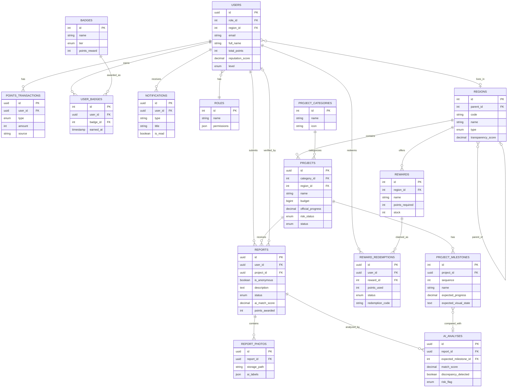

## Entity Relationship Diagram (ERD) Specification

---

# 1. DAFTAR ENTITAS

## Overview Entitas

| No  | Entitas               | Deskripsi                                     | Kategori     |
| --- | --------------------- | --------------------------------------------- | ------------ |
| 1   | `users`               | Pengguna platform (warga, admin, pemerintah)  | Core         |
| 2   | `roles`               | Jenis peran pengguna                          | Core         |
| 3   | `regions`             | Wilayah geografis (provinsi, kota, kecamatan) | Location     |
| 4   | `project_categories`  | Kategori jenis proyek infrastruktur           | Master Data  |
| 5   | `projects`            | Proyek infrastruktur yang dipantau            | Core         |
| 6   | `project_milestones`  | Tahapan progres proyek                        | Core         |
| 7   | `reports`             | Laporan dari warga                            | Core         |
| 8   | `report_photos`       | Foto bukti dalam laporan                      | Core         |
| 9   | `ai_analyses`         | Hasil analisis AI                             | Core         |
| 10  | `points_transactions` | Riwayat transaksi poin                        | Gamification |
| 11  | `badges`              | Lencana/achievement yang tersedia             | Gamification |
| 12  | `user_badges`         | Lencana yang dimiliki user                    | Gamification |
| 13  | `rewards`             | Hadiah yang bisa ditukarkan                   | Gamification |
| 14  | `reward_redemptions`  | Riwayat penukaran hadiah                      | Gamification |
| 15  | `notifications`       | Notifikasi untuk user                         | System       |
| 16  | `activity_logs`       | Log aktivitas sistem                          | System       |

---

# 2. DETAIL ENTITAS & ATRIBUT

## 2.1 Users (Pengguna)

Menyimpan data semua pengguna platform.

| Atribut                  | Tipe Data    | Constraint              | Deskripsi                               |
| ------------------------ | ------------ | ----------------------- | --------------------------------------- |
| `id`                     | UUID         | PK                      | Primary key                             |
| `role_id`                | INT          | FK → roles.id, NOT NULL | Peran pengguna                          |
| `region_id`              | INT          | FK → regions.id         | Wilayah domisili                        |
| `email`                  | VARCHAR(255) | UNIQUE, NOT NULL        | Email login                             |
| `password_hash`          | VARCHAR(255) | NOT NULL                | Password terenkripsi                    |
| `full_name`              | VARCHAR(100) | NOT NULL                | Nama lengkap                            |
| `phone`                  | VARCHAR(20)  |                         | Nomor telepon                           |
| `avatar_url`             | VARCHAR(500) |                         | URL foto profil                         |
| `nik`                    | VARCHAR(16)  | UNIQUE                  | NIK untuk verifikasi (opsional)         |
| `is_verified`            | BOOLEAN      | DEFAULT FALSE           | Status verifikasi akun                  |
| `is_anonymous_default`   | BOOLEAN      | DEFAULT FALSE           | Preferensi laporan anonim               |
| `total_points`           | INT          | DEFAULT 0               | Total poin saat ini                     |
| `lifetime_points`        | INT          | DEFAULT 0               | Total poin sepanjang waktu              |
| `reputation_score`       | DECIMAL(5,2) | DEFAULT 50.00           | Skor reputasi (0-100)                   |
| `level`                  | ENUM         | DEFAULT 'warga'         | Level: warga/pengamat/guardian/sentinel |
| `reports_count`          | INT          | DEFAULT 0               | Jumlah laporan (denormalized)           |
| `accurate_reports_count` | INT          | DEFAULT 0               | Laporan akurat (denormalized)           |
| `last_login_at`          | TIMESTAMP    |                         | Waktu login terakhir                    |
| `created_at`             | TIMESTAMP    | DEFAULT NOW()           | Waktu registrasi                        |
| `updated_at`             | TIMESTAMP    |                         | Waktu update terakhir                   |
| `deleted_at`             | TIMESTAMP    |                         | Soft delete                             |

**Indexes:**

- `idx_users_email` ON (email)
- `idx_users_region` ON (region_id)
- `idx_users_reputation` ON (reputation_score DESC)
- `idx_users_level` ON (level)

---

## 2.2 Roles (Peran)

Master data peran pengguna.

| Atribut       | Tipe Data   | Constraint         | Deskripsi                    |
| ------------- | ----------- | ------------------ | ---------------------------- |
| `id`          | INT         | PK, AUTO_INCREMENT | Primary key                  |
| `name`        | VARCHAR(50) | UNIQUE, NOT NULL   | Nama peran                   |
| `description` | TEXT        |                    | Deskripsi peran              |
| `permissions` | JSON        |                    | Daftar permission dalam JSON |
| `created_at`  | TIMESTAMP   | DEFAULT NOW()      |                              |

**Seed Data:**

```
1: citizen (Warga Biasa)
2: verified_citizen (Warga Terverifikasi)
3: government (Pemerintah Daerah)
4: inspector (Inspektorat)
5: admin (Administrator Sistem)
6: super_admin (Super Administrator)
```

---

## 2.3 Regions (Wilayah)

Hierarki wilayah geografis Indonesia.

| Atribut                  | Tipe Data     | Constraint                | Deskripsi                         |
| ------------------------ | ------------- | ------------------------- | --------------------------------- |
| `id`                     | INT           | PK, AUTO_INCREMENT        | Primary key                       |
| `parent_id`              | INT           | FK → regions.id, NULLABLE | Parent region                     |
| `code`                   | VARCHAR(10)   | UNIQUE, NOT NULL          | Kode wilayah (BPS)                |
| `name`                   | VARCHAR(100)  | NOT NULL                  | Nama wilayah                      |
| `type`                   | ENUM          | NOT NULL                  | provinsi/kota/kabupaten/kecamatan |
| `latitude`               | DECIMAL(10,8) |                           | Koordinat pusat                   |
| `longitude`              | DECIMAL(11,8) |                           | Koordinat pusat                   |
| `polygon`                | GEOMETRY      |                           | Batas wilayah (GeoJSON)           |
| `transparency_score`     | DECIMAL(5,2)  | DEFAULT 0                 | Skor transparansi daerah          |
| `active_reporters_count` | INT           | DEFAULT 0                 | Jumlah pelapor aktif              |
| `total_reports_count`    | INT           | DEFAULT 0                 | Total laporan                     |
| `created_at`             | TIMESTAMP     | DEFAULT NOW()             |                                   |
| `updated_at`             | TIMESTAMP     |                           |                                   |

**Indexes:**

- `idx_regions_parent` ON (parent_id)
- `idx_regions_type` ON (type)
- `idx_regions_transparency` ON (transparency_score DESC)
- `SPATIAL INDEX` ON (polygon)

---

## 2.4 Project Categories (Kategori Proyek)

Master data jenis proyek infrastruktur.

| Atribut       | Tipe Data    | Constraint         | Deskripsi          |
| ------------- | ------------ | ------------------ | ------------------ |
| `id`          | INT          | PK, AUTO_INCREMENT | Primary key        |
| `name`        | VARCHAR(100) | NOT NULL           | Nama kategori      |
| `description` | TEXT         |                    | Deskripsi          |
| `icon`        | VARCHAR(50)  |                    | Nama icon untuk UI |
| `color`       | VARCHAR(7)   |                    | Hex color code     |
| `is_active`   | BOOLEAN      | DEFAULT TRUE       | Status aktif       |
| `created_at`  | TIMESTAMP    | DEFAULT NOW()      |                    |

**Seed Data:**

```
1: Jembatan
2: Jalan Raya
3: Gedung Pemerintah
4: Sekolah
5: Puskesmas/Rumah Sakit
6: Pasar
7: Irigasi/Bendungan
8: Pelabuhan
9: Bandara
10: Terminal
11: Taman/RTH
12: Drainase
13: Lainnya
```

---

## 2.5 Projects (Proyek)

Data proyek infrastruktur yang dipantau.

| Atribut                 | Tipe Data     | Constraint                 | Deskripsi                           |
| ----------------------- | ------------- | -------------------------- | ----------------------------------- |
| `id`                    | UUID          | PK                         | Primary key                         |
| `category_id`           | INT           | FK → project_categories.id | Kategori proyek                     |
| `region_id`             | INT           | FK → regions.id, NOT NULL  | Lokasi wilayah                      |
| `code`                  | VARCHAR(50)   | UNIQUE                     | Kode proyek (dari APBD)             |
| `name`                  | VARCHAR(255)  | NOT NULL                   | Nama proyek                         |
| `description`           | TEXT          |                            | Deskripsi lengkap                   |
| `contractor_name`       | VARCHAR(255)  |                            | Nama kontraktor pelaksana           |
| `budget`                | BIGINT        | NOT NULL                   | Nilai anggaran (Rupiah)             |
| `source_fund`           | VARCHAR(100)  |                            | Sumber dana (APBD/APBN/DAK/dll)     |
| `fiscal_year`           | INT           | NOT NULL                   | Tahun anggaran                      |
| `start_date`            | DATE          |                            | Tanggal mulai rencana               |
| `end_date`              | DATE          |                            | Tanggal selesai rencana             |
| `actual_start_date`     | DATE          |                            | Tanggal mulai aktual                |
| `actual_end_date`       | DATE          |                            | Tanggal selesai aktual              |
| `latitude`              | DECIMAL(10,8) | NOT NULL                   | Koordinat lokasi                    |
| `longitude`             | DECIMAL(11,8) | NOT NULL                   | Koordinat lokasi                    |
| `address`               | TEXT          |                            | Alamat lengkap                      |
| `official_progress`     | DECIMAL(5,2)  | DEFAULT 0                  | Progres resmi (%)                   |
| `crowdsourced_progress` | DECIMAL(5,2)  |                            | Estimasi progres dari laporan warga |
| `risk_status`           | ENUM          | DEFAULT 'normal'           | normal/attention/high_risk          |
| `risk_score`            | DECIMAL(5,2)  | DEFAULT 0                  | Skor risiko (0-100)                 |
| `status`                | ENUM          | DEFAULT 'planned'          | planned/ongoing/completed/cancelled |
| `reports_count`         | INT           | DEFAULT 0                  | Jumlah laporan (denormalized)       |
| `last_report_at`        | TIMESTAMP     |                            | Waktu laporan terakhir              |
| `data_source`           | VARCHAR(100)  |                            | Sumber data (API APBD, manual, dll) |
| `external_id`           | VARCHAR(100)  |                            | ID dari sistem eksternal            |
| `metadata`              | JSON          |                            | Data tambahan fleksibel             |
| `created_at`            | TIMESTAMP     | DEFAULT NOW()              |                                     |
| `updated_at`            | TIMESTAMP     |                            |                                     |

**Indexes:**

- `idx_projects_region` ON (region_id)
- `idx_projects_category` ON (category_id)
- `idx_projects_risk` ON (risk_status, risk_score DESC)
- `idx_projects_status` ON (status)
- `idx_projects_year` ON (fiscal_year)
- `idx_projects_location` ON (latitude, longitude)
- `SPATIAL INDEX` ON POINT(latitude, longitude)

---

## 2.6 Project Milestones (Tahapan Proyek)

Tahapan/milestone yang diharapkan dalam proyek.

| Atribut                 | Tipe Data    | Constraint                 | Deskripsi                                           |
| ----------------------- | ------------ | -------------------------- | --------------------------------------------------- |
| `id`                    | INT          | PK, AUTO_INCREMENT         | Primary key                                         |
| `project_id`            | UUID         | FK → projects.id, NOT NULL | Proyek terkait                                      |
| `sequence`              | INT          | NOT NULL                   | Urutan milestone                                    |
| `name`                  | VARCHAR(100) | NOT NULL                   | Nama tahapan                                        |
| `description`           | TEXT         |                            | Deskripsi detail                                    |
| `expected_progress`     | DECIMAL(5,2) | NOT NULL                   | Target progres (%)                                  |
| `expected_date`         | DATE         |                            | Target tanggal                                      |
| `actual_date`           | DATE         |                            | Tanggal aktual tercapai                             |
| `expected_visual_state` | TEXT         |                            | Deskripsi kondisi visual yang diharapkan (untuk AI) |
| `ai_keywords`           | JSON         |                            | Keywords untuk AI detection                         |
| `is_completed`          | BOOLEAN      | DEFAULT FALSE              | Status selesai                                      |
| `created_at`            | TIMESTAMP    | DEFAULT NOW()              |                                                     |
| `updated_at`            | TIMESTAMP    |                            |                                                     |

**Indexes:**

- `idx_milestones_project` ON (project_id, sequence)

**Contoh Data:**

```json
{
  "project_id": "uuid-jembatan-x",
  "milestones": [
    {
      "sequence": 1,
      "name": "Pembersihan Lahan",
      "expected_progress": 5,
      "expected_visual_state": "area cleared, no vegetation"
    },
    {
      "sequence": 2,
      "name": "Pondasi",
      "expected_progress": 25,
      "expected_visual_state": "concrete foundation visible, steel reinforcement"
    },
    {
      "sequence": 3,
      "name": "Struktur Utama",
      "expected_progress": 60,
      "expected_visual_state": "main bridge structure, pillars standing"
    },
    {
      "sequence": 4,
      "name": "Lantai & Finishing",
      "expected_progress": 90,
      "expected_visual_state": "road surface, railings installed"
    },
    {
      "sequence": 5,
      "name": "Selesai",
      "expected_progress": 100,
      "expected_visual_state": "complete bridge, road markings, open to traffic"
    }
  ]
}
```

---

## 2.7 Reports (Laporan)

Laporan yang dikirim oleh warga.

| Atribut                 | Tipe Data     | Constraint                 | Deskripsi                                      |
| ----------------------- | ------------- | -------------------------- | ---------------------------------------------- |
| `id`                    | UUID          | PK                         | Primary key                                    |
| `user_id`               | UUID          | FK → users.id, NOT NULL    | Pelapor                                        |
| `project_id`            | UUID          | FK → projects.id, NOT NULL | Proyek yang dilaporkan                         |
| `is_anonymous`          | BOOLEAN       | DEFAULT FALSE              | Laporan anonim                                 |
| `title`                 | VARCHAR(255)  |                            | Judul laporan (opsional)                       |
| `description`           | TEXT          |                            | Deskripsi dari pelapor                         |
| `observed_progress`     | DECIMAL(5,2)  |                            | Estimasi progres oleh pelapor                  |
| `latitude`              | DECIMAL(10,8) | NOT NULL                   | Koordinat saat submit                          |
| `longitude`             | DECIMAL(11,8) | NOT NULL                   | Koordinat saat submit                          |
| `distance_from_project` | INT           |                            | Jarak dari lokasi proyek (meter)               |
| `device_info`           | JSON          |                            | Info device (untuk validasi)                   |
| `status`                | ENUM          | DEFAULT 'pending'          | pending/processing/verified/rejected/disputed  |
| `verification_type`     | ENUM          |                            | ai_verified/manual_verified/community_verified |
| `verification_notes`    | TEXT          |                            | Catatan verifikasi                             |
| `verified_by`           | UUID          | FK → users.id              | Verifikator (jika manual)                      |
| `verified_at`           | TIMESTAMP     |                            | Waktu verifikasi                               |
| `ai_match_score`        | DECIMAL(5,2)  |                            | Skor kecocokan AI (0-100)                      |
| `points_awarded`        | INT           | DEFAULT 0                  | Poin yang diberikan                            |
| `is_featured`           | BOOLEAN       | DEFAULT FALSE              | Laporan unggulan                               |
| `upvotes_count`         | INT           | DEFAULT 0                  | Jumlah upvote komunitas                        |
| `created_at`            | TIMESTAMP     | DEFAULT NOW()              | Waktu submit                                   |
| `updated_at`            | TIMESTAMP     |                            |                                                |

**Indexes:**

- `idx_reports_user` ON (user_id)
- `idx_reports_project` ON (project_id)
- `idx_reports_status` ON (status)
- `idx_reports_created` ON (created_at DESC)
- `idx_reports_ai_score` ON (ai_match_score)

---

## 2.8 Report Photos (Foto Laporan)

Foto-foto yang dilampirkan dalam laporan.

| Atribut             | Tipe Data     | Constraint                | Deskripsi                    |
| ------------------- | ------------- | ------------------------- | ---------------------------- |
| `id`                | UUID          | PK                        | Primary key                  |
| `report_id`         | UUID          | FK → reports.id, NOT NULL | Laporan terkait              |
| `storage_path`      | VARCHAR(500)  | NOT NULL                  | Path di cloud storage        |
| `thumbnail_path`    | VARCHAR(500)  |                           | Path thumbnail               |
| `original_filename` | VARCHAR(255)  |                           | Nama file asli               |
| `file_size`         | INT           |                           | Ukuran file (bytes)          |
| `mime_type`         | VARCHAR(50)   |                           | Tipe file                    |
| `width`             | INT           |                           | Lebar gambar (px)            |
| `height`            | INT           |                           | Tinggi gambar (px)           |
| `latitude`          | DECIMAL(10,8) |                           | EXIF GPS latitude            |
| `longitude`         | DECIMAL(11,8) |                           | EXIF GPS longitude           |
| `taken_at`          | TIMESTAMP     |                           | Waktu foto diambil (EXIF)    |
| `is_primary`        | BOOLEAN       | DEFAULT FALSE             | Foto utama                   |
| `hash`              | VARCHAR(64)   |                           | SHA-256 hash (anti duplikat) |
| `watermark_applied` | BOOLEAN       | DEFAULT FALSE             | Watermark sudah diterapkan   |
| `ai_processed`      | BOOLEAN       | DEFAULT FALSE             | Sudah diproses AI            |
| `ai_labels`         | JSON          |                           | Label dari AI detection      |
| `created_at`        | TIMESTAMP     | DEFAULT NOW()             |                              |

**Indexes:**

- `idx_photos_report` ON (report_id)
- `idx_photos_hash` ON (hash)

---

## 2.9 AI Analyses (Analisis AI)

Hasil analisis AI untuk setiap laporan.

| Atribut                 | Tipe Data    | Constraint                 | Deskripsi                                    |
| ----------------------- | ------------ | -------------------------- | -------------------------------------------- |
| `id`                    | UUID         | PK                         | Primary key                                  |
| `report_id`             | UUID         | FK → reports.id, NOT NULL  | Laporan yang dianalisis                      |
| `model_version`         | VARCHAR(50)  | NOT NULL                   | Versi model AI                               |
| `analysis_type`         | ENUM         | NOT NULL                   | progress_check/anomaly_detect/quality_assess |
| `detected_objects`      | JSON         |                            | Objek yang terdeteksi                        |
| `detected_progress`     | DECIMAL(5,2) |                            | Estimasi progres dari AI                     |
| `expected_milestone_id` | INT          | FK → project_milestones.id | Milestone yang dibandingkan                  |
| `match_score`           | DECIMAL(5,2) | NOT NULL                   | Skor kecocokan (0-100)                       |
| `confidence_score`      | DECIMAL(5,2) | NOT NULL                   | Tingkat kepercayaan AI                       |
| `discrepancy_detected`  | BOOLEAN      | DEFAULT FALSE              | Ada ketidaksesuaian                          |
| `discrepancy_type`      | VARCHAR(50)  |                            | Jenis ketidaksesuaian                        |
| `discrepancy_details`   | TEXT         |                            | Detail ketidaksesuaian                       |
| `risk_flag`             | ENUM         |                            | none/low/medium/high                         |
| `raw_response`          | JSON         |                            | Response mentah dari AI API                  |
| `processing_time_ms`    | INT          |                            | Waktu proses (milidetik)                     |
| `created_at`            | TIMESTAMP    | DEFAULT NOW()              |                                              |

**Indexes:**

- `idx_ai_report` ON (report_id)
- `idx_ai_discrepancy` ON (discrepancy_detected, risk_flag)

---

## 2.10 Points Transactions (Transaksi Poin)

Riwayat perolehan dan penggunaan poin.

| Atribut          | Tipe Data    | Constraint              | Deskripsi                                |
| ---------------- | ------------ | ----------------------- | ---------------------------------------- |
| `id`             | UUID         | PK                      | Primary key                              |
| `user_id`        | UUID         | FK → users.id, NOT NULL | Pemilik poin                             |
| `type`           | ENUM         | NOT NULL                | earn/redeem/bonus/penalty/expire         |
| `amount`         | INT          | NOT NULL                | Jumlah poin (+/-)                        |
| `balance_after`  | INT          | NOT NULL                | Saldo setelah transaksi                  |
| `source`         | VARCHAR(50)  | NOT NULL                | Sumber transaksi                         |
| `reference_type` | VARCHAR(50)  |                         | Tipe referensi (report/redemption/badge) |
| `reference_id`   | UUID         |                         | ID referensi                             |
| `description`    | VARCHAR(255) |                         | Deskripsi transaksi                      |
| `expires_at`     | TIMESTAMP    |                         | Waktu kadaluarsa poin                    |
| `created_at`     | TIMESTAMP    | DEFAULT NOW()           |                                          |

**Indexes:**

- `idx_points_user` ON (user_id, created_at DESC)
- `idx_points_type` ON (type)

**Contoh Source:**

```
- report_submitted: +5 poin
- report_verified_accurate: +20 poin
- report_featured: +50 poin
- badge_earned: +10-100 poin
- reward_redeemed: -X poin
- monthly_bonus: +X poin
- inaccurate_report_penalty: -10 poin
```

---

## 2.11 Badges (Lencana)

Master data lencana/achievement.

| Atribut          | Tipe Data    | Constraint         | Deskripsi                   |
| ---------------- | ------------ | ------------------ | --------------------------- |
| `id`             | INT          | PK, AUTO_INCREMENT | Primary key                 |
| `name`           | VARCHAR(100) | NOT NULL           | Nama badge                  |
| `description`    | TEXT         |                    | Deskripsi                   |
| `icon_url`       | VARCHAR(500) |                    | URL gambar badge            |
| `category`       | VARCHAR(50)  |                    | Kategori badge              |
| `tier`           | ENUM         | DEFAULT 'bronze'   | bronze/silver/gold/platinum |
| `points_reward`  | INT          | DEFAULT 0          | Poin yang diberikan         |
| `criteria_type`  | VARCHAR(50)  |                    | Jenis kriteria              |
| `criteria_value` | INT          |                    | Nilai kriteria              |
| `is_active`      | BOOLEAN      | DEFAULT TRUE       | Status aktif                |
| `created_at`     | TIMESTAMP    | DEFAULT NOW()      |                             |

**Seed Data:**

```
1: First Report (Bronze) - Submit laporan pertama
2: Consistent (Silver) - 7 hari berturut-turut submit laporan
3: Accuracy Master (Gold) - 10 laporan terverifikasi akurat
4: Regional Hero (Platinum) - Top contributor di region
5: Early Bird - Laporan pertama di proyek baru
6: Verifier - 50 laporan dengan akurasi >90%
7: Sentinel - Mencapai level Sentinel
```

---

## 2.12 User Badges (Lencana User)

Relasi many-to-many antara user dan badge.

| Atribut        | Tipe Data | Constraint               | Deskripsi                          |
| -------------- | --------- | ------------------------ | ---------------------------------- |
| `id`           | INT       | PK, AUTO_INCREMENT       | Primary key                        |
| `user_id`      | UUID      | FK → users.id, NOT NULL  | Pemilik badge                      |
| `badge_id`     | INT       | FK → badges.id, NOT NULL | Badge yang diperoleh               |
| `earned_at`    | TIMESTAMP | DEFAULT NOW()            | Waktu mendapatkan                  |
| `reference_id` | UUID      |                          | Referensi trigger (report_id, etc) |

**Indexes:**

- `idx_user_badges_user` ON (user_id)
- UNIQUE ON (user_id, badge_id)

---

## 2.13 Rewards (Hadiah)

Katalog hadiah yang bisa ditukarkan.

| Atribut            | Tipe Data    | Constraint                | Deskripsi                      |
| ------------------ | ------------ | ------------------------- | ------------------------------ |
| `id`               | INT          | PK, AUTO_INCREMENT        | Primary key                    |
| `region_id`        | INT          | FK → regions.id, NULLABLE | Daerah (NULL = nasional)       |
| `name`             | VARCHAR(255) | NOT NULL                  | Nama reward                    |
| `description`      | TEXT         |                           | Deskripsi lengkap              |
| `image_url`        | VARCHAR(500) |                           | URL gambar                     |
| `category`         | VARCHAR(50)  |                           | Kategori reward                |
| `points_required`  | INT          | NOT NULL                  | Poin yang dibutuhkan           |
| `stock`            | INT          | DEFAULT -1                | Stok tersedia (-1 = unlimited) |
| `claimed_count`    | INT          | DEFAULT 0                 | Jumlah sudah diklaim           |
| `valid_from`       | DATE         |                           | Mulai berlaku                  |
| `valid_until`      | DATE         |                           | Berakhir                       |
| `terms_conditions` | TEXT         |                           | Syarat dan ketentuan           |
| `partner_name`     | VARCHAR(255) |                           | Nama partner penyedia          |
| `is_active`        | BOOLEAN      | DEFAULT TRUE              | Status aktif                   |
| `created_at`       | TIMESTAMP    | DEFAULT NOW()             |                                |
| `updated_at`       | TIMESTAMP    |                           |                                |

**Indexes:**

- `idx_rewards_region` ON (region_id)
- `idx_rewards_points` ON (points_required)
- `idx_rewards_active` ON (is_active, valid_until)

**Contoh Reward:**

```
- Diskon PBB 5% (1000 poin) - Regional
- Priority Layanan Disdukcapil (500 poin) - Regional
- Merchandise AWASMATA (200 poin) - Nasional
- E-Voucher Pulsa 25K (300 poin) - Nasional
```

---

## 2.14 Reward Redemptions (Penukaran Hadiah)

Riwayat penukaran hadiah.

| Atribut           | Tipe Data   | Constraint                | Deskripsi                              |
| ----------------- | ----------- | ------------------------- | -------------------------------------- |
| `id`              | UUID        | PK                        | Primary key                            |
| `user_id`         | UUID        | FK → users.id, NOT NULL   | Penukar                                |
| `reward_id`       | INT         | FK → rewards.id, NOT NULL | Reward yang ditukar                    |
| `points_used`     | INT         | NOT NULL                  | Poin yang digunakan                    |
| `status`          | ENUM        | DEFAULT 'pending'         | pending/processing/completed/cancelled |
| `redemption_code` | VARCHAR(50) | UNIQUE                    | Kode unik penukaran                    |
| `processed_by`    | UUID        | FK → users.id             | Admin yang memproses                   |
| `processed_at`    | TIMESTAMP   |                           | Waktu diproses                         |
| `notes`           | TEXT        |                           | Catatan                                |
| `created_at`      | TIMESTAMP   | DEFAULT NOW()             |                                        |
| `updated_at`      | TIMESTAMP   |                           |                                        |

**Indexes:**

- `idx_redemptions_user` ON (user_id, created_at DESC)
- `idx_redemptions_status` ON (status)
- `idx_redemptions_code` ON (redemption_code)

---

## 2.15 Notifications (Notifikasi)

Notifikasi untuk pengguna.

| Atribut      | Tipe Data    | Constraint              | Deskripsi        |
| ------------ | ------------ | ----------------------- | ---------------- |
| `id`         | UUID         | PK                      | Primary key      |
| `user_id`    | UUID         | FK → users.id, NOT NULL | Penerima         |
| `type`       | VARCHAR(50)  | NOT NULL                | Tipe notifikasi  |
| `title`      | VARCHAR(255) | NOT NULL                | Judul            |
| `message`    | TEXT         | NOT NULL                | Isi pesan        |
| `action_url` | VARCHAR(500) |                         | URL untuk action |
| `data`       | JSON         |                         | Data tambahan    |
| `is_read`    | BOOLEAN      | DEFAULT FALSE           | Status dibaca    |
| `read_at`    | TIMESTAMP    |                         | Waktu dibaca     |
| `created_at` | TIMESTAMP    | DEFAULT NOW()           |                  |

**Indexes:**

- `idx_notifications_user` ON (user_id, is_read, created_at DESC)

**Tipe Notifikasi:**

```
- report_verified: Laporan Anda telah diverifikasi
- points_earned: Anda mendapatkan X poin
- badge_earned: Selamat! Anda mendapatkan badge X
- reward_ready: Hadiah Anda siap diambil
- project_update: Update proyek yang Anda pantau
- risk_alert: Proyek X memiliki status risiko tinggi
```

---

## 2.16 Activity Logs (Log Aktivitas)

Audit trail untuk semua aktivitas sistem.

| Atribut       | Tipe Data    | Constraint         | Deskripsi               |
| ------------- | ------------ | ------------------ | ----------------------- |
| `id`          | BIGINT       | PK, AUTO_INCREMENT | Primary key             |
| `user_id`     | UUID         | FK → users.id      | Pelaku (NULL = system)  |
| `action`      | VARCHAR(100) | NOT NULL           | Jenis aksi              |
| `entity_type` | VARCHAR(50)  |                    | Tipe entitas terkait    |
| `entity_id`   | VARCHAR(100) |                    | ID entitas terkait      |
| `old_values`  | JSON         |                    | Nilai sebelum perubahan |
| `new_values`  | JSON         |                    | Nilai setelah perubahan |
| `ip_address`  | VARCHAR(45)  |                    | IP address              |
| `user_agent`  | VARCHAR(500) |                    | User agent browser      |
| `created_at`  | TIMESTAMP    | DEFAULT NOW()      |                         |

**Indexes:**

- `idx_logs_user` ON (user_id, created_at DESC)
- `idx_logs_entity` ON (entity_type, entity_id)
- `idx_logs_action` ON (action, created_at DESC)

---

# 3. ENTITY RELATIONSHIP DIAGRAM

## 3.1 Diagram Visual (Mermaid)



---

## 3.2 Relasi Antar Entitas

| Relasi                | Tipe             | Deskripsi                           |
| --------------------- | ---------------- | ----------------------------------- |
| Users → Roles         | Many-to-One      | Setiap user memiliki satu role      |
| Users → Regions       | Many-to-One      | User tinggal di satu region         |
| Users → Reports       | One-to-Many      | User bisa submit banyak report      |
| Users → Points        | One-to-Many      | User memiliki banyak transaksi poin |
| Users → User_Badges   | One-to-Many      | User bisa punya banyak badge        |
| Users → Redemptions   | One-to-Many      | User bisa redeem banyak reward      |
| Regions → Regions     | Self-referencing | Hierarki wilayah                    |
| Regions → Projects    | One-to-Many      | Region punya banyak project         |
| Regions → Rewards     | One-to-Many      | Region punya reward regional        |
| Projects → Categories | Many-to-One      | Project punya satu kategori         |
| Projects → Milestones | One-to-Many      | Project punya banyak milestone      |
| Projects → Reports    | One-to-Many      | Project menerima banyak report      |
| Reports → Photos      | One-to-Many      | Report berisi banyak foto           |
| Reports → AI_Analyses | One-to-Many      | Report bisa dianalisis berulang     |
| Badges → User_Badges  | One-to-Many      | Badge dimiliki banyak user          |
| Rewards → Redemptions | One-to-Many      | Reward bisa diredeem berkali-kali   |

---

# 4. QUERY EXAMPLES

## 4.1 Leaderboard Daerah

```sql
SELECT
    r.id,
    r.name AS region_name,
    r.transparency_score,
    COUNT(DISTINCT rep.user_id) AS active_reporters,
    COUNT(rep.id) AS total_reports,
    AVG(rep.ai_match_score) AS avg_accuracy
FROM regions r
LEFT JOIN projects p ON p.region_id = r.id
LEFT JOIN reports rep ON rep.project_id = p.id
    AND rep.status = 'verified'
    AND rep.created_at >= DATE_SUB(NOW(), INTERVAL 30 DAY)
WHERE r.type = 'kota'
GROUP BY r.id
ORDER BY r.transparency_score DESC, total_reports DESC
LIMIT 10;
```

## 4.2 Proyek Berisiko Tinggi

```sql
SELECT
    p.id,
    p.name,
    p.budget,
    p.official_progress,
    p.crowdsourced_progress,
    p.risk_status,
    r.name AS region_name,
    COUNT(rep.id) AS report_count,
    MAX(rep.created_at) AS last_report
FROM projects p
JOIN regions r ON r.id = p.region_id
LEFT JOIN reports rep ON rep.project_id = p.id
WHERE p.risk_status = 'high_risk'
   OR (p.official_progress - p.crowdsourced_progress) > 30
GROUP BY p.id
ORDER BY p.risk_score DESC;
```

## 4.3 User Ranking

```sql
SELECT
    u.id,
    u.full_name,
    u.level,
    u.total_points,
    u.reputation_score,
    u.reports_count,
    u.accurate_reports_count,
    ROUND(u.accurate_reports_count * 100.0 / NULLIF(u.reports_count, 0), 2) AS accuracy_rate,
    r.name AS region_name
FROM users u
JOIN regions r ON r.id = u.region_id
WHERE u.role_id = 1 -- citizen
ORDER BY u.reputation_score DESC, u.total_points DESC
LIMIT 100;
```

---

# 5. DATA FLOW DIAGRAM

## 5.1 Submit Report Flow

```
┌─────────────────────────────────────────────────────────────────────────┐
│                       SUBMIT REPORT DATA FLOW                          │
├─────────────────────────────────────────────────────────────────────────┤
│                                                                         │
│  ┌──────────┐    ┌──────────────┐    ┌──────────────┐                  │
│  │   USER   │───▶│   reports    │───▶│report_photos │                  │
│  │ (submit) │    │   (INSERT)   │    │   (INSERT)   │                  │
│  └──────────┘    └──────────────┘    └──────────────┘                  │
│                         │                    │                          │
│                         ▼                    ▼                          │
│                  ┌──────────────┐    ┌──────────────┐                  │
│                  │  Queue: AI   │    │Cloud Storage │                  │
│                  │  Processing  │    │ (Upload img) │                  │
│                  └──────┬───────┘    └──────────────┘                  │
│                         │                                               │
│                         ▼                                               │
│                  ┌──────────────┐                                      │
│                  │ai_analyses   │                                      │
│                  │  (INSERT)    │                                      │
│                  └──────┬───────┘                                      │
│                         │                                               │
│          ┌──────────────┼──────────────┐                               │
│          ▼              ▼              ▼                                │
│   ┌────────────┐ ┌────────────┐ ┌────────────┐                        │
│   │  reports   │ │  projects  │ │   users    │                        │
│   │  (UPDATE   │ │  (UPDATE   │ │  (UPDATE   │                        │
│   │   status)  │ │ risk_score)│ │   points)  │                        │
│   └────────────┘ └────────────┘ └────────────┘                        │
│          │              │              │                                │
│          ▼              ▼              ▼                                │
│   ┌────────────┐ ┌────────────┐ ┌────────────┐                        │
│   │points_trans│ │notifications│ │activity_log│                       │
│   │  (INSERT)  │ │  (INSERT)  │ │  (INSERT)  │                        │
│   └────────────┘ └────────────┘ └────────────┘                        │
│                                                                         │
└─────────────────────────────────────────────────────────────────────────┘
```

---

# 6. NOTES FOR IMPLEMENTATION

## 6.1 PostgreSQL Extensions Needed

```sql
-- Untuk fitur geospatial
CREATE EXTENSION IF NOT EXISTS postgis;

-- Untuk UUID generation
CREATE EXTENSION IF NOT EXISTS "uuid-ossp";

-- Untuk full-text search (opsional)
CREATE EXTENSION IF NOT EXISTS pg_trgm;
```

## 6.2 Indexing Strategy

- **Primary lookups**: Gunakan B-tree index standar
- **Geospatial**: Gunakan GiST index untuk kolom geometry
- **Full-text search**: Gunakan GIN index
- **Composite indexes**: Untuk query yang sering dipakai bersama

## 6.3 Partitioning Recommendations

```sql
-- Partition reports by month untuk performance
CREATE TABLE reports (
    ...
) PARTITION BY RANGE (created_at);

-- Partition activity_logs by month
CREATE TABLE activity_logs (
    ...
) PARTITION BY RANGE (created_at);
```

## 6.4 Caching Strategy

| Data               | Cache Location     | TTL        |
| ------------------ | ------------------ | ---------- |
| User session       | Redis              | 24 hours   |
| Leaderboard        | Redis (Sorted Set) | 5 minutes  |
| Project list (map) | Redis              | 1 minute   |
| Badges catalog     | Redis              | 1 hour     |
| Rewards catalog    | Redis              | 10 minutes |

---

_Dokumen ini adalah bagian dari proposal AWASMATA untuk lomba PROXOCORIS 2026_
