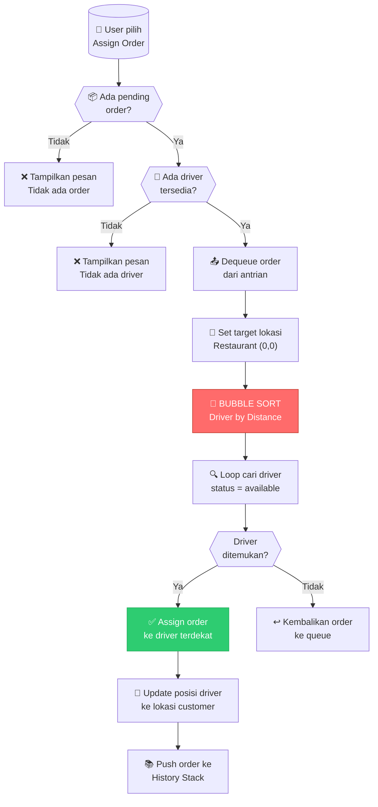
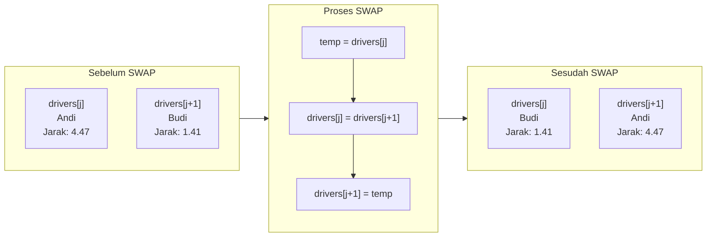
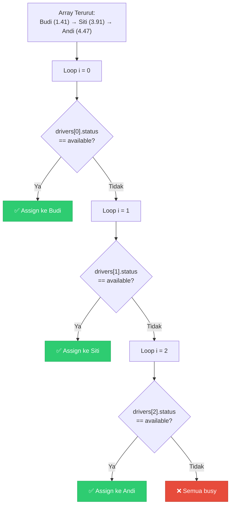

# 🚚 Visualisasi Proses Sorting pada Assign Order ke Driver

## 📋 Gambaran Umum

Ketika sebuah order di-assign ke driver, sistem akan **mengurutkan driver berdasarkan jarak terdekat** ke restoran menggunakan algoritma **Bubble Sort**. Berikut adalah penjelasan lengkap proses tersebut.

---

## 🔄 Flow Diagram Keseluruhan



---

## 🎯 Detail Algoritma Bubble Sort

### Fungsi `sortDriversByDistance(Location target)`

```cpp
void sortDriversByDistance(Location target) {
    for (int i = 0; i < driverCount - 1; i++) {
        for (int j = 0; j < driverCount - i - 1; j++) {
            float jarak1 = hitungJarak(drivers[j].posisiSaatIni, target);
            float jarak2 = hitungJarak(drivers[j+1].posisiSaatIni, target);

            if (jarak1 > jarak2) {
                // SWAP
                Driver temp = drivers[j];
                drivers[j] = drivers[j+1];
                drivers[j+1] = temp;
            }
        }
    }
}
```

---

## 📐 Rumus Euclidean Distance

Jarak dihitung menggunakan rumus **Euclidean Distance**:

$$d = \sqrt{(x_2 - x_1)^2 + (y_2 - y_1)^2}$$

```cpp
float hitungJarak(Location a, Location b) {
    return sqrt(pow(a.x - b.x, 2) + pow(a.y - b.y, 2));
}
```

---

## 🎬 Simulasi Step-by-Step Bubble Sort

### Kondisi Awal

Misalkan kita punya **3 driver** dengan posisi berikut, dan **target = Restaurant (0, 0)**:

```
         Y
         │
       4 ┤
         │              🚗 Andi (4, 2)
       3 ┤     🚗 Siti (2.5, 3)
         │
       2 ┤
         │  🚗 Budi (1, 1)
       1 ┤
         │
       0 ┼──────────────────────── X
         0    1    2    3    4

         🏪 Restaurant (0, 0)
```

### Hitung Jarak Masing-masing Driver

| Index | Driver | Posisi (x, y) | Perhitungan                   |  Jarak   |
| :---: | :----: | :-----------: | :---------------------------- | :------: |
|   0   |  Budi  |    (1, 1)     | √((1-0)² + (1-0)²) = √2       | **1.41** |
|   1   |  Siti  |   (2.5, 3)    | √((2.5-0)² + (3-0)²) = √15.25 | **3.91** |
|   2   |  Andi  |    (4, 2)     | √((4-0)² + (2-0)²) = √20      | **4.47** |

---

## 🔄 Proses Bubble Sort Per Iterasi

### Pass 1 (i = 0)

```
┌─────────────────────────────────────────────────────────────────┐
│  PASS 1: Membandingkan elemen dari index 0 sampai 1             │
└─────────────────────────────────────────────────────────────────┘

Array Awal:
┌───────────────┬───────────────┬───────────────┐
│  [0] Budi     │  [1] Siti     │  [2] Andi     │
│  Jarak: 1.41  │  Jarak: 3.91  │  Jarak: 4.47  │
└───────────────┴───────────────┴───────────────┘

────────────────────────────────────────────────────────────────────
j = 0: Bandingkan drivers[0] dengan drivers[1]
────────────────────────────────────────────────────────────────────

   Budi (1.41) vs Siti (3.91)

   1.41 < 3.91  →  TIDAK SWAP ✓

   ┌───────────────┬───────────────┬───────────────┐
   │  [0] Budi     │  [1] Siti     │  [2] Andi     │
   │  Jarak: 1.41  │  Jarak: 3.91  │  Jarak: 4.47  │
   └───────────────┴───────────────┴───────────────┘

────────────────────────────────────────────────────────────────────
j = 1: Bandingkan drivers[1] dengan drivers[2]
────────────────────────────────────────────────────────────────────

   Siti (3.91) vs Andi (4.47)

   3.91 < 4.47  →  TIDAK SWAP ✓

   ┌───────────────┬───────────────┬───────────────┐
   │  [0] Budi     │  [1] Siti     │  [2] Andi     │
   │  Jarak: 1.41  │  Jarak: 3.91  │  Jarak: 4.47  │
   └───────────────┴───────────────┴───────────────┘
                                   ▲
                                   └── Elemen terbesar sudah di posisi akhir!
```

### Pass 2 (i = 1)

```
┌─────────────────────────────────────────────────────────────────┐
│  PASS 2: Membandingkan elemen dari index 0 sampai 0             │
└─────────────────────────────────────────────────────────────────┘

────────────────────────────────────────────────────────────────────
j = 0: Bandingkan drivers[0] dengan drivers[1]
────────────────────────────────────────────────────────────────────

   Budi (1.41) vs Siti (3.91)

   1.41 < 3.91  →  TIDAK SWAP ✓

   ┌───────────────┬───────────────┬───────────────┐
   │  [0] Budi     │  [1] Siti     │  [2] Andi     │
   │  Jarak: 1.41  │  Jarak: 3.91  │  Jarak: 4.47  │
   └───────────────┴───────────────┴───────────────┘
```

**Hasil: Array sudah terurut dari jarak terpendek ke terpanjang!**

---

## 🔄 Contoh dengan SWAP (Skenario Lain)

Bagaimana jika urutan awal driver berbeda?

### Kondisi Awal (Urutan Acak)

```
Array Awal:
┌───────────────┬───────────────┬───────────────┐
│  [0] Andi     │  [1] Budi     │  [2] Siti     │
│  Jarak: 4.47  │  Jarak: 1.41  │  Jarak: 3.91  │
└───────────────┴───────────────┴───────────────┘
```

### Pass 1 (i = 0)

```
j = 0: Bandingkan Andi (4.47) vs Budi (1.41)
       4.47 > 1.41  →  🔄 SWAP!

       Sebelum SWAP:
       ┌───────────────┬───────────────┬───────────────┐
       │  [0] Andi     │  [1] Budi     │  [2] Siti     │
       └───────────────┴───────────────┴───────────────┘

       Proses SWAP:
       ┌───────────────┐     ┌───────────────┐
       │  [0] Andi     │ ←→  │  [1] Budi     │
       └───────────────┘     └───────────────┘

       Sesudah SWAP:
       ┌───────────────┬───────────────┬───────────────┐
       │  [0] Budi     │  [1] Andi     │  [2] Siti     │
       │  Jarak: 1.41  │  Jarak: 4.47  │  Jarak: 3.91  │
       └───────────────┴───────────────┴───────────────┘

────────────────────────────────────────────────────────────────────

j = 1: Bandingkan Andi (4.47) vs Siti (3.91)
       4.47 > 3.91  →  🔄 SWAP!

       Sesudah SWAP:
       ┌───────────────┬───────────────┬───────────────┐
       │  [0] Budi     │  [1] Siti     │  [2] Andi     │
       │  Jarak: 1.41  │  Jarak: 3.91  │  Jarak: 4.47  │
       └───────────────┴───────────────┴───────────────┘
                                       ▲
                                       └── Andi "menggelembung" ke akhir!
```

### Pass 2 (i = 1)

```
j = 0: Bandingkan Budi (1.41) vs Siti (3.91)
       1.41 < 3.91  →  TIDAK SWAP ✓

       Array sudah terurut:
       ┌───────────────┬───────────────┬───────────────┐
       │  [0] Budi     │  [1] Siti     │  [2] Andi     │
       │  Jarak: 1.41  │  Jarak: 3.91  │  Jarak: 4.47  │
       └───────────────┴───────────────┴───────────────┘
```

---

## 📊 Diagram Proses SWAP



---

## 🎯 Proses Assign ke Driver

Setelah array terurut, sistem mencari driver **available** pertama:



---

## 📈 Kompleksitas Algoritma

| Aspek                | Nilai | Penjelasan                                     |
| -------------------- | ----- | ---------------------------------------------- |
| **Time Complexity**  | O(n²) | Nested loop: outer n-1, inner n-i-1            |
| **Space Complexity** | O(1)  | Hanya butuh 1 variabel temp untuk swap         |
| **Best Case**        | O(n²) | Tetap O(n²) karena tidak ada early termination |
| **Worst Case**       | O(n²) | Array terbalik, semua elemen di-swap           |

---

## 🏁 Kesimpulan Proses

```
┌─────────────────────────────────────────────────────────────────────────────┐
│                        RINGKASAN PROSES ASSIGN ORDER                        │
├─────────────────────────────────────────────────────────────────────────────┤
│                                                                             │
│  1️⃣  Ambil order dari queue (FIFO - First In First Out)                   │
│                           ↓                                                 │
│  2️⃣  Set target = Restaurant (0, 0)                                        │
│                           ↓                                                 │
│  3️⃣  BUBBLE SORT: Urutkan driver berdasarkan jarak ke target               │
│      • Bandingkan pasangan bersebelahan                                     │
│      • Swap jika jarak kiri > jarak kanan                                   │
│      • Ulangi sampai terurut                                                │
│                           ↓                                                 │
│  4️⃣  Loop dari index 0, cari driver dengan status "available"              │
│                           ↓                                                 │
│  5️⃣  Assign order ke driver terdekat yang tersedia                         │
│                           ↓                                                 │
│  6️⃣  Update posisi driver ke lokasi customer                               │
│                           ↓                                                 │
│  7️⃣  Push completed order ke History Stack                                 │
│                                                                             │
└─────────────────────────────────────────────────────────────────────────────┘
```

> [!TIP] > **Mengapa Bubble Sort?**  
> Bubble Sort dipilih karena:
>
> - Sederhana dan mudah diimplementasi
> - Jumlah driver kecil (max 5), sehingga O(n²) tidak menjadi masalah
> - Tidak memerlukan extra space (in-place sorting)
